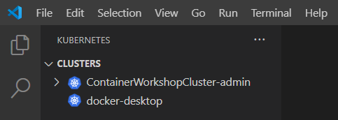

# Lab 9 - Blue/Green deployments on Kubernetes with Contour

During this lab, you will become familiar with Kubernetes networking concepts, like services and ingress.

Goals for this lab:

- Gain an understanding of basic networking concepts in Kubernetes.
- Learn how to use Ingress to expose services based on routing keys.
- Run multiple versions of a workload on Kubernetes concurrently, combined with traffic routing to perform [Blue/Green testing](https://martinfowler.com/bliki/BlueGreenDeployment.html).

## Prerequisites

Make sure you have completed [Lab 1 - Getting Started](Lab01-GettingStarted.md#6). Doublecheck that you have completed chapter 'Create a Kubernetes cluster'

## Getting started



Launch VS Code, open the Kubernetes extension, make sure the cluster named 'docker-desktop' or 'ContainerWorkshopCluster-admin' is the current cluster, or right click on it to select it as the current cluster.
Click on the 'Install dependencies' button if needed.

Also, in the terminal, change directories to the Docs repository directory named 'resources/lab09'

```
C:\Sources\ContainerWorkshop\ContainerWorkshop-Docs\resources\lab09>
```

## <a name='deploy-contour'></a>Deploying the Contour ingress controller

An ingress controller manages traffic into and out of the cluster. You can use it to get network connectivity between pods and software outside of the cluster.

Kubernetes does not have a built-in [ingress](https://kubernetes.io/docs/concepts/services-networking/ingress/) controller. We first need to deploy one. For this lab, we chose [Contour](https://github.com/heptio/contour). Other popular [options](https://kubernetes.io/docs/concepts/services-networking/ingress-controllers/) are Nginx and Traefik.

Open a terminal, move to the repository directory named 'resources/lab09'.

Type the following command to deploy the [Contour](https://github.com/heptio/contour) ingress controller:

```
kubectl apply -f 00-contour.yaml
```

This command will install custom resource definitions and pods to serve as ingress controller within the local cluster.

## <a name='deploy-workloads'></a>Deploying two versions of a container

We will now deploy a small demo application. It is a .NET Core Web Api. There are two versions, 'blue' and 'green'. In real life, this would probably be something similar to v1 and v2. The demo application with version _'blue'_ is configured to return string value `blue` when it is called. The _'green'_ version, likewise returns string value `green`. This way, we can easily see which application version answers our call when we call the API's later.

Deploy the two versions of the workload by running these commands:

```
kubectl apply -f 01-green.yaml
kubectl apply -f 02-blue.yaml
```

> In this lab, we will move from the 'green' version to 'blue'.

Each of these commands will first ensure that the namespace 'BlueGreen' exists, and then create a [deployment](https://kubernetes.io/docs/concepts/workloads/controllers/deployment/#creating-a-deployment) and expose it by using a [service](https://kubernetes.io/docs/concepts/services-networking/service/).

The first command creates the 'green' version of the workload, and the second will create the 'blue' version.
After this step, you will have two active pods who can be called individually.

### Check the resources

Kubernetes groups resources in namespaces. Namespaces can also act as a security boundary. The YAML files we applied earlier, created a new Namespace 'bluegreen'.

List all Namespaces by running `kubectl get namespace`:

```
kubectl get namespace

NAME              STATUS   AGE
bluegreen         Active   1m22s
default           Active   2d5h
projectcontour    Active   8m39s
kube-node-lease   Active   2d5h
kube-public       Active   2d5h
kube-system       Active   2d5h
```

Switch to the 'bluegreen' namespace by using the `kubectl config set-context` command:

```
kubectl config set-context --current --namespace=bluegreen
```

When omitting the namespace from `kubectl` commands, it will use the Namespace named `default` as a default value. We have just instructed `kubectl` to use the Namespace `bluegreen` instead.

Check if the service is deployed correctly by running this command:

```
kubectl get -n projectcontour service contour -o wide
```

This should return something similar to this:

```
NAME      TYPE        CLUSTER-IP     EXTERNAL-IP   PORT(S)    AGE   SELECTOR
contour   ClusterIP   10.0.168.105   <none>        8001/TCP   11m   app=contour
```

### Finding node internal IP address for Docker Desktop

If you're running Docker Desktop, write down the node IP address shown by running this command:

```
kubectl get node/docker-desktop -o wide
```

It will output something similar to this:

```
NAME             STATUS   ROLES    AGE    VERSION   INTERNAL-IP    EXTERNAL-IP   OS-IMAGE         KERNEL-VERSION                CONTAINER-RUNTIME
docker-desktop   Ready    master   2d6h   v1.19.3   192.168.65.3   <none>        Docker Desktop   4.19.128-microsoft-standard   docker://20.10.2
```

### Finding node internal IP address for Azure Kubernetes Service

If you're running on Azure, use this command to get the first node name:

```
kubectl get nodes
```

Use the node name to get information (your node name will be different):

```
kubectl get node aks-nodepool1-36156572-vmss000000 -o wide
```

It will output something similar to this:

```
NAME                                STATUS   ROLES   AGE    VERSION    INTERNAL-IP   EXTERNAL-IP   OS-IMAGE             KERNEL-VERSION     CONTAINER-RUNTIME
aks-nodepool1-36156572-vmss000000   Ready    agent   2d5h   v1.18.14   10.240.0.4    <none>        Ubuntu 18.04.5 LTS   5.4.0-1035-azure   docker://19.3.14
```

## Checking external IP address of cluster

The cluster is exposed via a loadbalancer that we can find by inspecting the services. 

```cmd
kubectl get services -A
```

The output show the envoy loadbalancer and its EXTERNAL-IP address:

```
NAMESPACE        NAME         TYPE           CLUSTER-IP       EXTERNAL-IP   PORT(S)                      AGE
bluegreen        blue         ClusterIP      10.99.180.12     <none>        80/TCP                       12m
bluegreen        green        ClusterIP      10.99.26.173     <none>        80/TCP                       12m
default          kubernetes   ClusterIP      10.96.0.1        <none>        443/TCP                      12m
kube-system      kube-dns     ClusterIP      10.96.0.10       <none>        53/UDP,53/TCP,9153/TCP       12m
projectcontour   contour      ClusterIP      10.103.179.185   <none>        8001/TCP                     12m
projectcontour   envoy        LoadBalancer   10.110.54.134    localhost     80:31919/TCP,443:30848/TCP   12m
```

As you can see, the loadbalancer is exposed via `localhost`.

## <a name='ingress'></a>Adding an HTTPProxy

We now want to consume both services at a single endpoint, so we can perform Blue/Green testing. In this lab, ninety percent of traffic will be sent to the 'green' version, the remaining 10 percent will be sent to the 'blue' version.

To do this, we'll create a Contour-specific 'HTTPProxy' resource.
This resource acts as a [reverse proxy](https://en.wikipedia.org/wiki/Reverse_proxy) that routes incoming HTTP requests to one or more deployed services. Being able to target multiple services (e.g. blue & green) allows us to perform Blue/Green testing.

```yaml
apiVersion: projectcontour.io/v1
kind: HTTPProxy
metadata:
  name: ingress
  namespace: bluegreen
spec:
  virtualhost:
    fqdn: demo.local
  routes:
    - conditions:
        - prefix: / # matches everything
      permitInsecure: true
      services:
        - name: blue
          port: 80
          weight: 10
        - name: green
          port: 80
          weight: 90
```

The value in 'virtualhost' will be matched against the `Host` header of incoming HTTP requests. The value in `prefix` will be matched with the path of the URL. In this lab we will simply forward all HTTP requests for '/'. The values in `services` indicate the back-end services that will receive the forwarded calls.

Create the ingress by running this command:

```
kubectl apply -f 03-ingress.yaml
```

To ensure everything works, run this command:

```
kubectl get proxy/ingress -o wide
```

The output should look like this:

```
NAME      FQDN         TLS SECRET   STATUS   STATUS DESCRIPTION
ingress   demo.local                valid    Valid HTTPProxy
```

> The 'valid' status means that the all checks of the HTTPProxy are currently successful.

## <a name='results'></a>Checking the results.

To test the new ingress route, start a terminal window running Linux, and run the following command to test the ingress:

```
(for i in {1..100}; do echo -e ""; curl -s http://localhost/api/color -H 'Host: demo.local';  done;) | sort | uniq -c
```

This command makes 100 web requests, targeting the host 'demo.local', and displaying the returned unique word frequencies (which are blue & green):Repeat the call, to see both words being returned.
Running the command, should display output similar to this:

```
 1
 9 blue
91 green
```

> You should see that around 90 percent of the calls returned were answered by the _green_ version, returning the word 'green' and that around 10 percent of the calls returned 'blue'.

Switch back to your terminal and leave the test pod running.

### Blue/Green testing

You can now perform Blue/Green testing, and (gradually) shift traffic towards the (newer) 'blue' version of the software.

Type the following command to edit the existing Ingress:

```
kubectl edit HTTPProxy ingress
```

Change the weights into:

```yaml
- name: blue
  port: 80
  weight: 80
- name: green
  port: 80
  weight: 20
```

Save the file and run the `curl` loop again:

```
(for i in {1..100}; do echo -e ""; curl -s http://localhost/api/color -H 'Host: demo.local';  done;) | sort | uniq -c
```

This time, it should display a result like this:

```
 1
78 blue
22 green
```

In real life, you can use this technique to gradually increase traffic to a new version of your software, with the means of moving back to the previous version in a few seconds in case of issues. For every software release, you would flip from blue, to green, to blue, etc.

## <a name='clean'></a>Cleaning up

Uninstall Contour and delete the workloads:

```
kubectl delete -f '00-contour.yaml'
kubectl delete namespace bluegreen
kubectl delete ns heptio-contour
```

## Wrapup

In this lab you experimented with Kubernetes network connectivity from the command line. You have learned how to shape traffic flowing into pods using Countour HTTPProxy.

Continue with [Lab 10 - Working with Istio on Kubernetes](Lab10-Istio.md).
