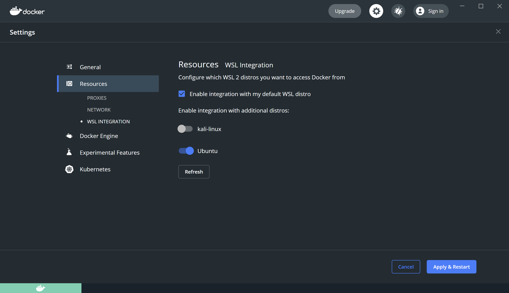
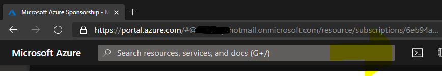
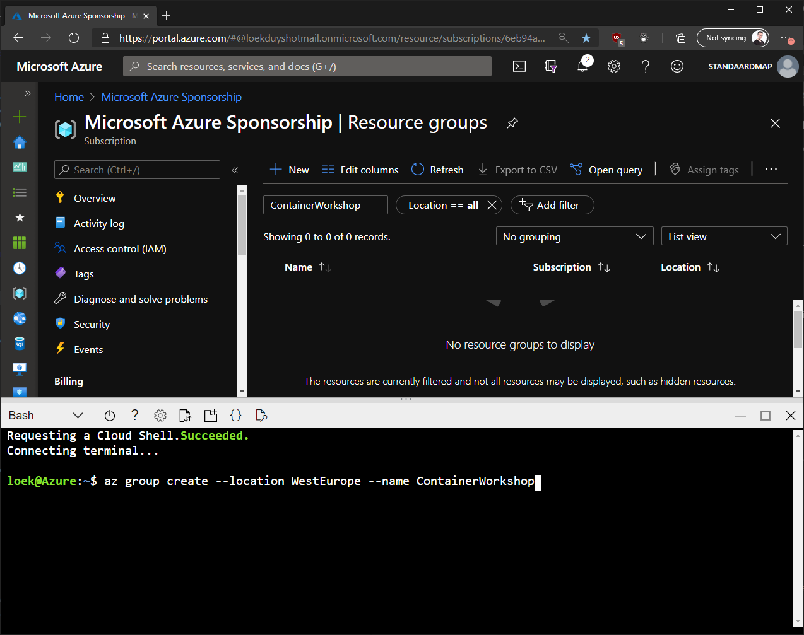
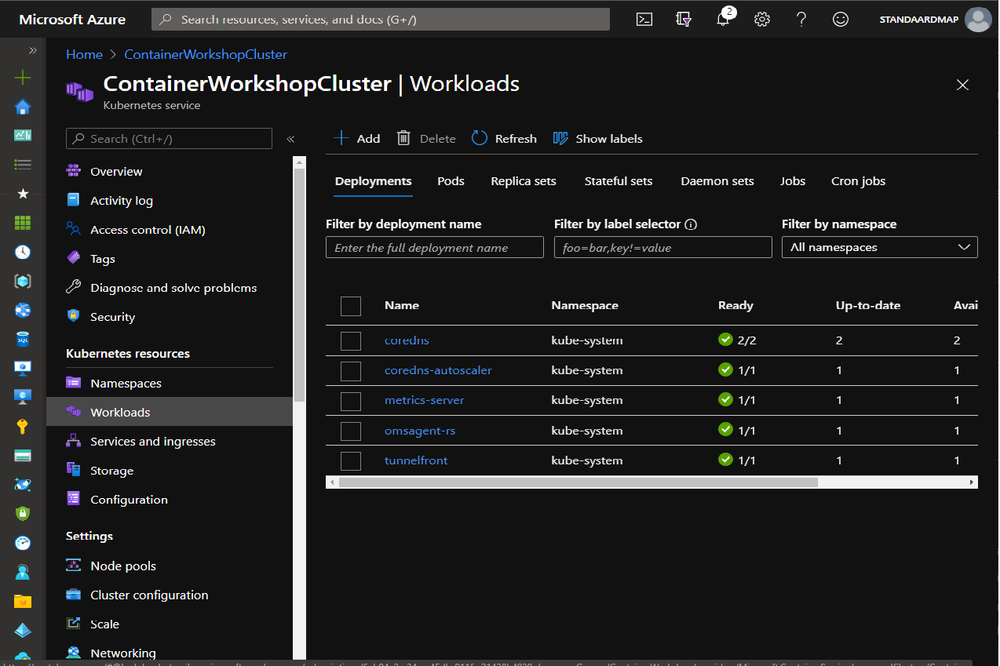

#  <a name="start"></a>Lab 1 - Getting started

This lab is going to let you prepare your development environment for the rest of the labs in the workshop. Not all steps are required. The more you can prepare, the better the experience during the workshop.

Goals for this lab: 
- [Get the optional subscriptions](#1)
- [Prepare development laptop](#2)
- [Download required and optional tooling](#3)
- [Clone Git repository for lab code](#4)
- [Run and inspect lab application](#5)
- [Create a Kubernetes cluster](#6)
- [Save time later](#7)
 
## <a name="1"></a>1. Get optional subscriptions
If you want to learn how to work with Azure and Azure DevOps, make sure to get access to (trial) subscriptions.

For [Lab 8 - Azure DevOps pipelines](Lab8-AzDOPipelines.md), you'll need an Azure DevOps subscription. Get one for free here: [dev.azure.com](https://dev.azure.com).

To create a Kubernetes cluster and/or a Container Registry inside Azure, you will need an Azure subscription.
Create a free [trial account here](https://azure.microsoft.com/en-us/free/).

## <a name="2"></a>2. Prepare your development laptop
Make sure that your laptop is up-to-date with the latest security patches. This workshop is specific towards Windows as the operating system for your machine. The labs can also be done on Linux and Mac.

## <a name="3"></a>3. Install tools

### Windows Subsystem for Linux
- On Windows 10, enable WSL, by following the steps described here:
[Enable WSL](https://docs.microsoft.com/en-us/windows/wsl/install-win10#manual-installation-steps)
- Add the Ubuntu distro from the [Microsoft Store](https://www.microsoft.com/en-us/p/ubuntu/9nblggh4msv6)

> If you cannot do this, you will use a Linux Virtual Machine to run Linux containers on Windows later.

> Also, you'll need to run [Lab 12 - Working with Istio on Kubernetes](Lab12-Istio.md) in an [Azure Cloud Shell](https://devblogs.microsoft.com/commandline/the-azure-cloud-shell-connector-in-windows-terminal/).

For the best experience, run the entire workshop using Linux based terminals, even on Windows.

### Visual Studio 2019 / VS Code
First, you will need to have a development IDE installed. The most preferable IDE is [Visual Studio 2019](https://www.visualstudio.com/vs/) if you are running the Windows operating system.

You can also use [Visual Studio Code](https://code.visualstudio.com/).

#### VS Code Extensions:

A couple of VS Code extensions are required to assist you during the labs. You can install them before the workshop or just in time. 

- On Windows, install the [Remote WSL](https://marketplace.visualstudio.com/items?itemName=ms-vscode-remote.remote-wsl) extension to open this repo in WSL.
- For labs 10,11,12 -  Install the [Kubernetes](https://marketplace.visualstudio.com/items?itemName=ms-kubernetes-tools.vscode-kubernetes-tools) extension
- For labs 2,3,4,5 Install the [Docker](https://marketplace.visualstudio.com/items?itemName=ms-azuretools.vscode-docker) extensions.
   - and configure VS Code for debugging C# by installing the [C# extension](https://marketplace.visualstudio.com/items?itemName=ms-dotnettools.csharp)
- For lab 8 - Install the [Azure DevOps extension](https://marketplace.visualstudio.com/items?itemName=ms-azure-devops.azure-pipelines)


### Docker Desktop (Windows & Mac)
Second, you are going to need the Docker Community Edition tooling on your development machine. Depending on your operating system you need to choose the correct version of the tooling. Instructions for installing the tooling can be found [here](https://docs.docker.com/install/). You can choose either the stable or edge channel.

> Download and install Docker Community Edition (version 3.1.0 or higher):
> - [Docker Desktop for Windows](https://docs.docker.com/docker-for-windows/install/)
> - [Docker Desktop for Mac](https://docs.docker.com/docker-for-mac/install/)

When on Windows, make sure to enable WSL integration, if possible.


### Azure CLI
If you want to interact with Azure from your local machine, you will also need the [Azure Command Line 2.0 tooling](https://docs.microsoft.com/en-us/cli/azure/install-azure-cli?view=azure-cli-latest) for interaction with Azure resources. 
> Install [Azure CLI 2.18 or higher](https://docs.microsoft.com/en-us/cli/azure/install-azure-cli-windows?view=azure-cli-latest)

### .NET Platform
Download and install [.NET 5](https://download.visualstudio.microsoft.com/download/pr/75483251-b77a-41a9-9ea2-05fb1668e148/2c27ea12ec2c93434c447f4009f2c2d2/dotnet-sdk-5.0.102-win-x64.exe) if needed.

### Git CLI
Download [git](https://git-scm.com/downloads) if needed. Store the file in a location that is part of the PATH variable, e.g. "C:\Program Files".

### Optional tooling
The following optional tools are recommended, but not required.

- [GitHub Desktop](https://desktop.github.com/) for Git Shell and Git repository utilities
- [PuTTY](http://www.putty.org/) for `PuTTY.exe` and `PuTTYgen.exe`

## <a name="4"></a>4. Clone Git repositories with labs and code
The workshop uses an example to get you started with Dockerizing a typical ASP.NET Core application. 

Clone the repository to your development machine:
- Create a folder for the source code, e.g. `C:\Sources\ContainerWorkshop`.
- Open a command prompt (terminal) from that folder
- Clone the Git repositories for the workshop files

### Code
Create a local copy of the [source code](https://github.com/XpiritBV/ContainerWorkshop-Code):

```
git clone https://github.com/XpiritBV/ContainerWorkshop-Code.git
```

### Labs
Create a local copy of the [labs](https://github.com/XpiritBV/ContainerWorkshop-Docs):
```
git clone https://github.com/XpiritBV/ContainerWorkshop-Docs.git
```
- Set an environment variable to the root of the cloned repository from PowerShell:

```powershell
pwsh
$env:workshop = 'C:\Sources\ContainerWorkshop'
```

## <a name="5"></a>5. Compile and inspect demo application
Start Visual Studio and open the solution you cloned in the previous step. 
Build the application and fix any issues that might occur. 
Take a look at the solution and inspect the source code.

## <a name="6"></a>6. Create a Kubernetes cluster

During the labs, you will need admin access to a working Kubernetes cluster. You can choose to create one in Azure, or use Docker Desktop.

### Option 1: Create a Kubernetes cluster in Azure

This part requires you have an active Azure subscription. If you do not, you can create a trial account at [Microsoft Azure](https://azure.microsoft.com/en-us/free/). It will require access to a credit card, even though it will not be charged.

The easiest option to run these scripts, is to use the terminal inside the Azure portal.


If you want to run the scripts from your local machine, first login to your Azure subscription using the Azure CLI and switch to the right subscription (in case you have multiple subscriptions). The second command will list your subscriptions. Choose the appropriate GUID to select the subscription you want to use and substitute that in the third command. 

```
az login
az account list -o table
az account set --subscription <your-subscription-guid>
```

After you have successfully logged in, create a resource group for your cluster.


```
az group create --location WestEurope --name ContainerWorkshop
```

If running locally, install the Azure Kubernetes Service Command-Line Interface tools by running and following the instructions from this command:
```
az aks install-cli
```

Make sure that the proper resource providers are enabled:
```
az provider register --namespace Microsoft.OperationsManagement
az provider register --namespace Microsoft.OperationalInsights
```

#### Deploy Kubernetes

First, enable the Pod Identity preview by using the `az feature register` command:
```
az feature register --name EnablePodIdentityPreview --namespace Microsoft.ContainerService

az feature show --name EnablePodIdentityPreview --namespace Microsoft.ContainerService
```
Make sure that the operation has completed before continuing, by using the `az feature show` command.

Update the resource provider:
```
az provider register -n Microsoft.ContainerService
```

Update the CLI tooling:
```
az extension add --name aks-preview
az extension update --name aks-preview
```

You can now create the cluster with the `az aks create` command:
```
az aks create --resource-group ContainerWorkshop --name ContainerWorkshopCluster --node-count 1 --enable-addons monitoring --generate-ssh-keys --enable-managed-identity --enable-pod-identity --network-plugin azure
```

If you get an error such as this message, simply retry the deployment:

```
Deployment failed. Correlation ID: 019756e2-cadd-429d-86dc-1c2bd0d71339. Unable to get log analytics workspace info. 
```

It can take quite a long time for this command to complete. Take a coffee break! The command will show JSON based information about the cluster.
After the cluster has been created we can start interacting with it.

Check the status of the cluster by using `az aks show`:
```
az aks show --resource-group ContainerWorkshop --name ContainerWorkshopCluster
```

Get admin credentials for the Kubernetes management API using `az aks get-credentials`:
```
az aks get-credentials --resource-group ContainerWorkshop --name ContainerWorkshopCluster -a
```

Make sure that the `kubectl` tools will communicate with your new cluster:
```
kubectl config use-context ContainerWorkshopCluster-admin
```
### Using the Azure Portal to view your AKS cluster
Get your subscription id by running `az account show`, the `id` field will contain your subscription id:
```
az account show

{
  "environmentName": "AzureCloud",
  "id": "6eb94a2c-34ac-45db-911f-c21438b4939c",
  "isDefault": true,
```

To view the Kubernetes resources view, please open:

```
https://portal.azure.com/#resource/subscriptions/<your subscriptionid>/resourceGroups/ContainerWorkshop/providers/Microsoft.ContainerService/managedClusters/ContainerWorkshopCluster/workloads
```
Replace the part `<your subscriptionid>` with your subscription id. Open the link, and you should see information about your cluster:




This does not incur any costs other than your Azure resource consumption and should be fit easily within your Azure trial subscription credits.

> Make sure to delete the cluster when you have **finished** with this workshop:
> 
> `az aks delete --resource-group ContainerWorkshop --name ContainerWorkshopCluster`

### Option 2: Create a Kubernetes cluster in Docker Desktop (Windows & Mac)

You can also use Docker Desktop to create a Kubernetes cluster, that runs on your local machine.


1. Make sure Docker Desktop is running.
1. Open the settings screen, by clicking on the whale-icon in your taskbar.
1. In the 'Resources' tab, select 'WSL INTEGRATION'
1. Check 'Enable integration with my default WSL distro
1. Enable any additional WSL distro's if you like. You might have to upgrade these to WSL version 2 before the integration is available. See more [here](https://docs.docker.com/docker-for-windows/wsl/).

After a few minutes, you should be able to run `wsl` and interact with Docker and Kubernetes.
Check if everything works:

1. Open a terminal
1. Run `wsl` to launch your default wsl distro
1. Run `docker run hello-world`
   The output should look very similar to this:
    ```
    Unable to find image 'hello-world:latest' locally
    latest: Pulling from library/hello-world
    0e03bdcc26d7: Pull complete
    Digest: sha256:31b9c7d48790f0d8c50ab433d9c3b7e17666d6993084c002c2ff1ca09b96391d
    Status: Downloaded newer image for hello-world:latest

    Hello from Docker!
    ```
1. Run `kubectl get nodes`
   The output should look similar to this:
   ```
   NAME             STATUS   ROLES    AGE    VERSION
   docker-desktop   Ready    master   8m2s   v1.19.3
   ```

If the output checks out, you are good to go. If not, ask your proctor for some help.

> If Docker Desktop keeps crashing during startup, assign more memory: 
>
> `wsl --shutdown`
>
> `notepad "$env:USERPROFILE/.wslconfig"`
>
> Increase WSL ram to 4GB `memory=4GB`
>
> Restart the Docker Desktop service

## <a name="7"></a> 7. Save some time later
During this workshop we will use a couple of Docker images. You can download these images at home ahead of time, so you don't have to wait for them to download during the workshop:

```
docker pull mcr.microsoft.com/mssql/server:2019-latest
docker pull portainer/portainer-ce
docker pull nginx
docker pull alpine
docker pull busybox
docker pull curlimages/curl
docker pull fortio/fortio
```

## Wrapup
You have prepared your laptop and container environment to be ready for the next labs. Any issues you may have, can probably be resolved during the labs. Ask your fellow attendees or the proctor to help you, if you cannot solve the issues.

Continue with [Lab 2 - Docker101](Lab2-Docker101.md).
