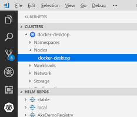

# Lab 10 Blue/Green deployments on Kubernetes

During this lab, you will become familiar with Kubernetes networking concepts, like Service and Ingress.

Goals for this lab:
- Gain an understanding of basic networking concepts in Kubernetes.
- Learn how to use Ingress to expose Services based on routing keys.
- Run multiple versions of a workload on Kubernetes concurrently, combined with traffic routing to perform [Blue/Green testing](https://martinfowler.com/bliki/BlueGreenDeployment.html).

## <a name='start'></a>Inspect your Kubernetes environment
We will deploy and call an application using Visual Studio Code. Make sure you installed it, return to [Lab 1 - Getting Started](Lab1-GettingStarted.md) if you do not have it installed. Also, make sure you have [this](https://github.com/XpiritBV/ContainerWorkshop2019Docs) repository cloned, so you have a copy of the Kubernetes template files on your machine.

Tip: Having multiple ingress controllers on a Kubernetes cluster may cause issues. To avoid this, start this lab by installing the Kubernetes feature of Docker Desktop. This miniature version of Kubernetes can be reset to defaults by the click of a button!
You can deploy the mini-cluster by right clicking on the icon in the tool bar. 


On the Kubernetes tab, check 'Enable Kubernetes' and click 'Apply'.


Wait a few minutes until the indicator in the bottom-left of the screen indicates that both Docker and Kubernetes are running.

If you already installed the mini-cluster, please open the tab named 'Reset' and select 'Reset Kubernetes Cluster..' to reset the local mini-cluster to its defaults.



Now, in VS Code, open the Kubernetes extension, make sure the cluster named 'docker-desktop' is the current cluster, or right click on it to select it as the current cluster.


Also, in the terminal, move to the repository directory named 'resources/lab10'.

## <a name='deploy-contour'></a>Deploying the Contour ingress controller
Kubernetes does not have a built-in [ingress](https://kubernetes.io/docs/concepts/services-networking/ingress/) controller. We first need to deploy one. For this lab, we chose [Contour](https://github.com/heptio/contour). Other popular [options](https://kubernetes.io/docs/concepts/services-networking/ingress-controllers/) are Nginx and Traefik.

Type the following command to deploy the [Contour](https://github.com/heptio/contour) ingress controller:

```
kubectl apply -f '00-contour.yaml'
```

This command will install custom resource definitions and pods to serve as ingress controller within the local cluster.

## <a name='deploy-workloads'></a>Deploying two versions of a container
We will now deploy a small demo application, it is a .Net Core Web Api. There are two versions, 'blue' and 'green'. (In real life, this would probably be something similar to v1 and v2.) The demo application with version *'blue'* is configured to return string value *'blue'* when it is called. The *'green'* version, likewise returns string value *'green'*. This way, we can easily see which application version answers our call when we consume the workload later.

Deploy the two versions of the workload by running these commands:

```
kubectl apply -f '01-green.yaml'
```

and

```
kubectl apply -f '02-blue.yaml'
```
> In this lab, we will move from the 'green' version to 'blue'.

Each of these commands will first ensure that the namespace 'BlueGreen' exists, and then create a [Deployment](https://kubernetes.io/docs/concepts/workloads/controllers/deployment/#creating-a-deployment) and expose it by using a [Service](https://kubernetes.io/docs/concepts/services-networking/service/).
The first command creates the 'green' version of the workload, and the second will create the 'blue' version.
After this step, you will have two active Pods who can be called individually. 

Check if the service is deployed correctly by running this command:

```
kubectl get -n heptio-contour service contour -o wide
```

This should return something similar to this:

```
NAME      TYPE        CLUSTER-IP     EXTERNAL-IP   PORT(S)    AGE   SELECTOR
contour   ClusterIP   10.99.235.14   <none>        8001/TCP   43m   app=contour
```

Note down the Node IP address by running this command:

```
kubectl get node/docker-desktop  -o wide
```

It will output something similar to this:
```
NAME             STATUS   ROLES    AGE   VERSION   INTERNAL-IP    EXTERNAL-IP   OS-IMAGE         KERNEL-VERSION     CONTAINER-RUNTIME
docker-desktop   Ready    master   78m   v1.14.3   192.168.65.3   <none>        Docker Desktop   4.9.184-linuxkit   docker://19.3.1
```
> Later in this lab, we will need the value of 'INTERNAL-IP'. So make a note of it.

## <a name='ingress'></a>Adding an IngressRoute
We now want to consume both services at a single endpoint, so we can perform Blue/Green testing. In this lab, ninety percent of traffic will be sent to the 'green' version, the remaining 10 percent will be sent to the 'blue' version.

To do this, we'll create a Contour-specific '[IngressRoute](https://github.com/heptio/contour/blob/master/design/ingressroute-design.md)' resource.
This resource acts as a [reverse proxy](https://en.wikipedia.org/wiki/Reverse_proxy) that routes incoming HTTP requests to one or more deployed Services. Being able to target multiple services (e.g. blue & green) allows us to perform Blue/Green testing!

```
apiVersion: contour.heptio.com/v1beta1
kind: IngressRoute
metadata: 
  name: ingress
  namespace: bluegreen
spec: 
  virtualhost:
    fqdn: demo.local
  routes: 
    - match: /
      permitInsecure: true
      services: 
        - name: blue
          port: 80
          weight: 10
        - name: green
          port: 80
          weight: 90
```
The value in 'virtualhost' will be matched against the `Host` header of incoming HTTP requests. The value in 'match' will be matched with the path of the URL. In this lab we will simply forward all HTTP requests  '/'. The values in 'services' indicate the back-end Services that will receive the forwarded calls.

Create the ingress by running this command:

```
kubectl apply -f '03-ingress.yaml'
```

To ensure everything works, run this command:

```
kubectl get ingressroutes.contour.heptio.com/ingress  -o wide
```

The output should look like this:

```
NAME      FQDN         TLS SECRET   FIRST ROUTE   STATUS   STATUS DESCRIPTION
ingress   demo.local                /             valid    valid IngressRoute
```

> The 'valid' status means that the health checks of the IngressRoute are currently successful.

## <a name='results'></a>Checking the results.

To test the new ingress route, we'll run a terminal in a temporary Pod:

```
kubectl run -i --rm --tty curl --image=mcr.microsoft.com/dotnet/core/aspnet:2.2-stretch-slim --restart=Never bash
```


Inside the terminal, run this command to test the ingress, by making 100 web requests, targeting the host 'demo.local', and displaying the returned unique word frequencies (which are blue & green):

```
(for i in {1..100}; do echo -e ""; curl -s http://192.168.65.3/api/color -H 'Host: demo.local';  done;) | sort | uniq -c
```

> Replace the IP address with the value you noted down for 'INTERNAL-IP' (the Host's IP address) earlier in this lab. You can display it again, by running this command:
`kubectl get node/docker-desktop  -o wide`

Running the command, should display output similar to this:

```
9 blue
91 green
```
> You should see that around 90 percent of the calls returned were answered by the *green* version, returning the word 'green' and that around 10 percent of the calls returned 'blue'.

Type `exit` to stop the container.

### Blue/Green testing
You can now perform Blue/Green testing, and (gradually) shift traffic towards the (newer) 'blue' version of the software.

Type the following command to edit the existing Ingress:

```
kubectl edit IngressRoute ingress
```
Change the weights into:
```
- name: blue
  port: 80
  weight: 80
- name: green
  port: 80
  weight: 20
``` 

Running the `curl` loop again:

```
(for i in {1..100}; do echo -e ""; curl -s http://192.168.65.3/api/color -H 'Host: demo.local';  done;) | sort | uniq -c
```

This time, it should display a result like this:

```
78 blue
22 green
```

In real life, you can use this technique to gradually increase traffic to a new version of your software, with the means of moving back to the previous version in a few seconds in case of issues. For every software release, you would flip from blue, to green, to blue, etc. 