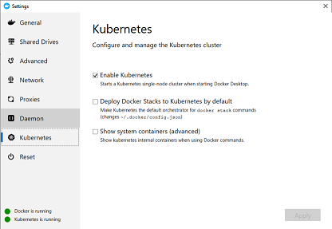
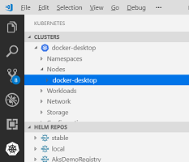
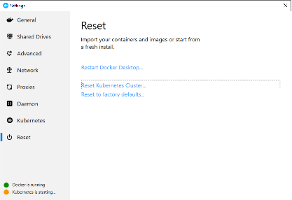

# Lab 11 Working with Istio on Kubernetes

During this lab, you will become familiar with [Istio](https://istio.io/docs/concepts/what-is-istio/) concepts, like the sidecar proxy-pattern, canary release, and connection resiliency.

Goals for this lab:
- Gain a **basic** understanding of Istio capabilities.

## <a name='start'></a>Inspect your Kubernetes environment
We will deploy and call an application using Visual Studio Code. Make sure you installed it, return to [Lab 1 - Getting Started](Lab1-GettingStarted.md) if you do not have it installed. Also, make sure you have [this](https://github.com/XpiritBV/ContainerWorkshop2019Docs) repository cloned, so you have a copy of the Kubernetes template files on your machine.

Tip: Having multiple ingress controllers on a Kubernetes cluster may cause issues. To avoid this, start this lab by installing the Kubernetes feature of Docker Desktop. This miniature version of Kubernetes can be reset to defaults by the click of a button!
You can deploy the mini-cluster by right clicking on the icon in the tool bar. 


1. On the 'Advanced' tab, configure 4 CPU's and 16GB of memory, or the amount available on your machine. Note that allocating too little memory, can prevent Pods from being started later.
2. On the Kubernetes tab, check 'Enable Kubernetes' and click 'Apply'.



3. If you already installed the mini-cluster, please open the tab named 'Reset' and select 'Reset Kubernetes Cluster..' to reset the local mini-cluster to its defaults.



4. Wait a few minutes until the indicator in the bottom-left of the screen indicates that both Docker and Kubernetes are running.

5. Now, in VS Code, open the Kubernetes extension, make sure the cluster named 'docker-desktop' is the current cluster, or right click on it to select it as the current cluster.



6. Also, in the terminal, move to the repository directory named 'resources/lab11'.
7. Unzip the file 'istio-1.2.5.zip' in the same folder.

## <a name='deploy-contour'></a>Deploying Istio

Let's start by deploying Istio to the mini-cluster.
From the folder 'resources/lab11', run the following command to deploy the Custom Resource Definitions:

```
kubectl apply -f istio-1.2.5/install/kubernetes/helm/istio-init/files --recursive
```

Next, install the demo version of Istio, by running:

```
kubectl apply -f istio-1.2.5/install/kubernetes/istio-demo.yaml
```

### Verify install

Run this command, and check that all Pods are deployed correctly:

```
kubectl get pods -n istio-system
```

The output should be similar to this:

```
NAME                                      READY   STATUS      RESTARTS   AGE
grafana-6fb9f8c5c7-mrmd7                  1/1     Running     0          4m1s
istio-citadel-5cf47dbf7c-9cfg9            1/1     Running     0          4m1s
istio-cleanup-secrets-1.2.5-8nx72         0/1     Completed   0          4m2s
istio-egressgateway-867485bc6f-ggggr      1/1     Running     0          4m1s
istio-galley-7898b587db-rfh6z             1/1     Running     0          4m1s
istio-grafana-post-install-1.2.5-7d5k8    0/1     Completed   0          4m2s
istio-ingressgateway-6c79cd454c-5jpjm     1/1     Running     0          4m1s
istio-pilot-76c567544f-t97gs              2/2     Running     0          4m1s
istio-policy-6ccd5fbb7f-l2f9g             2/2     Running     4          4m1s
istio-security-post-install-1.2.5-fshtc   0/1     Completed   0          4m2s
istio-sidecar-injector-677bd5ccc5-2s46v   1/1     Running     0          4m
istio-telemetry-8449b7f8bd-zf49j          2/2     Running     4          4m1s
istio-tracing-5d8f57c8ff-78pmg            1/1     Running     0          4m
kiali-7d749f9dcb-xkc4g                    1/1     Running     0          4m1s
prometheus-776fdf7479-mbnvk               1/1     Running     0          4m1s
```

> Note that it can take a few minutes for all Pods to be deployed.

## <a name='deploy-workload'></a> Deploying a workload
Now it is time to see ingress in action. 
1. First, make sure that we start with a clean slate:

```
kubectl delete namespace bluegreen
```

2. Second, deploy both versions of the sample workload; by creating a namespace with two deployments and services. 

> For more information about this application, read the introduction in [Lab 10](Lab10-BlueGreen.md#deploy-workloads).

Version 1:
```
kubectl apply -f ..\lab10\01-green.yaml
```

And version 2:

```
kubectl apply -f ..\lab10\02-blue.yaml
```

And select the new 'bluegreen' namespace as the default for this session:

```
kubectl config set-context --current --namespace=bluegreen
```
### Sidecar proxy

After a few seconds, the Pods will appear. However, they are not only running the green and blue containers. Examine the Pods by running this command:

```
kubectl get pod -n bluegreen

NAME                     READY   STATUS    RESTARTS   AGE
blue-76b4cd7845-psrb9    2/2     Running   0          3m4s
green-7fd8c669cd-8szfq   2/2     Running   0          3m9s
```

In the output, you can see that each Pod - configured to run a single container - is now running two containers (indicated by '2/2'). Let's investigate what happened...
> Note that the name of your Pod will be different from what is displayed here.

Get the `yaml` definition of your Pod by running this command, replacing the name of the Pod with the output of the previous command:

```
kubectl describe pod/blue-76b4cd7845-psrb9 --namespace bluegreen
```

In the output you should see the sample workload, together with a second container inside the `spec`.

``` yaml
spec:
  containers:
  - image: xpiritbv/bluegreen:blue
  - args: {}
    ..
    image: docker.io/istio/proxyv2:1.2.5
```
The second container - Istio proxy - is a '[user-level](https://en.wikipedia.org/wiki/User_space) [Layer 7](https://en.wikipedia.org/wiki/OSI_model#Layer_7:_Application_Layer)' proxy, that manages all network access into and out of the Pod. It was automatically added to the Deployment by Istio, because the namespace 'bluegreen' has a label `istio-injection=enabled`. The added container is called the 'sidecar proxy'. In this lab, you will learn some of the useful features that are made possible by this sidecar.

## <a name='simple-ingress'></a>Exposing a Pod to the outside world
Let us get back on topic. We will expose the Pod that is running the 'blue' version to the outside world. Deploying Istio in the previous steps has resulted in the deployment of a Pod that manages ingress into the mini-cluster. 

### Ingress gateway
Run this command to display the Istio Pods again:

```
kubectl get pods -n istio-system
```

One of the Pods has a name that starts with 'istio-ingressgateway'. This [ingress gateway](https://istio.io/docs/tasks/traffic-management/ingress/ingress-control/) is the brain we will configure with some policies later on. This is the Istio alternative for an IngressController in Kubernetes.
Examine the description of the service:

```
kubectl get svc istio-ingressgateway -n istio-system

NAME                   TYPE           CLUSTER-IP      EXTERNAL-IP   PORT(S)
                                              AGE
istio-ingressgateway   LoadBalancer   10.96.240.207   localhost     15020:32700/TCP,80:31380/TCP,443:31390/TCP,31400:31400/TCP,15029:30802/TCP,15030:30801/TCP,15031:31368/TCP,15032:32407/TCP,15443:30823/TCP   2d17h
```

> Note that the value of 'EXTERNAL-IP' shows 'localhost'. This means that you can access this service from the host that runs the mini-cluster (i.e. your laptop), by using 'localhost'. This is convenient for testing.

At this time, no services are exposed yet. So if you run the following command, you will receive an empty response:

```
curl -v http://localhost/

*   Trying ::1...
* TCP_NODELAY set
* Connected to localhost (::1) port 80 (#0)
> GET / HTTP/1.1
> Host: localhost
> User-Agent: curl/7.55.1
> Accept: */*
>
* Empty reply from server
* Connection #0 to host localhost left intact
curl: (52) Empty reply from server
```

### Creating a Gateway and VirtualService

We will add a [Gateway](https://istio.io/docs/reference/config/networking/v1alpha3/gateway/) resource, which is a Layer 4-6 load balancer that connects the Istio gateway to a virtual host, specifying hostname (e.g. 'blue.example.com'), port (e.g. 80) and protocol (e.g HTTP).

The next step is to create a [VirtualService](https://istio.io/docs/reference/config/networking/v1alpha3/virtual-service/) which adds Layer 7 based traffic routing. It routes traffic to Service instances or even to specific Pods running behind a Service.

Examine the contents of the file `01-RegularIngress.yaml`, and then create the resources by running this command:

```
kubectl apply -f 01-RegularIngress.yaml

gateway.networking.istio.io/blue-gateway created
virtualservice.networking.istio.io/blue created
```

After a few seconds, you will be able to access the 'blue' service.
You can do this by using this command:

```
curl -HHost:blue.example.com http://localhost/api/color
```

> Note that we have exposed an endpoint using the ingress gateway, which has now been configured to route traffic to the 'blue' service.

Delete the Gateway and VirtualService before the next step:

```
kubectl delete -f 01-RegularIngress.yaml
```

### Traffic shifting
Istio also supports Blue/Green testing. By adding a second `destination` to the VirtualService, and specifying the `weight` per destination.


Examine the contents of the file `02-TrafficShift.yaml`, notice the additional `destination`, and then create the resources by running this command:

```
kubectl apply -f 02-TrafficShift.yaml
```

> Note that this service runs under a different virtual host 'bluegreen.example.com'.

If you now test the exposed service again, you should see that around fifty percent of all calls return 'blue' and the others return 'green':

```
curl -HHost:bluegreen.example.com http://localhost/api/color
blue
[..]
curl -HHost:bluegreen.example.com http://localhost/api/color
green
```

> Note that by gradually modifying the values in `weight`, you can gradually shift traffic from one version to the next.

Delete the Gateway and VirtualService before the next step:

```
kubectl delete -f 02-TrafficShift.yaml
```

### DestinationRule resources

Up until now we have relied on two Service instances for traffic shifting. It is also possible to apply this technique to a single Service, exposing multiple application versions. It requires a [DestinationRule](https://istio.io/docs/reference/config/networking/v1alpha3/destination-rule/) to be created, which describes which services form a group together and creates a load balancer for them. A perk of this approach is that it enables you to create a pool of Service instances, with automated health checking and eviction.

Examine the following yaml definition:

``` yaml
apiVersion: networking.istio.io/v1alpha3
kind: DestinationRule
metadata:
  name: bluegreen-destinationrule
spec:
  host: bluegreen
  trafficPolicy:
    loadBalancer:
        simple: ROUND_ROBIN
  subsets:
  - name: v1
    labels:
      app: green
  - name: v2
    labels:
      app: blue
```

This DestinationRule named 'bluegreen-destinationrule', targets a Service named `bluegreen`, and specifies that Pods labeled 'app: green' become a `subset` named 'v1' and that Pods labeled 'app: blue' become subset 'v2'.

The VirtualService can now be described as follows:

``` yaml
apiVersion: networking.istio.io/v1alpha3
kind: VirtualService
metadata:
  name: versions
  namespace: bluegreen
spec:
  hosts:
  - "versions.example.com"
  gateways:
  - versions-gateway
  http:
  - match:
    - uri:
        prefix: /api/color
    route:
    - destination:
        port:
          number: 80
        host: bluegreen
        subset: v1
      weight: 80
    - destination:
        port:
          number: 80
        host: bluegreen
        subset: v2
      weight: 20
```

We specified two `destination` entries that each target a specific `subset` of the Service 'bluegreen'.

Now, create the resources:

```
kubectl apply -f 03-DestinationRule.yaml
```

And test the exposed service a few times, and notice that again, most of the times the word 'green' is returned, and occasionally you will see 'blue':

```
curl -HHost:versions.example.com http://localhost/api/color
green
[..]
curl -HHost:versions.example.com http://localhost/api/color
blue
```

Delete the Gateway, VirtualService, Service and DestinationRule before the next step:

```
kubectl delete -f 03-DestinationRule.yaml
```

## <a name='deploy-workload'></a> Focused canary testing
If you don't want to route traffic for a random percentage of users to your new software version, but instead you want to expose it for specific users, you can also use a DestinationRule.

Releasing a new software version specifically for a target audience, is called 'Focused canary testing'. You configure it, by adding a `match` section to the DestinationRule.

``` yaml
  http:
  - match:
    - uri:
        prefix: /api/color
      headers:
          Foo:
            exact: bar
    route:
    - destination:
        port:
          number: 80
        host: bluegreen
        subset: v2
  - route:
    - destination:
        port:
          number: 80
        host: bluegreen
        subset: v1
```
The `http` section now has two elements. The first one specifies a `match` section that defines both a `prefix` path and a header (Foo: bar) requirement. Matching traffic will be sent to `subset` v2. All other traffic will be sent to `subset` v1.

This means that you can instruct testers of the 'blue' version to include an HTTP header to their web requests in order to use it.

> Note that many more options for matching exist. For example, based on cookie content (user groups) or request path (/v1/).

It is now possible to send targeted requests to both software versions. To target the green version, you can use the same call as before:

```
curl -HHost:versions.example.com http://localhost/api/color

green
```

To target the 'blue' version, you add the Foo header:

```
curl -HHost:versions.example.com -HFoo:bar http://localhost/api/color

blue
```

### Cleaning up

Please open the tab named 'Reset' and select 'Reset Kubernetes Cluster..' to reset the local mini-cluster to its defaults.


Wait a few minutes until the indicator in the bottom-left of the screen indicates that both Docker and Kubernetes are running and continue with the next lab.


