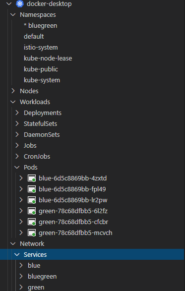

# Lab 12 Working with Istio on Kubernetes

During this lab, you will become familiar with [Istio](https://istio.io/docs/concepts/what-is-istio/) concepts, like the sidecar proxy-pattern, canary release, and connection resiliency.

Goals for this lab:
- Gain a **basic** understanding of Istio capabilities.

Tip: Having multiple ingress controllers on a Kubernetes cluster may cause issues. To avoid this, start this lab by installing the Kubernetes feature of Docker Desktop. This miniature version of Kubernetes can be reset to defaults by the click of a button.
You can deploy the mini-cluster by right clicking on the icon in the tool bar. 

## Prerequisites
Make sure you have completed [Lab 1 - Getting Started](Lab1-GettingStarted.md#6). Doublecheck that you have completed chapter 'Create a Kubernetes cluster'

## Getting started

Launch VS Code, open the Kubernetes extension, make sure the cluster named 'docker-desktop' or 'ContainerWorkshopCluster-admin' is the current cluster, or right click on it to select it as the current cluster.
Click on the 'Install dependencies' button if needed.

> Regularly switch to VS Code to examine the resources of your cluster. It will help you understand this lab.

Also, in the terminal, change directories to the Docs repository directory named 'resources/lab12':
```
user@machine:/mnt/c/Sources/ContainerWorkshop-Docs/resources/lab12/$ 
```

## Important

The local Istio tooling uses a Linux based executable. Make sure to run this lab on:
- WSL on Windows (like Ubuntu)
- Azure Cloud Shell (in the Terminal) on Windows 
- Any Linux distro that supports the `az` CLI
- Mac also works fine

## <a name='deploy-istio'></a>Deploying Istio

You can choose to install Istio to the local mini-cluster that is installed with Docker Desktop, or to AKS.

1. Download and install the tool `istioctl`. In WSL on Windows, or Mac or Linux run:

```
cd resources/lab12

curl -L https://istio.io/downloadIstio | sh -
```
This will make sure that the tool is installed in a folder named 'istio-1.9.0' and available for the next steps.

> Note that your version may be different.

1. Add `istioctl` to your `PATH` definitions. Copy and run the `export PATH="..."` command that is shown in the output of the script that was executed
1. Run the Istion precheck command to validate Istio can be installed correctly:
```
istioctl x precheck
```

1. Install the 'demo' profile of Istio:
```
istioctl install --set profile=demo -y

Detected that your cluster does not support third party JWT authentication. Falling back to less secure first party JWT. See https://istio.io/v1.8/docs/ops/best-practices/security/#configure-third-party-service-account-tokens for details.
✔ Istio core installed
✔ Istiod installed
✔ Egress gateways installed
✔ Ingress gateways installed
✔ Installation complete
```

This could take a few minutes to complete. Make sure that all elements in the output are checked, before continueing.

### Verify install

Run this command, and check that all Pods are deployed correctly:

```
kubectl get pods -n istio-system
```

The output should be similar to the output below. Depending on the type of install, there could be more Pods, e.g. the 'istiod' Pod:

```
NAME                                    READY   STATUS    RESTARTS   AGE
istio-egressgateway-7fc985bd9f-z6rgx    1/1     Running   0          106m
istio-ingressgateway-58f9d7d858-8dzhl   1/1     Running   0          106m
istiod-7d8f784f96-cvf6g                 1/1     Running   0          106m
```

> Note that it can take a few minutes for all Pods to be deployed.

## <a name='deploy-workload'></a> Deploying a workload

Now it is time to see ingress in action.
1. First, make sure that we start with a clean slate by deleting the existing namespace 'bluegreen', which may have been left over from Lab 11:

```
kubectl delete namespace bluegreen
```

2. Second, deploy both versions of the sample workload; by creating a namespace with two deployments and services. 

> For more information about this application, read the introduction in [Lab 11](Lab11-BlueGreen.md#deploy-workloads).

> If you're running in the Cloud Shell, you can apply files by passing the raw Github URL, like this: `kubectl apply -f https://raw.githubusercontent.com/XpiritBV/ContainerWorkshop-Docs/master/resources/lab11/01-green.yaml`
Version 1:
```
kubectl apply -f ../lab11/01-green.yaml

namespace/bluegreen created
deployment.apps/green created
service/green created
```

and also for version 2:

```
kubectl apply -f ../lab11/02-blue.yaml

namespace/bluegreen unchanged
deployment.apps/blue created
service/blue created
```

Select the new 'bluegreen' namespace as the default for this session:

```
kubectl config set-context --current --namespace=bluegreen

Context "docker-desktop" modified.
```
### Sidecar proxy

After a few seconds, the BlueGreen Pods will appear. However, they are not only running the green and blue containers. Examine the Pods by running this command:

```
kubectl get pod  -o wide
NAME                     READY   STATUS    RESTARTS   AGE   IP          NODE             NOMINATED NODE   READINESS GATES
blue-6d5c8869bb-4zxtd    2/2     Running   4          28m   10.1.0.28   docker-desktop   <none>           <none>
blue-6d5c8869bb-fpl49    2/2     Running   4          28m   10.1.0.31   docker-desktop   <none>           <none>
blue-6d5c8869bb-lr2pw    2/2     Running   4          28m   10.1.0.29   docker-desktop   <none>           <none>
green-78c68dfbb5-6l2fz   2/2     Running   4          28m   10.1.0.27   docker-desktop   <none>           <none>
green-78c68dfbb5-cfcbr   2/2     Running   4          28m   10.1.0.30   docker-desktop   <none>           <none>
green-78c68dfbb5-mcvch   2/2     Running   3          28m   10.1.0.26   docker-desktop   <none>           <none>
```

In the output, you can see that each pod - configured to run a **single** container - is now running **two** containers (indicated by '2/2'). Let's investigate what happened.

> Note that the names of your pods will be different from what is displayed here.

Get the `yaml` definition of one of the pods by running this command, replacing the name of the pod with the output of the previous command:

```
 kubectl get pod blue-6d5c8869bb-4zxtd -o yaml | grep image
```

In the output you should see the image of the sample workload 'xpiritbv/bluegreen:blue', together with some other images:

``` yaml
- image: xpiritbv/bluegreen:blue
  imagePullPolicy: Always
  image: docker.io/istio/proxyv2:1.8.2
  imagePullPolicy: Always
  image: docker.io/istio/proxyv2:1.8.2
  imagePullPolicy: Always
  image: xpiritbv/bluegreen:blue
  imageID: docker-pullable://xpiritbv/bluegreen@sha256:d1a72b5377958050abf45d579162e4a133c45ef5b229c9d05134917e4f55d73c
  image: istio/proxyv2:1.8.2
  imageID: docker-pullable://istio/proxyv2@sha256:2f5931b4c0856ae48a9b17cae2ddc384cdd97b0f40d455e61e8636d32a6392f3
  image: istio/proxyv2:1.8.2
  imageID: docker-pullable://istio/proxyv2@sha256:2f5931b4c0856ae48a9b17cae2ddc384cdd97b0f40d455e61e8636d32a6392f3
```
The 'istio/proxy' image - is a '[user-level](https://en.wikipedia.org/wiki/User_space) [Layer 7](https://en.wikipedia.org/wiki/OSI_model#Layer_7:_Application_Layer)' proxy, that manages all network access into and out of the pod. It was automatically added to the deployment by Istio, because the namespace 'bluegreen' has a label `istio-injection=enabled`. The added container is called the 'sidecar proxy'. In this lab, you will learn some of the useful features that are made possible by this sidecar.

Examine the metadata of the Namespace 'bluegreen' by running `kubectl get namespace`:
```
kubectl get namespace bluegreen -o yaml | grep \"metadata\"

      {"apiVersion":"v1","kind":"Namespace","metadata":{"annotations":{},"labels":{"istio-injection":"enabled"},"name":"bluegreen"}}
```

Istio adds network proxies to pods in designated namespaces. This approach can work, because containers running in a pod share an IP address. The proxy can listen on port 80 and forward traffic to the 'bluegreen' API listening at port 8080. The proxy can also manage network traffic going out of the pod.

## <a name='simple-ingress'></a>Exposing a pod to the outside world
Let us get back on topic. We will expose the Pod that is running the 'blue' version to the outside world. Deploying Istio in the previous steps has resulted in the deployment of a pod that manages ingress into the mini-cluster. 

### Ingress gateway
Run this command again to display the Istio pods running in the 'istio-system' Namespace again:

```
kubectl get pods -n istio-system

NAME                                    READY   STATUS    RESTARTS   AGE
istio-egressgateway-c9c55457b-pxqbm     1/1     Running   1          18h
istio-ingressgateway-865d46c7f5-qp9lx   1/1     Running   1          18h
istiod-7f785478df-trvgl                 1/1     Running   1          18h
```

One of the pods has a name that starts with 'istio-ingressgateway'. This [ingress gateway](https://istio.io/docs/tasks/traffic-management/ingress/ingress-control/) is the load balancer we will configure with some policies later on. This is the Istio alternative for an IngressController in Kubernetes.

Examine the description of the Service resources in the Namespace 'istio-system' by running `kubectl get svc`:

### Docker Desktop
```
kubectl get svc istio-ingressgateway -n istio-system

NAME                   TYPE           CLUSTER-IP      EXTERNAL-IP   PORT(S)                                                                      AGE
istio-ingressgateway   LoadBalancer   10.98.129.141   localhost     15021:32511/TCP,80:30191/TCP,443:31251/TCP,31400:32614/TCP,15443:30962/TCP   18h
```

### Azure Kubernetes Service
```
kubectl get svc istio-ingressgateway -n istio-system

NAME                   TYPE           CLUSTER-IP    EXTERNAL-IP   PORT(S)                                                                      AGE
istio-ingressgateway   LoadBalancer   10.0.231.29   20.71.15.44   15021:31119/TCP,80:31749/TCP,443:32426/TCP,31400:30310/TCP,15443:32578/TCP   168m
```

> Note that the value of 'EXTERNAL-IP' shows 'localhost' when running on the Docker Desktop. This means that you can access this service from the host that runs the cluster (i.e. your laptop), by using 'localhost'. This is convenient for local testing.
>
>  **If the value of 'EXTERNAL-IP' is not 'localhost', make a note of the value, replace 'localhost' with that value in the CURL commands below. In the output above this would be 20.71.15.44. For your cluster it will be a different address.**

At this time, no services are exposed yet. So if you run the following command, you will receive an empty response:

```
curl -v http://localhost/
```

It should return something like this:
```
*   Trying ::1...
* TCP_NODELAY set
* Connected to localhost (::1) port 80 (#0)
> GET / HTTP/1.1
> Host: localhost
> User-Agent: curl/7.55.1
> Accept: */*
>
* Empty reply from server
* Connection #0 to host localhost left intact
curl: (52) Empty reply from server
```

### Understanding what we have running now

At this time, you are running these resources:
| Namespace     | Resource      | Name       | Remarks                        | 
| ------------- |:-------------:|:---------- |:-------------------------------|
| bluegreen     | Pod           | blue       | 3 instances                    |
| bluegreen     | Pod           | green      | 3 instances                    |
| bluegreen     | Service       | blue       | Targeting blue pods            |
| bluegreen     | Service       | green      | Targeting green pods           |
| bluegreen     | Service       | bluegreen  | Targeting blue and green pods  |

See if you can visualize these resources in VS Code:



### Creating a Gateway and VirtualService

We will add a [Gateway](https://istio.io/docs/reference/config/networking/v1alpha3/gateway/) resource, which is a Layer 4-6 load balancer that connects the Istio gateway to a virtual host, specifying hostname (e.g. 'blue.example.com'), port (e.g. 80) and protocol (e.g HTTP). It is a gateway into your cluster for clients running outside of the cluster.

The next step is to create a [VirtualService](https://istio.io/docs/reference/config/networking/v1alpha3/virtual-service/) which adds Layer 7 based traffic routing. It routes traffic to Service instances or even to specific Pods running behind a Service. A VirtualService is connected to a Gateway to allow outside clients access to Pods running in the cluster (ingress).

Examine the contents of the file `01-RegularIngress.yaml`:

```yaml
#Gateway to access cluster
#VirtualService to forward traffic with path '/api/color' to Service named 'blue'
apiVersion: networking.istio.io/v1alpha3
kind: Gateway
metadata:
  name: blue-gateway
  namespace: bluegreen
spec:
  selector:
    istio: ingressgateway # use Istio default gateway implementation
  servers:
  - port:
      number: 80
      name: http
      protocol: HTTP
    hosts:
    - "blue.example.com"
---
apiVersion: networking.istio.io/v1alpha3
kind: VirtualService
metadata:
  name: blue
  namespace: bluegreen
spec:
  hosts:
  - "blue.example.com"
  gateways:
  - blue-gateway
  http:
  - match:
    - uri:
        prefix: /api/color
    route:
    - destination:
        port:
          number: 80
        host: blue
```

Next, create the resources by running this command:

```
kubectl apply -f 01-RegularIngress.yaml

gateway.networking.istio.io/blue-gateway created
virtualservice.networking.istio.io/blue created
```

After a few seconds, you will be able to access the 'blue' service. The VirtualService is configured to route traffic for host `blue.example.com` to service `blue`.

Call the 'blue' API by using the `curl` command from your terminal:

```
curl -HHost:blue.example.com http://localhost/api/color
```

> Note that on WSL, the answer is written in front of your username in the prompt: `blueuser@machine:/mnt/c/Sources/ContainerWorkshop-Docs/resources/lab12$` or `blueuser@Azure:~$ `

> Also note that we have exposed an endpoint using the ingress gateway, which has now been configured to route traffic to the 'blue' service, using the `destination` attribute.

Let's see if we can use this for some Blue/Green deployment.
Delete the Gateway and VirtualService before the next step:

```
kubectl delete -f 01-RegularIngress.yaml
```

### Traffic shifting
Istio also supports Blue/Green testing. By adding a second `destination` to the VirtualService, and specifying the `weight` per destination.


Examine the contents of the file `02-TrafficShift.yaml`, it is very similar to the first file `01-RegularIngress.yaml`, but notice that there is an additional `destination`. The `weight` attribute determines the ratio of traffic sent to one destination (the 'blue' service) compared to the other (the 'green' service). In this case the ratio is 50/50.

Create the resources by running this command:

```
kubectl apply -f 02-TrafficShift.yaml
```

> Note that this service runs under a different virtual host 'bluegreen.example.com'. Modify the `curl` call accordingly.

If you now test the exposed service again repeatedly, you should see that around fifty percent of all calls return 'blue' and the others return 'green':

```
curl -HHost:bluegreen.example.com http://localhost/api/color
blue
[..]
curl -HHost:bluegreen.example.com http://localhost/api/color
green
```

> Note that by gradually modifying the values in `weight`, you can gradually shift traffic from one version to the next.

Delete the Gateway and VirtualService before the next step:

```
kubectl delete -f 02-TrafficShift.yaml
```

### DestinationRule resources

Up until now we have relied on two Service instances for traffic shifting. It is also possible to apply this technique to a single Service, exposing multiple application versions. It requires a [DestinationRule](https://istio.io/docs/reference/config/networking/v1alpha3/destination-rule/) to be created, which describes which services form a group together and creates a load balancer for them. A perk of this approach is that it enables you to create a pool of Service instances, with automated health checking and eviction.

Examine the following yaml definition:

``` yaml
apiVersion: networking.istio.io/v1alpha3
kind: DestinationRule
metadata:
  name: bluegreen-destinationrule
spec:
  host: bluegreen
  trafficPolicy:
    loadBalancer:
        simple: ROUND_ROBIN
  subsets:
  - name: v1
    labels:
      app: green
  - name: v2
    labels:
      app: blue
```

This DestinationRule named 'bluegreen-destinationrule', targets the Service named `bluegreen` that is a load balancer for both 'green' and 'blue' Pods. 
The DestinationRule specifies that Pods labeled 'app: green' become a `subset` named 'v1' and that Pods labeled 'app: blue' become subset 'v2'.

The VirtualService can now be described as follows:

``` yaml
apiVersion: networking.istio.io/v1alpha3
kind: VirtualService
metadata:
  name: versions
  namespace: bluegreen
spec:
  hosts:
  - "versions.example.com"
  gateways:
  - versions-gateway
  http:
  - match:
    - uri:
        prefix: /api/color
    route:
    - destination:
        port:
          number: 80
        host: bluegreen
        subset: v1
      weight: 80
    - destination:
        port:
          number: 80
        host: bluegreen
        subset: v2
      weight: 20
```

We specified two `destination` entries that each target a specific `subset` of the Service `host` named 'bluegreen'.

Now, create the resources:

```
kubectl apply -f 03-DestinationRule.yaml
```

And test the exposed service a few times, and notice again that around 80% of the calls returns the word 'green', and occasionally you will see 'blue':

```
curl -HHost:versions.example.com http://localhost/api/color
green
[..]
curl -HHost:versions.example.com http://localhost/api/color
blue
```

Delete the Gateway, VirtualService, Service and DestinationRule before the next step:

```
kubectl delete -f 03-DestinationRule.yaml
```

## <a name='deploy-workload'></a> Focused canary testing
If you don't want to route traffic for a random percentage of users to your new software version, but instead you want to expose it for specific users, you can also use a DestinationRule.

Releasing a new software version specifically for a target audience, is called 'Focused canary testing'. You configure it, by adding a `match` section to the DestinationRule.

``` yaml
  http:
  - match:
    - uri:
        prefix: /api/color
      headers:
          Foo:
            exact: bar
    route:
    - destination:
        port:
          number: 80
        host: bluegreen
        subset: v2
  - route:
    - destination:
        port:
          number: 80
        host: bluegreen
        subset: v1
```
The `http` section now has two elements. The first one specifies a `match` section that defines both a `prefix` path and a header (Foo: bar) requirement. Matching traffic will be sent to `subset` v2. All other traffic will be sent to `subset` v1.

This means that you can instruct testers of the 'blue' version to include an HTTP header to their web requests in order to use it.

> Note that many more options for matching exist. For example, based on cookie content (user groups) or request path (/v1/).

Deploy the complete solution:

```
kubectl apply -f 04-Canary.yaml
```

It is now possible to send targeted requests to both software versions. To target the green version, you can use the same call as before:

```
curl -HHost:versions.example.com http://localhost/api/color

green
```

No matter how many calls you make, this call will always return 'green'.
To target the 'blue' version, you add the 'Foo' header:

```
curl -HHost:versions.example.com -HFoo:bar http://localhost/api/color

blue
```

You can now configure API clients for a specific user group to send the custom HTTP Header, so they will use the 'blue' version of the API. 

## <a name='clean'></a>Cleaning up

Remove the Lab resources by running the following commands:

```
kubectl delete namespace bluegreen
```

## Wrapup

In this lab you experimented with network traffic shaping using Istio, from the command line. You have learned how to gradually shift traffic to a newer API version and how to perform focused canary releases.

Continue with [Lab 13 Retry and Circuit breaker with Istio](Lab13-IstioRetry-CircuitBreaker).


