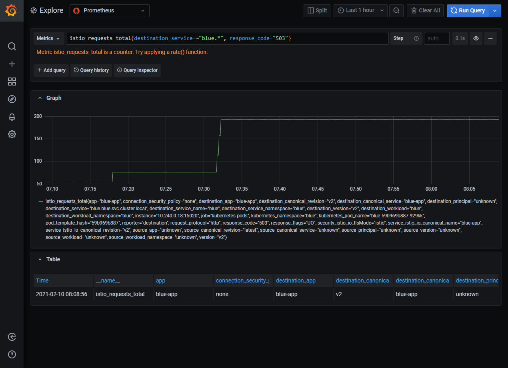

# Lab 12 - Monitoring

During this lab you will use Azure Application Insights and instrument the web application and the Web API to collect telemetry, and logging information. Also, you are going to review the existing implementation of the structured logging and health endpoints. Finally, you will introduce an actual bug and monitor the behavior of the application, and fix the bug afterwards.

Goals for this lab:
- [Create an Application Insights resource](#appinsights)
- [Configure the web application and Web API to gather telemetry and monitoring data](#configure)
- [Review structured logging and health endpoints](#review)
- [Introduce, find and fix a bug](#bug)

## <a name='appinsights'></a>Create an Application Insights resource

Go to the Azure portal and create a new Application Insights resource in the existing resource group `ContainerWorkshop`. Once created go to the overview and take note of the AppInsights instrumentation key.

Currently, you cannot [easily](https://docs.microsoft.com/en-us/cli/azure/ext/application-insights/monitor/app-insights?view=azure-cli-latest) create the AppInsights resource from the Azure CLI. It is possible to use Azure Resource Management (ARM templates) to automate the provisioning.

## <a name='configure'></a>Configure gathering of telemetry and monitoring data

Open Visual Studio and the solution for the retro gaming application. We need to specify the AppInsights instrumentation key from the previous exercise in the right places. Open the `Startup.cs` file and locate the `ConfigureTelemetry` method. The implementation adds the required services for AppInsights to start collecting telemetry. Find the location from which the instrumentation key is read.

> ##### Questions
>
> Where is the instrumentation key read from?
> Is the key to be considered a secret?
> What would be a good place to specify the key?

Go to the place where you think the key should be located and specify it there.

Repeat this for the Web API project.
Redeploy the solution. If you made changes to files, you will have to commit the code and build and release with the pipelines. If you did not change the code, it might be enough to create only a new release.

Open a browser and navigate to the web application. Refresh the page a number of times. Next, visit the AppInsights resource in the Azure portal again and go to the Application Map. View the statistics there. Also view the Live Metrics and make another set of requests. Observe the behavior of the application under these normal circumstances. You might want to look at the Kubernetes dashboard as well to get a complete impression of how the application behaves.

## <a name='review'></a>Review structured logging and health endpoints

The Web API already has structured (also known as semantic logging) and health endpoints implemented. You will review at the existing code and get an understanding of both.

First, open the `Program.cs` file and look for the call to `UseHealthChecks`. This call specifies the relative path where the health endpoint will be hosted. You can change this to be at a specific port. Use the comment at the line to change it if you want to try using a port.

Next, go to `Startup.cs` and find to the `ConfigureHealth` method. Inspect the implementation and notice how a health check is added. There is a second health check behind a feature flag. That is for there for experimenting in the next lab. Right now, the feature flag is not active and the second health check is not really added.

You can try the health endpoint by navigating to the correct URL.

```url
https://localhost:44369/health (local hosted)
https://<cluster-address>/health (Azure hosted)
```

For the semantic logging, you will implement a minimal set of code. Find the constructor of the `LeaderboardController` and add an additional argument:

```c#
public LeaderboardController(LeaderboardContext context, ILoggerFactory loggerFactory)
```

Introduce a field called `logger` of type `ILogger<LeaderboardController>`:

```c#
private readonly ILogger<LeaderboardController> logger;
```

and initialize it in the constructor:

```c#
this.logger = loggerFactory.CreateLogger<LeaderboardController>();
```

In the controller `Get` action, call the `LogInformation` method to log at the Information level:

```c#
logger.LogInformation("Retrieving score list with a limit of {SearchLimit}.", limit);
```

Notice how the name of the log message format does not resemble the name of the argument. For semantic logging, it is not necessary to match by name. Instead, the matching is done positionally.

Two main log providers know how to deal with semantic logging: Azure Application Insights and SeriLog. We will be using AppInsights again.

Finally, open the `Program.cs` file and go to the `CreateHostBuilder` method. Examine the `ConfigureLogging` to see how logging to Application Insights is configured:

```c#
.ConfigureLogging((context, builder) =>
{
   builder.AddApplicationInsights(options =>
   {
      options.IncludeScopes = true;
      options.TrackExceptionsAsExceptionTelemetry = true;
   });
})
```

Go to the Azure Portal and open the blade for the AppInsights resource you created. Refresh the home page of the Look at Live Metrics and Log Analytics to see the effects of the logging and telemetry.

## <a name='bug'></a>Introduce, find and fix a bug

With monitoring in place, you can now start to do a full outer cycle to your production cluster from your local development environment.

Create a bug by adding the following method to the `LeaderboardController` class:

```c#
private void AnalyzeLimit(int limit)
{
   // This is a demo bug, supposedly "hard" to find
   do
   {
         limit--;
   }
   while (limit != 0);
}
```
and calling it at the beginning of the `Get` method:
```c#
public async Task<ActionResult<IEnumerable<HighScore>>> Get(int limit = 10)
{
   logger.LogError("Retrieving score list with a limit of {SearchLimit}.", limit);
   AnalyzeLimit(limit);
```

Compile your changes locally. If it compiles, check in the source code and perform a build and release into your cluster. After a successful deployment, check how the website is behaving. You might want to create some load on the cluster from PowerShell:

```PowerShell
for ($i = 0 ; $i -lt 100; $i++)
{
   Invoke-WebRequest -uri http://<yourclusterip>/?limit=0
}
```

Check that there is a bug by refreshing the home page of the web application. If all is correct, the page should display without any highscores.

Use the Kubernetes dashboard, the telemetry data and the logging information to investigate what is happening. Also, trace back from the current Docker images running in production to the commits that were made in this particular release.

Fix the bug (by removing the code you added previously) by following a proper DevOps workflow:

- Create a bug work item
- Create a branch
- Fix the bug by making code changes and commiting
- Make a pull request to master
- Perform a build and release to your Kubernetes cluster
- Verify everything works and close the work item

## Monitoring Kubernetes Pods with Istio
In this chapter we will use Istio addons to visualize your Kubernetes environment.

### Getting started
1. Install Istio by following the steps outlined in chapter 'Deploying Istio' of [Lab 10 - Working with Istio on Kubernetes](Lab10-Istio.md).
2. Deploy an Istio enabled **buggy** workload (a .NET API that returns a color string) as described in chapter 'Deploying a workload' of [Lab 11 Retry and Circuit breaker with Istio](Lab11-IstioRetry-CircuitBreaker). Stop after deploying Fortio and return here.
3. Generate some traffic to the workload, by running `fortio`:
   ```
   kubectl exec -it fortio-deploy-6dc9b4d7d9-p68rg -- fortio load -c 100 -qps 10  http://blue/api/color
   ```

### Prometheus
Prometheus is an open source monitoring system and time series database. You can use Prometheus with Istio to record metrics that track the health of Istio and of applications within the service mesh. You can visualize metrics using tools like Grafana and Kiali.

Prometheus will gather telemetry from the platform and store it in a database. We can query the data using a built-in web portal. 

First, deploy Prometheus to Istio:

```
kubectl apply -f https://raw.githubusercontent.com/istio/istio/release-1.8/samples/addons/prometheus.yaml
```

Create a port forwarding from your machine to the cluster using `istioctl dashboard` and passing the name `prometheus`. This command will block the terminal, until you press `Ctrl+c`:

```
istioctl dashboard prometheus
```

In your browser, navigate to http://localhost:9090


Click on the 'Graph' tab.

Execute the query 'istio_requests_total'. Depending on how much load you generated with Fortio, you should see some statistics about the total amount of requests processed by Istio.

Try to find out why you can see two lines, while we are running just a single Pod. (It's not the sidecar...)

Run the `fortio` tool a couple of times in a different terminal, to generate some more data.

Let's zoom in on the failed responses returned by the Service named 'blue', by filtering out the successful calls. Run the following query:

```
istio_requests_total{destination_service=~"blue.*", response_code="503"}
```
You should see one line that indicates the total amount of failed requests. It should look similar to the image below, try to zoom in a little if needed, by changing the time scale to 15m:


Press `Ctrl+c` to stop the `istioctl` port forward.
### Grafana

Grafana is an open source monitoring solution that can be used to configure dashboards for Istio. You can use Grafana to monitor the health of Istio and of applications within the service mesh. Grafana will query the data that was gathered by Prometheus.

Generate some more test data:
```
kubectl exec -it fortio-deploy-6dc9b4d7d9-p68rg -- fortio load -c 100 -qps 10  http://blue/api/color
```

Add the Grafana (visualization tooling) addon to Istio:

```
kubectl apply -f https://raw.githubusercontent.com/istio/istio/release-1.8/samples/addons/grafana.yaml
```

Just like Prometheus, Grafana comes with a built-in Portal. Create a port forward to Grafana by using the `istioctl dashboard` command again, but passing `grafana` as the name:
```
istioctl dashboard grafana
```

In your browser, navigate to the Grafana portal. We will open the 'Data sources' tab, to check if the connection to Prometheus works:

```
http://localhost:3000/datasources
```


Let's see if we can query the request totals again:
Navigate to the 'Explore' tab:

```
http://localhost:3000/explore
```

Enter the following query:

```
istio_requests_total{destination_service=~"blue.*", response_code="503"}
```

It should show the same chart, as Prometheus:


The added benefit of Grafana is that you can combine data from multiple data sources. Another great thing about the Grafana addon is that it comes with a couple of built-in Istio dashboards. Also, Grafana has an auto-refresh option, so it will regularly update the charts for you.
(Grafana charts also look a lot nicer.)

In your browser, navigate to:
```
http://localhost:3000/dashboards
```
It should show you a 'folder' named Istio.

With your mouse, hover over the folder and click on 'Go to folder'


Select the dashboard named 'Istio Service Dashboard' and open the tab 'Service Workloads'. It will show information about incoming requests. Use this dashboard to see current usage of your Services in near-real time.


Go back and open the dashboard named 'Istio Performance Dashboard'. It will show information about Istio's resource consumption. Return here to investigate performance issues.


Look around in the Istio dashboards for a few minutes. See if you can find more useful charts.

Break the port forward by pressing `Ctrl+c`.


## Wrapup

In this lab you have added the first monitoring support to the application and Web API. You used Application Insights to capture telemetry of multiple Azure resources and introduced semantic logging to create rich log information.

Continue with [Lab 13 - Azure DevOps Pipelines](Lab13-AzDOPipelines.md).