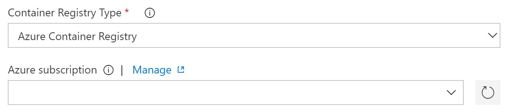

# Lab 13 - Azure DevOps Build and release pipelines

Goals for this lab:
- Create build pipeline to build images
- Create release pipeline for deploying images to registry
- Deploy images to cluster

## <a name="run"></a>Get existing application
We will start with or continue running the completed ASP.NET Core application from Visual Studio. Make sure you have cloned the Git repository, or return to [Lab 1 - Getting Started](Lab1-GettingStarted.md) to clone it now if you do not have the sources. Switch to the `master` branch by using this command :

```
git checkout master
```

> ##### Important
> Make sure you have switched to the `master` branch to use the right .NET solution.


## Prerequisites
You will need an Azure Kubernetes Service (AKS) cluster. Make sure you have completed [Lab 1 - Getting Started](Lab1-GettingStarted.md#6). Doublecheck that you have completed chapter 'Create a Kubernetes cluster'. 

You will also need an Azure Container Registry. Please visit [Lab 7 - Container registries and clusters](Lab7-RegistriesClusters.md) and review the chapter named 'Pushing images to a registry' to see how to create a new container registry.

The final step before you can get started with building pipelines, is to get access to an Azure DevOps (AZDO) account and a team project. You can use an existing AZDO account, or create a new one at [dev.azure.com ](https://dev.azure.com). 

> Make sure that you use the same user account for both Azure and Azure DevOps.

Create a new project named 'ContainerWorkshop'

After this, your cloned Git repository needs to be pushed to the AzDO project. Assuming you have your current work branch checked out, you can change the URL for the git `origin` to point to the Git repo in your Team Project by using `git remote set-url`.

```cmd
git remote set-url origin https://dev.azure.com/<your-vsts-account>/<your-teamproject>/_git/containerworkshop
```

Now push your code to the new origin, including any branches by using `git push`.
```
git push -u origin --all
```
> The URL should look similar to this: `https://xpirit@dev.azure.com/xpirit/ContainerWorkshop/_git/workshop`

You now have a private code repo inside Azure DevOps. Now let's see if we can deploy that code to Kubernetes.

### Reverting back to Github in case of disasters

In case you want to revert back to Github at some point, run this command:
```
git remote set-url origin https://github.com/XpiritBV/ContainerWorkshop-Code.git
```
> Don't run this as part of the lab, only if you want to start over.

## Create build pipelines

Login to your AZDO account and switch to the `ContainerWorkshop` team project. Go to `Repos, Files` and verify that your source code is there. Switch to `Pipelines, Build` and create a new definition for a Build pipeline. 

You will get a question stating "Where is your code?". 
Pick `Azure Repos Git`, select the proper repository, and the master branch of that Git repository.


From the available templates select the `Starter pipeline` template, so we can start adding tasks.


After completing that step, you should see a YAML pipeline that looks similar to this:

```yaml
# Starter pipeline
# Start with a minimal pipeline that you can customize to build and deploy your code.
# Add steps that build, run tests, deploy, and more:
# https://aka.ms/yaml

trigger:
- main

pool:
  vmImage: 'ubuntu-latest'

steps:
- script: echo Hello, world!
  displayName: 'Run a one-line script'

- script: |
    echo Add other tasks to build, test, and deploy your project.
    echo See https://aka.ms/yaml
  displayName: 'Run a multi-line script'
```

### Adding tasks to the pipeline

Remove the two generated `script` steps, as they are useless to us.

You will build your application code using containers with the Docker composition file.

Click on 'Show Assistant' to display the toolbox.

> Make sure your cursor is on line 13 of the YAML file before the next step.  

In the toolbox, select a task named 'Docker Compose'.

Leave the container registry type 'Azure Container Registry'

Select the Azure subscription that holds your Container Registry.

Click on 'Authorize' to create a Service Connection that can access your Container Registry.

Leave the value of the 'Docker Compose File' as is.


//////////////////LD: stopped at this point

Enter `build` as the Command that will execute for `Run a Docker Compose command`.

Select the pipeline at the top again to fill in all linked properties, as described below.

Notice that this template assumes that you will use an Azure Container Registry. You can use one if you created it before. If not, refer back to [Lab 7](Lab7-RegistriesClusters.md) to read how to create the container registry.

You need to create a connection between Azure DevOps and your Azure subscription. Open the details of the first task, locate the property for the `Azure subscription` and add your subscription details.



After the registration of your subscription is completed, select your container registry from the dropdown below.

Notice how the Docker Compose file is already preselected to be `docker-compose.yml`. This aligns with the previous design decision to only include actual images relevant to the application components to be in this Docker Compose file.

Further down, specify an environment variable for the registry, so the created images have the correct fully qualified name:

```cmd
DOCKER_REGISTRY=<registry>.azurecr.io/
```

You can specify additional Docker Compose files. Remove the reference to file `docker-compose.ci.yml` from the other three Docker Compose tasks.

Link the environment variables for all four Docker Compose tasks.

This completes your first task to build your sources. The other 3 tasks 

In the `Copy Files` task set the `Contents` property to this file:
```
**/gamingwebapp.k8s-dep.yaml
```
In the last task for `Publish Artifacts`, specify `artifacts` as the Artifact name.

Save the build definition and queue a new build. Check whether the build completes successfully and fix any errors that might occur. Inspect the build artifacts, notice that there are 2 artifacts there, the Kubernetes manifest and a modified Docker compose file. Download the `docker-compose.yml` file and open it. It should resemble this:

```yaml
services:
  gamingwebapp:
    build:
      context: ./src/RetroGaming2017/src/Applications/GamingWebApp
      dockerfile: Dockerfile
    image: <your-registry>.azurecr.io/gamingwebapp@sha256:e198caef40f1e886c3a70db008a69aa9995dc00301a035867757aad9560d9088
  leaderboard.webapi:
    build:
      context: ./src/RetroGaming2017/src/Services/Leaderboard.WebAPI
      dockerfile: Dockerfile
    image: <your-registry>.azurecr.io/leaderboard.webapi@sha256:40b83b74b7e6c5a06da2adbaf5d99aec64cde63c16a66956091cbddb93349f86
version: '3.0'
```

Notice how the image names have an appended SHA256 digest value to confirm their identity in the registry. This file could be used to release the images into the cluster later on.

When your build has completed without errors, you should find that your container registry has a new image that is tagged with the build number. Verify this at your registry from the Azure portal.

If this all is working correctly you are ready to release the new image to the cluster.

## Release new images to cluster

With the Docker images located in the registry, you can release these to your cluster by instructing it deploy the composition defined in the Kubernetes manifest file. This file `gamingwebapp.k8s-dep.yaml` is now part of the build artifacts. This file contains various tokens that need to be replaced by actual values, such as the build ID and sensitive data.

Create a new release definition from the Releases tab in AZDO. Choose an `Deploy to a Kubernetes cluster` and name the first stage `Production`.
Add a new artifact and select the previously made pipeline as the `Source`.

Select the tasks in the Production environment from the link `1 job, 1 task` link. Navigate to its empty task list and set the Agent selection to `Hosted VS2017` under the Agent job.

Next, select the `Deploy to Kubernetes` task and create a connection to your cluster with the `+ New` button. A modal dialog pops up. Give the connection a name, such as `ContainerWorkshopCluster`.
Finally, you need to get the KubeConfig from your Kubernetes cluster. Run the command:
```
az aks get-credentials --name ContainerWorkshopCluster --resource-group ContainerWorkshop -a --file -
```
This will dump the configuration to the output window. Copy it in the dialog of AZDO. Check the checkbox for `Accept untrusted certificates`. Verify the connection. If all is well, close the dialog by clicking `OK`.

Set the property for Namespace to `$(namespace)`.

Check the checkbox Use Configuration Files and choose the `gamingwebapp.k8s-dep.yaml` file from the artifacts.

Finally, you are going to add a number of pipeline variables to serve as the replacement values in the deployment manifest and the namespace in the cluster to which will be deployed.

Add a `Replace Tokens` task as the first task of the release pipeline. You might have to download it from the Marketplace first. It is a task by Guillaume Rouchon and you can find more information [here](https://github.com/qetza/vsts-replacetokens-task#readme).

Name the new task `Replace tokens in manifest` and set the root directory to `$(System.DefaultWorkingDirectory)/_RetroGaming2019CIBuild/docker-compose`. Specify `deployment/gamingwebapp.k8s-dep.yaml` as the Target Files property. Set the Prefix and Suffix to __.

Here is the list of variables you need to create:

Name | Value (example)
--- | ---
containerregistry | <your-registry> (e.g. 'containerworkshopregistry.azurecr.io' or else 'xpiritbv')
namespace | workshop
aikey | (empty)
keyvaultclientid | ca5a0aeb-0eec-49a3-a527-a29e2524fa5b
keyvaultclientsecret | 45gSC1AZ3lkaSUHpsqFfL/+vddtbshVs1umC0IZWsVY=
keyvaulturl | https://Containerworkshop.vault.azure.net

**If you did Lab 8 before:**
Each of these variable names should be familiar and known to you (except the `aikey`, which remains empty for now). For the key vault related values (e.g. `keyvaultclientid`), use the values from the [Security Lab](Lab8-Security.md#adding-support-for-azure-key-vault).
Some of these will be used later.
You can remove the `volumeMounts` and `spec` from the `dep-leaderboardwebapi` deployment, now that the values in it are coming from the pipeline variables and the environment variables. 

### Try it out
Try your release pipeline by creating a new release. Check whether the release is successful and fix any errors. You might want to check the Kubernetes dashboard to see if the cluster deployment succeeded as well. 

## Wrapup

In this lab you have created a build pipeline to build and push the container images for your .NET solution. You used a release pipeline to deploy the composition to a cluster in Azure.
