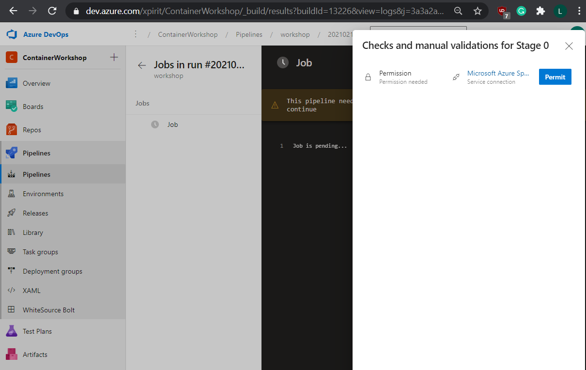
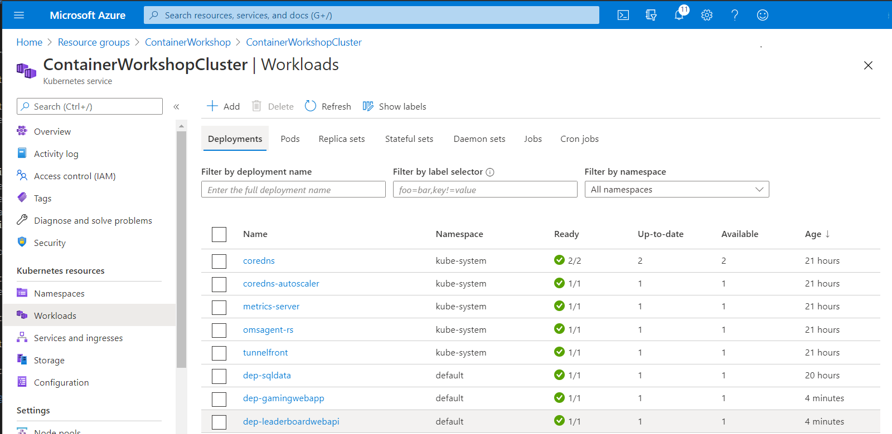
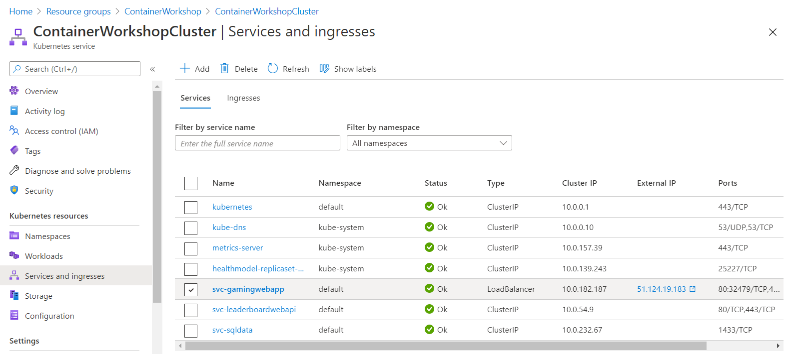

# Lab 13 - Azure DevOps Build and release pipelines

Goals for this lab:
- Create build pipeline to build images
- Create release pipeline for deploying images to registry
- Deploy images to cluster

## <a name="run"></a>Get existing application
We will start with or continue running the completed ASP.NET Core application from Visual Studio. Make sure you have cloned the Git repository, or return to [Lab 1 - Getting Started](Lab1-GettingStarted.md) to clone it now if you do not have the sources. Switch to the `master` branch by using this command :

```
git checkout master
```

> ##### Important
> Make sure you have switched to the `master` branch to use the right .NET solution.


## Prerequisites
You will need an Azure Kubernetes Service (AKS) cluster. Make sure you have completed [Lab 1 - Getting Started](Lab1-GettingStarted.md#6). Doublecheck that you have completed chapter 'Create a Kubernetes cluster'. 

You will also need an Azure Container Registry. Please visit [Lab 7 - Container registries and clusters](Lab7-RegistriesClusters.md) and review the chapter named 'Pushing images to a registry' to see how to create a new container registry.

The final step before you can get started with building pipelines, is to get access to an Azure DevOps (AZDO) account and a team project. You can use an existing AZDO account, or create a new one at [dev.azure.com ](https://dev.azure.com). 

> Make sure that you use the same user account for both Azure and Azure DevOps.

Create a new project named 'ContainerWorkshop'

After this, your cloned Git repository needs to be pushed to the AzDO project. Assuming you have your current work branch checked out, you can change the URL for the git `origin` to point to the Git repo in your Team Project by using `git remote set-url`.

```cmd
git remote set-url origin https://dev.azure.com/<your-vsts-account>/<your-teamproject>/_git/containerworkshop
```

Now push your code to the new origin, including any branches by using `git push`.
```
git push -u origin --all
```
> The URL should look similar to this: `https://xpirit@dev.azure.com/xpirit/ContainerWorkshop/_git/workshop`

You now have a private code repo inside Azure DevOps. Now let's see if we can deploy that code to Kubernetes.

### Reverting back to Github in case of disasters

In case you want to revert back to Github at some point, run this command:
```
git remote set-url origin https://github.com/XpiritBV/ContainerWorkshop-Code.git
```
> Don't run this as part of the lab, only if you want to start over.

## Create build pipelines

Login to your AZDO account and switch to the `ContainerWorkshop` team project. Go to `Repos, Files` and verify that your source code is there. Switch to `Pipelines, Build` and create a new definition for a Build pipeline. 

You will get a question stating "Where is your code?". 
Pick `Azure Repos Git`, select the proper repository, and the master branch of that Git repository.


From the available templates select the `Starter pipeline` template, so we can start adding tasks.


After completing that step, you should see a YAML pipeline that looks similar to this:

```yaml
# Starter pipeline
# Start with a minimal pipeline that you can customize to build and deploy your code.
# Add steps that build, run tests, deploy, and more:
# https://aka.ms/yaml

trigger:
- main

pool:
  vmImage: 'ubuntu-latest'

steps:
- script: echo Hello, world!
  displayName: 'Run a one-line script'

- script: |
    echo Add other tasks to build, test, and deploy your project.
    echo See https://aka.ms/yaml
  displayName: 'Run a multi-line script'
```

### Adding a Docker-Compose build task to the pipeline

Remove the two generated `script` steps, as they are useless to us.

You will build your application code using containers with the Docker composition file.

Click on 'Show assistant' to display the toolbox.

> Make sure your cursor is on line 13 of the YAML file before the next step.  

In the toolbox, select a task named 'Docker Compose'.

Leave the container registry type 'Azure Container Registry'

Select the Azure subscription that holds your Container Registry.

Click on 'Authorize' to create a Service Connection that can access your Container Registry.

Leave the value of the 'Docker Compose File' as is. The docker-compose.yml file is in the root of the repo.

At the 'Command', enter 'build', so the build agent will execute a `docker-compose build` command, to compile sources and generate container images for both 'GamingWebApp' and 'LeaderboardWebAPI' by using the 'Dockerfile' files in each folder.


Click on the 'Add' button.
In the resulting yaml, add an additional attribute called `displayName` with value `Docker Compose Build`.

It should look very similar to this:

```yaml
trigger:
- main

pool:
  vmImage: 'ubuntu-latest'

steps:
- task: DockerCompose@0
  displayName: Docker Compose Build
  inputs:
    containerregistrytype: 'Azure Container Registry'
    azureSubscription: 'Microsoft Azure (00000000-6c99-40d9-8390-00000000)'
    azureContainerRegistry: '{"loginServer":"containerworkshopregistry-on.azurecr.io", "id" : "/subscriptions/00000000-6c99-40d9-8390-00000000/resourceGroups/containerworkshopregistry/providers/Microsoft.ContainerRegistry/registries/containerworkshopregistry"}'
    dockerComposeFile: '**/docker-compose.yml'
    action: 'Run a Docker Compose command'
    dockerComposeCommand: 'build'
```
### Adding a Docker-Compose push task to the pipeline

We now have container images on the build agent. If we want to run containers on Kubernetes, we will have to upload them into a container registry. 

Copy and paste the previous task, as a shortcut. Hover over the `settings` element that appears above the task definition, and click on it to edit. 

Change the value of 'Command' into 'push', and click on the 'Add' button to update the task.
Update the display name, so your second task looks like this:

```yaml
- task: DockerCompose@0
  displayName: Docker Compose Push
  inputs:
    containerregistrytype: 'Azure Container Registry'
    azureSubscription: 'Microsoft Azure (00000000-6c99-40d9-8390-00000000)'
    azureContainerRegistry: '{"loginServer":"containerworkshopregistry-on.azurecr.io", "id" : "/subscriptions/00000000-6c99-40d9-8390-00000000/resourceGroups/containerworkshopregistry/providers/Microsoft.ContainerRegistry/registries/containerworkshopregistry"}'
    dockerComposeFile: '**/docker-compose.yml'
    action: 'Run a Docker Compose command'
    dockerComposeCommand: 'push'
```

### Running the pipeline for the first time

Click on 'Save and run', to save your build pipeline definition file and queue the build to run on an agent. Click on the job named 'job1' to see details.


At this point, you might need to authorize the pipeline to use a Service Connection to interact with Azure.



Click on the 'Permit' button to continue.

View the output of the build pipeline to monitor progress.


After a few minutes, you should see that your build has completed. At that point, you should have 2 brand new container images in your Container Registry.

### Deploying to Azure Kubernetes Service

After doing lab 6, you know that we can deploy workloads to Kubernetes by using `kubectl apply` and passing in a filename.

We have created such a file for you in the code repo. It's in the 'deployment' folder named 'gamingwebapp.k8s-static.yaml'.

Open the file and examine the contents. Please note that it contains a few placeholders, marked with two underscores `__` as prefix and postfix. For example, it contains the name of the container registry to use for images.

> We need to pass in these values on the build agent. To do this in real life, we would use a Token replacement task to replace these values with environment specific values.
For now, you can just replace them with your single environment.

| Line          | Placeholder  | Value      |
| ------------- |:-------------|:---------- |
| 77            | `image: __containerregistry__/gamingwebapp:demo` | `image: containerworkshopregistry-on.azurecr.io/gamingwebapp:latest` |
| 118           | `image: __containerregistry__/leaderboardwebapi:demo`| `image: containerworkshopregistry-on.azurecr.io/leaderboardwebapi:latest` | 

Save the file under a different name, e.g. 'gamingwebapp.k8s-test.yaml'.
Commit and push the changes using the `git` cli:

```
git add .
git commit -m "add test deployment file"
git pull
git push
```

We have now pushed a copy of the Kubernetes template file to Azure DevOps, so we can run our pipeline using this file later.

As we might not have configured a Managed Identity with this cluster yet, we will quickly do that now.

> Make sure to use a different file name and remember the new name.

#### Connecting AKS to ACR

> If you have completed [Lab 7](Lab7-RegistriesClusters.md) and left the connection between your cluster and the container registry in place, you can skip this chapter.

To get the resource Id for your container registry, run `az acr show`:

```json
az acr show --resource-group ContainerWorkshop --name <registry>

{
  "adminUserEnabled": false,
  "creationDate": "2019-04-23T06:42:10.403448+00:00",
  "dataEndpointEnabled": false,
  "dataEndpointHostNames": [],
  "encryption": {
    "keyVaultProperties": null,
    "status": "disabled"
  },
  "id": "/subscriptions/00000000-6c99-40d9-8390-00000000/resourceGroups/containerworkshop/providers/Microsoft.ContainerRegistry/registries/containerworkshopregistry",
```

Run the `az aks update` command to connect an existing AKS cluster to an existing Azure Container Registry, passing in the resource Id of the registry:
```
registryResourceId=/subscriptions/<subscriptionid>/resourceGroups/ContainerWorkshop/providers/Microsoft.ContainerRegistry/registries/$registryName

az aks update --name ContainerWorkshopCluster --resource-group ContainerWorkshop --attach-acr <registry ResourceId>
```

This operation takes a few seconds to complete.

### Connecting to AKS from the build agent

To deploy our yaml file to Kubernetes, we will run `kubectl` from an Azure DevOps task.

In your browser, on the page that displays the build results, navigate back using the arrow pointing leftward. Click on the button with 3 vertical dots in the top right corner. 

Select 'Edit pipeline'


In the toolbox, click on the 'Deploy to Kubernetes' task.

#### Creating a new Service Connection to AKS

The Kubernetes deployment task requires an existing service connection to Kubernetes. 
Let's see if we can create one.

Press `Ctrl` and click on the 'Project Settings' button in the bottom left corner, to navigate to the project settings page.

Click on 'Service Connections'

Click on 'New Service Connection'

From the list, select 'Kubernetes'

On the next screen, select the Azure subscription that holds the AKS cluster.

Select your 'ContainerWorkshop' cluster

Select the namespace 'default'

Below 'Service connection name', type 'ContainerWorkshopServiceConnection'

Make sure the check for 'Grant access permissions to all pipelines' is checked

Click on the 'Save' button

Close the settings tab to return to your pipeline definition

#### Adding the task to the pipeline

You should now be back on the browser tab to edit your pipeline definition.

Refresh the page, so your new Service Connection will show.

In the yaml build definition, put the cursor on a clear line on the bottom. (e.g. line 33)

In the toolbox, click on the 'Deploy to Kubernetes' task again, this time you should be able to select your new service connection.

Use these values, without the quotes:

Action: 'deploy'
Kubernetes service connection: 'ContainerWorkshopServiceConnection'
Namespace: 'default'
Strategy: 'none'
Manifests: '$(Build.SourcesDirectory)/deployment/gamingwebapp.k8s-test.yaml'

> Note that we're using the file we updated and pushed earlier.

Click on the 'Add' button, to add the yaml task to the pipeline. Again, add a readable description like `displayName: AKS Deploy`.

Click on the 'Save' button, and 'Save' again

Next, click on the 'Run' button that appears after that, and 'Run' again to queue a new build.

Click on the Job named 'Job' to monitor progress.


When the pipeline had completed, open your cluster on the Azure portal. Go to the Workloads tab and see if the Pods have deployed successfully.




Spend some time on the Azure Portal to see how you can interact with your cluster.
It offers great insights into your workloads.

Open the 'Services and ingresses' tab. It should show a Service named 'svc-gamingwebapp' of type 'LoadBalancer'. That line should also contain a public IP address (in the screenshot, it has the value '51.1124.19.183').



Click on the IP address. The Service is connected (using a `selector`) to your Gaming WebApp Pod, so your browser should now load the frontend application.

You have now deployed your code into a production environment.

### Continuous integration

In Azure DevOps, please examine the yaml pipeline again. Note that the build trigger points to a branch name `main`. However, our branch still has the old name `master`. Change the yaml, so the pipeline will run for every commit on master.

```yaml
trigger:
- main
```

## Improvements

This pipeline is the absolute minimal setup that you can create. There's room for improvements.

- The ability to target different environments (staging, production).
- Using Managed Identity to connect to Azure Key Vault to store the connection string.
- Running multiple Pods of the same type, for high availability.
- Using an external SQL Server database, e.g. in Azure.

Using the knowledge from the other Labs, you should be able to add these features.

### Additional improvements

Additional improvements that you might make include:

- Adding multiple build [stages](https://docs.microsoft.com/en-us/azure/devops/pipelines/process/stages?view=azure-devops&tabs=yaml#specify-stages), to deploy updates to environments progressively.
- Running a build, with tests that runs for pull requests, but does not deploy to Kubernetes by using [conditions](https://docs.microsoft.com/en-us/azure/devops/pipelines/process/stages?view=azure-devops&tabs=yaml#conditions).
- Adding [approval](https://docs.microsoft.com/en-us/azure/devops/pipelines/process/approvals?view=azure-devops&tabs=check-pass) steps to the pipeline to require human approval before deploying to a specific environment.
- Creating a [Helm package](https://andrewlock.net/deploying-asp-net-core-applications-to-kubernetes-part-4-creating-a-helm-chart-for-an-aspnetcore-app/) to simplify deployment across different environments.

## Wrapup

In this lab you have created a build pipeline to build and push the container images for your .NET solution. You used a release pipeline to deploy the composition to a cluster in Azure.

Congratulations, you can now do Docker DevOps style!
