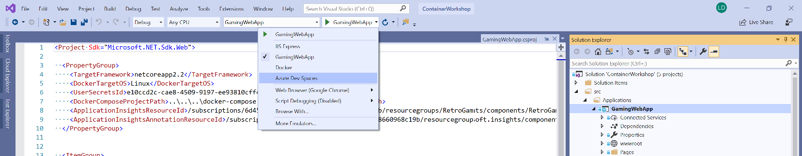

# Lab 14 Azure Dev Spaces

During this lab, you will become familiar with [Azure Dev Spaces]().

Azure Dev Spaces is a developer assisting technology that allows them to deploy, test and debug software directly on an AKS cluster without requiring committed code or adding images to the container registry. 
Similar to Istio, it works by injecting 3 sidecar-containers together with your application inside a Pod. Dev Spaces works inside Namespaces labeled `azds.io/space=true`:

1. devspaces-proxy : Manages all TCP network traffic in and out of the Pod, and route HTTP calls to child spaces if needed. 
2. devspaces-proxy-init: Bootstraps networking rules inside the application container, ensuring all TCP traffic is routed through the devspaces-proxy.
3. devspaces-build container: Compiles software, builds container images, to be run locally.  

Dev Spaces works by configuring Ingress with a custom DNS entry and routing rules for every space. Spaces can be nested, and the most specific match will be selected, when routing traffic to Pods.

Goals for this lab:
- Deploy a Dev Spaces -enabled solution
- Gain a **basic** understanding Dev Spaces

## <a name='start'></a>Inspect your environment
We will debug an application using Visual Studio. Make sure you installed it, return to [Lab 1 - Getting Started](Lab1-GettingStarted#start) if you do not have it installed. 
You will need an [AKS cluster](Lab1-GettingStarted#5) as well.
Also, make sure you have [this](https://github.com/XpiritBV/ContainerWorkshop2019Docs) repository cloned, so you have a copy of the Kubernetes template files on your machine.

We will enable Dev Spaces for the [demo project](https://github.com/XpiritBV/ContainerWorkshop2018), so make sure you also have cloned that repository, checked out to the 'devspaces' branch.

1. In VS Code, in the terminal, move to the repository directory named 'resources/lab14'.

## <a name='tiller'></a>Deploy Helm with Tiller
Ensure that Tiller is installed, with rights to manage the cluster.

> Note that using Helm is simple, but the default settings, as used here, are not secure. In real life, you should use Helm without Tiller. For demo purposes, it works fine.

Create a Tiller ServiceAccount with cluster administrator rights, and deploy Helm with Tiller temporarily:

```
kubectl apply -f 01-TillerSA.yaml
helm init --service-account tiller --wait
```

## <a name='devspac'></a>Deploy Azure Dev Spaces

Run the following command to enable Dev Spaces and install the CLI. Make sure to accept the license terms:

```
az aks use-dev-spaces -g ContainerWorkshop -n ContainerWorkshopCluster --space default --yes

The installed extension 'dev-spaces-preview' is in preview.
Installing Dev Spaces (Preview) commands...
Installing Azure Dev Spaces client components...
The following dependencies will be installed: xdg-utils, unzip, .NET Core Runtime

By continuing, you agree to the Microsoft Software License Terms (https://aka.ms/azds-LicenseTerms) and Microsoft Privacy Statement (https://aka.ms/privacystatement). Do you want to continue? (Y/n): y
```

> Note that this operation takes a while.
> Replace the values for resource group `g` and cluster name `n` with your own cluster details if needed.
> To enable Dev Spaces with tools already installed, type `azds controller create --name AksDevSpacesCtl --target-name ContainerWorkshopCluster --resource-group ContainerWorkshop`.

## <a name='deploy-workload'></a> Deploying a baseline workload

It is now time to deploy the baseline workload to the cluster. For this demo, we'll use the tool `kompose` to deploy a docker-compose file to Kubernetes without modifications. First, [download](https://kubernetes.io/docs/tasks/configure-pod-container/translate-compose-kubernetes/#install-kompose) the tool.

Second, create and select the 'baseline' Dev Space, without a parent:

```
azds space select -n baseline
Dev space 'baseline' does not exist and will be created.

Select a parent dev space or Kubernetes namespace to use as a parent dev space.
 [0] <none>
 [1] default
 [2] dev
 [3] kube-node-lease
Type a number: 0

Creating and selecting dev space 'baseline'...2s
```

Followed by:

```
kubectl config set-context --current --namespace=baseline
```

Finally, use the following command to deploy the demo solution:

```
kompose up -f docker-compose.remote.yml
```
> Note that it can take quite some time (up to minutes) for SQL Server to start and for the database to be created.

In VS Code, right click on the `gamingwebapp` pod and open up a port-forward, from local port 80 to remote port 80 to test the application.
In your browser, navigate to the url: `http://localhost/`.
Make sure the 'Pacman' high score is displayed; this indicates that all system components (web app, web api and database) are running.
Terminate the port forward.

> Note: sometimes it helps to kill the LeaderBoard WebAPI Pod to get things going.

### Configure Dev Spaces for project

Delete the Deployment named 'gamingwebapp', this will be replaced with a 'Dev Spaces'-enabled version.

Modify the Web App for use of Dev Spaces.
In the terminal of VS Code, type:

```
cd <your-repo-folder>\ContainerWorkshop2018\src\Applications\GamingWebApp
azds prep --public
```

One of the results, is a new Docker file, named `\ContainerWorkshop2018\src\Applications\GamingWebApp\Dockerfile.develop`
Open this file and on line 5, add an environment variable, that specifies where the Web API can be found:

```
ENV LeaderboardApiOptions__BaseUrl=http://leaderboardwebapi.baseline
```

And change the default port to 14069, by replacing the value for `ASPNETCORE_URLS`:

```
ENV ASPNETCORE_URLS=http://+:14069
```

### Run the Web App

Run the following commands to start Azure Dev Spaces from the CLI:

```
kubectl config set-context --current --namespace=baseline
azds up
```
This command will generate a lot of logging. Within the output, you'll find a note that your `gamingwebapp` Service was configured in an `Ingress` also named `gamingwebapp`.

Check the status of all URLs associated with your Dev Spaces services:

```
azds list-uris
```

After some time, you'll be able to navigate to that url in your browser, e.g.:
http://baseline.gamingwebapp.p4v88vkr7c.weu.azds.io/

You should see the Pacman high score again.

At this point in time we have replaced our Gaming Web App front-end, with a Dev Spaces enabled version. We can now start running additional copies of the front-end, by adding additional Dev Spaces.


## <a name='debug'></a>Debugging the GamingWebApp
In Visual Studio 2017 or 2019, open the [ContainerWorkshop](https://github.com/XpiritBV/ContainerWorkshop2018) solution.
Make sure that the GamingWebApp project is configured as the startup project.
Pull down the hosting environments dropdown and select Azure Dev Spaces from the list.



This should show a pop-up that allows you to select the cluster and Namespace you have provisioned for Dev Spaces earlier. 
**Make sure to allow public access.**

Press F5 to deploy the project and attach a remote debugger.
Place a breakpoint inside the file `IndexModel.cs` on line 32. Refresh the page. If all works well, you should now see your breakpoint being hit.
You are now debugging code that runs inside AKS, without the need to mock the calls to the Web API.


## Debugging the Web API

Create a new Dev Space, called 'dev', choose 'baseline' as its parent:

```
azds space select -n dev

Dev space 'dev' does not exist and will be created.

Select a parent dev space or Kubernetes namespace to use as a parent dev space.
 [0] <none>
 [1] default
 [2] baseline
 [3] kube-node-lease
Type a number: 3

Creating and selecting dev space baseline/dev'...2s
```

Run this command again, to display the new endpoint URL:
```
azds list-uris
```

Modify the Web API to enable it for Dev Spaces in the same way as the Web App, except that the Web API must not have a public endpoint:

```
cd <your-repo-folder>\ContainerWorkshop2018\src\Services\Leaderboard.WebAPI
azds prep
```
Make sure the Web API has a SQL Server to work with, by changing the connection string to SQL Server in the `appsettings.json` file:

``` json
  "ConnectionStrings": {
    "LeaderboardContext": "Server=sql.baseline;Database=Leaderboard;User Id=sa;Password=Pass@word;Trusted_Connection=False;"
  }
```

Deploy the Web API:

```
kubectl config set-context --current --namespace=dev
azds up
```

## <a name='clean'></a>Cleaning up

Remove Azure Dev Spaces support by using the Azure Portal.
Undo pending changes to the 'devspaces' branch.

Remove the Dev Spaces:

```
azds space remove dev
azds space remove baseline
```

Remove the Kubernetes Namespaces:
```
kubectl delete ns dev
kubectl delete ns baseline
```
