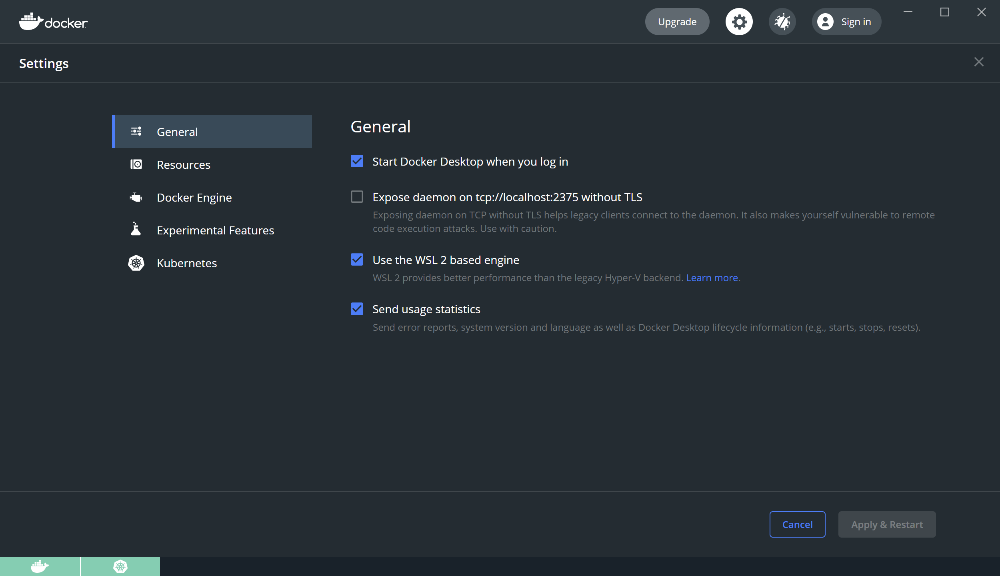
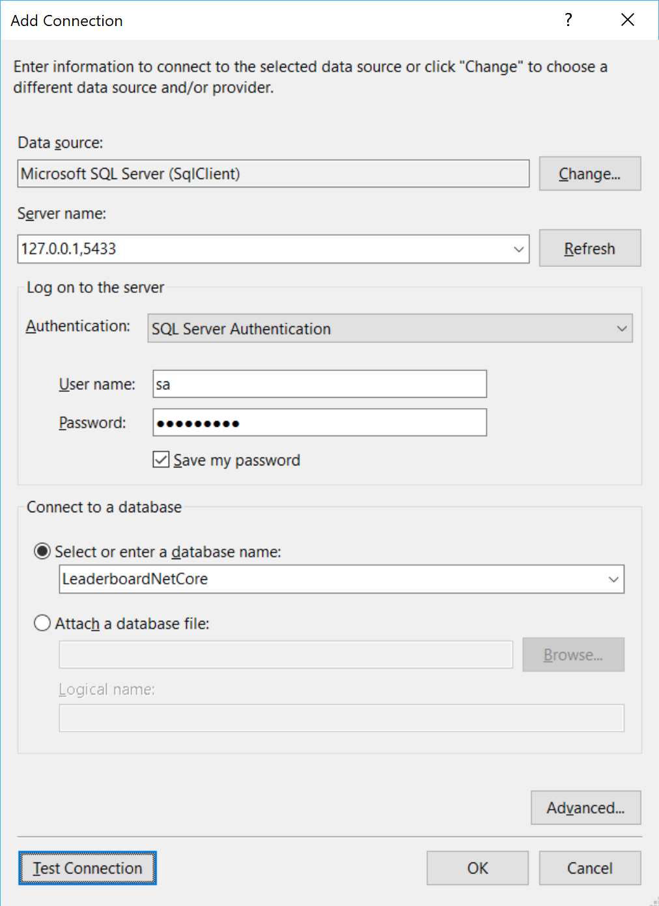

# Lab 2 - Docker 101

In this lab you will become more familiar with the Docker command-line interface (CLI). 

Goals for this lab: 
- [Inspect Docker environment on local machine](#inspect)
- [Manage container images and instances](#manage)
- [Working with container images](#working)

## <a name="inspect"></a>Inspect your Docker environment
Let's check whether your Docker Desktop Community Edition tooling is correctly set up. Also, you might need to get familiar with the Docker tooling.

You should see the Docker tooling running. On Windows, you can check this by looking for a tray icon like this:


If you cannot find the Docker icon in the tray, you might need to start the Docker tooling:

```cmd
C:\Program Files\Docker\Docker\Docker for Windows.exe
```

After starting the Docker tooling you should see the following dialog:



Start a Developer Command Prompt and run the following commands:

```cmd
docker --version
docker version
docker info
docker images
```
Verify that your installation functions correctly. You should get see the current version of the tooling and information on the client and server. The output for the first two commands should be similar to the following.

Tooling version:
```
Docker version 18.09.2, build 6247962
```

Client and server information:
```
Client: Docker Engine - Community
 Version:           18.09.2
 API version:       1.39
 Go version:        go1.10.8
 Git commit:        6247962
 Built:             Sun Feb 10 04:12:31 2019
 OS/Arch:           windows/amd64
 Experimental:      false

Server: Docker Engine - Community
 Engine:
  Version:          18.09.2
  API version:      1.39 (minimum version 1.12)
  Go version:       go1.10.6
  Git commit:       6247962
  Built:            Sun Feb 10 04:13:06 2019
  OS/Arch:          linux/amd64
  Experimental:     false
 Kubernetes:
  Version:          v1.10.11
  StackAPI:         v1beta2
```

If the Engine does not report `OS/Arch` as `linux/amd64` but `windows/amd64` instead, it means that you are running Windows containers at the moment. Run the following command to switch to Linux:
```
"c:\Program Files\Docker\Docker\DockerCli.exe" -SwitchDaemon
```

## <a name="manage"></a>Managing container instances
Let's see whether you can start some container instances. The categorical sample is "Hello World". Start a container that should run if everything is configured correctly. From a command prompt, run the following command:
```
docker run hello-world
```
This should output a message that starts with the following:
```
Hello from Docker!
This message shows that your installation appears to be working correctly.

To generate this message, Docker took the following steps:
 1. The Docker client contacted the Docker daemon.
 2. The Docker daemon pulled the "hello-world" image from the Docker Hub.
 3. The Docker daemon created a new container from that image which runs the
    executable that produces the output you are currently reading.
 4. The Docker daemon streamed that output to the Docker client, which sent it
    to your terminal.
```
Run `docker ps` to see if there are any running container instances. It might return an empty result:
```
CONTAINER ID        IMAGE               COMMAND             CREATED             STATUS              PORTS               NAMES
```
This is because the `hello-world` container instance has already stopped after producing the console output. To see stopped containers change the previous docker command to, use `docker ps -a` to output all container instances, running and stopped.

Next, start a new container with:
```
docker run -d -p 9000:9000 -v /var/run/docker.sock:/var/run/docker.sock -v /opt/portainer:/data portainer/portainer
```
Navigate to http://localhost:9000 and create a login for your local machine. Choose to manage the local machine. The management UI might come in useful to manage Docker on your machine.

Return to your command prompt and search the Docker Hub for public images. Try searching for `ngingx` which is an HTTP and reverse proxy server.
```
docker search nginx
docker pull nginx
docker run -it --name docker-nginx -p 8090:80 nginx
```

The last command seems to block. That's okay. Navigate to http://localhost:8090. You will notice that the output of the nginx container is now filling the console. The prompt is missing. This is because you are now attached to the container. To detach use the key combination `Ctrl+P, Ctrl+Q` to detach from the container and return to the prompt.
Inspecting the running containers with `docker ps`, you should find that the nginx container is still running.

Next, start a container to run an instance of SQL Server on Linux. 
The image for SQL Server for Linux is located in the Docker Store, since it is an official image. Navigate to https://hub.docker.com and search for SQL Server there. Pull the image when you found its name:
```
docker pull mcr.microsoft.com/mssql/server:2017-latest-ubuntu
```

Use the command:
```
docker run -e ACCEPT_EULA=Y -e MSSQL_PID=Developer -e SA_PASSWORD="Pass@word" --name sqldocker -p 5433:1433 -d mcr.microsoft.com/mssql/server:2017-CU8-ubuntu
```
The SQL Server container is started detached, so it will not show any output other than the container ID:
```
70e944041df92c7e5c12217e98683a11f85eb480288cacc2b50888504366b0af
```
You can refer to this container by its ID or its name `sqldocker`. You do not have to specify the entire container ID for commands with the Docker CLI. It is sufficient to provide enough characters from the start to give a unique match. In the example above this would be `7` or `70` or `70e`, depending on the IDs of other containers.

You can still examine the output of the container even though it is detached from the console. Simply run `docker logs <container-id>`, substituting the ID of the container, like so:
```
docker logs 70e
```
Start Visual Studio and examine the contents of the master database by adding a Data Connection in the Server Explorer. The database connection details are:
- Server: 127.0.0.1,5433 (notice the comma instead of a colon)
- Username: sa
- Password: Pass@word
- Database instance: master



Inspect the running containers again with `docker ps`. 

Stop and remove the `nginx` container with these commands:
```
docker stop docker-nginx
docker ps -a
docker rm docker-nginx
```

Do the same for the `hello-world` container by using its container ID or the generated two-part name, which is something like `loving_newton`.

*Note that you can specify `--rm` with the `docker run` command to have the container automatically deleted when it exits.*

## <a name="working"></a>Working with container images
By running the examples above you will have downloaded some container images. You can see which ones are available on your machine by the following command:
```
docker images
```
Remove the image `hello-world`:
``` 
docker rmi hello-world
```

## State
You have already seen that containers support network connectivity. They also support disk operations. However, any data written to disk inside a container is only visible from within the container. It also shares the lifecycle of the container. This means that the data is lost when the container is deleted. There is a way to persist files generated by container. You do this by having the container write to a `volume`. A volume is a file or folder that exists outside of the container, for example on the host or on a network share. By storing files in volumes, they can have a lifecycle that is not coupled that of the container; files remain and can be used by consecutive container instances.

## Wrapup
You have just learned some of the basic commands in the Docker CLI to manage both container instances and images. There is a lot more to discover with Docker commands, but you will encounter this during the rest of the labs.

Keep the container with the SQL Server developer instance running, as we will need it in the next lab.

Continue with [Lab 3 - Dockerizing .NET Core](Lab3-DockerizingNETCore.md).
