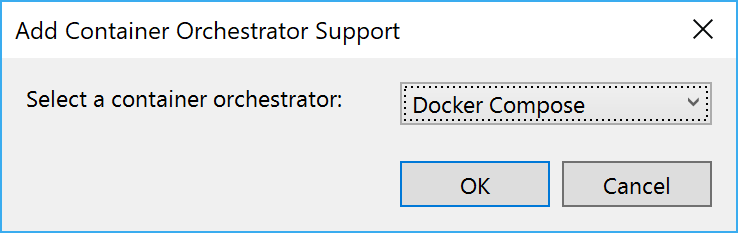
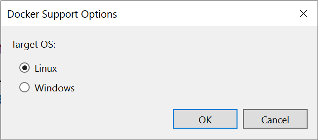

# Lab 3 - Dockerizing a .NET Core application

During this lab you will take an existing application and port it to use Docker containers.

Goals for this lab:
- [Run existing application](#run)
- [Add Docker support to .NET Core application](#add)
- [Run and debug applications from containers](#debug)
- [Build container images](#build)
- [Running SQL Server in a Docker container](#sql)

## <a name="run"></a>Run existing application
We will start with running the existing ASP.NET Core application from Visual Studio. Make sure you have cloned the Git repository, or return to [Lab 1 - Getting Started](Lab1-GettingStarted.md) to clone it now if you do not have the sources. Switch to the `Start` branch by using this command:

```cmd
git checkout start
```

> ##### Important

> Make sure you have switched to the `start` branch to use the right .NET solution. If you are still on the `master` branch, you will use the completed solution. 

> Make sure you have configured 'Docker Desktop' to run Linux containers.
> If your VS2017 debugger won't start and attach, reset 'Docker Desktop' to its factory defaults and recreate network shares by using the settings screen.

Open the solution `ContainerWorkshop.sln` in Visual Studio. Take your time to navigate the code and familiarize yourself with the various projects in the solution. You should be able to identify these:

- `GamingWebApp`, an ASP.NET MVC Core frontend 
- `Leaderboard.WebAPI`, an ASP.NET Core Web API

For now, the SQL Server for Linux container instance is providing the developer backend for data storage. This will be changed later on. Make sure you run the SQL Server as described in [Lab 2](https://github.com/XpiritBV/ContainerWorkshop2018Docs/blob/master/Lab2-Docker101.md#lab-2---docker-101).

> ##### Important
> Update the connectionstring in the appsettings.json file to use the computername instead of localhost or 127.0.0.1. We will need this later. 

```json
{
  "ConnectionStrings": {
    "LeaderboardContext": "Server=tcp:machinename,5433;Database=Leaderboard;User Id=sa;Password=Pass@word;Trusted_Connection=False;"
  }
```

Then start the container, if you did not already do this.
```
docker run -e ACCEPT_EULA=Y -e MSSQL_PID=Developer -e SA_PASSWORD="Pass@word" --name sqldocker -p 5433:1433 -d mcr.microsoft.com/mssql/server:2017-CU8-ubuntu
```

Right-click both the GamingWebApp and Leaderboard.WebAPI and start to debug a new instance.

First, navigate to the web site located at http://localhost:44325/. There should be a single highscore listed. Notice what the operating system is that you are currently running on.

Next, navigate to the Web API endpoint at http://localhost:44369/swagger. Experiment with the GET and POST operations that are offered from the Swagger user interface. Try to retrieve the list of high scores, and add a new high score for one of the registered player names.

Make sure you know how this application is implemented. Set breakpoints if necessary and navigate the flow of the application for the home page.

## <a name="add"></a>Add Docker support

Visual Studio offers tooling for adding support to run your application in a Docker container. You will first add container support to the Web API project.

To get started you can right-click the Leaderboard.WebAPI project and select Add, Container Orchestrator Support from the context menu. Choose `Docker Compose` as the local orchestrator from the dropdown.



In the next dialog, choose `Linux` as the target operating system.



Observe the changes that Visual Studio makes to your solution.  

Most noticeably you will see that a new Docker Compose project has been added with the name `docker-compose`. It is now your start project for the solution. *(If it's not, make sure to configure it as the startup project.)*

Inspect the contents of the `docker-compose.yml` and `docker-compose.override.yml` files if you haven't already. The compose file specifies which services (containers), volumes (data) and networks (connectivity) need to be created and run. The `override` file is used for local debugging purposes. Ensure that you understand the meaning of the various entries in the YAML files.

Repeat adding Docker support for the Web application project. More changes will be made to the YAML files.

Run your application again. Which projects are effectively started? If some project is not running, start it by choosing `Debug` > `Start new instance` from the right-click context menu of the project.

> If you encounter the error 'The DOCKER_REGISTRY variable is not set. Defaulting to a blank string.', make sure you started Visual Studio as an administrator

> Does the application still work?

Now that the projects are running from a Docker container, the application is not working anymore. You can try to find what is causing the issue, but do not spend too much time to try to fix it. We will do that next.

> Some things to try if you feel like finding the cause:
> - Inspect the running and stopped containers
> - Try to reach the Web API from http://localhost:44369/swagger.
> - Debug the call from the web page to the API by stepping through the code.
> - Verify application settings for each of the projects. 

Notice how the `docker-compose.override.yml` file contains some port mappings, defining the ports inside the container and the composition and outside of it:
```
ports:
  - "14069:80"
  - "44325:443"
```

> You will learn more on networking later on. For now, notice that the URL is not referring to `localhost` but `leaderboardwebapi` (the name of the Docker container service as defined in the `docker-compose.yml` file).

Change the `LeaderboardWebApiBaseUrl` setting to point to the new endpoint of the Web API with the internal address `http://leaderboard.webapi`.

> Make sure you use the HTTP endpoint, because hosting an HTTPS endpoint with self-signed certificates in a cluster does not work by default.

Choose the right place to make that change, considering that you are now running from Docker containers.
  
> ##### Hint
> Changing the setting in the `appsettings.json` file will work and you could choose to do so for now. It does mean that the setting for running without container will not work anymore. So, what other place can you think of that might work? Use that instead if you know, or just change `appsettings.json`.

```
gamingwebapp:
  environment:
    - ASPNETCORE_ENVIRONMENT=Development
    - LeaderboardApiOptions:BaseUrl=http://leaderboard.webapi
```

Change the IP address of the connection string in the application settings for the Web API to be your local IP address (of your LAN) instead of `127.0.0.1`. This is a temporary fix.

Start the solution by pressing `F5`. See if it works correctly. Timebox your efforts to try to fix any errors.

## <a name="sql"></a>Running SQL Server in a Docker container

Now that your application is running two projects in Docker containers, you can also run SQL Server in the same composition. This is convenient for isolated development and testing purposes. It eliminates the need to install SQL Server locally and to start the container for SQL Server manually.

Go ahead and add the definition for a container service in the `docker-compose.yml` file.

```
  sql.data:
    image: mcr.microsoft.com/mssql/server
```

Remember that from the Docker CLI you used many environment variables to bootstrap the container instance. Go back to the previous lab to check what these are.

The new container service also requires these same environment variables. Add them to the `docker-compose.override.yml` file under an entry for sql.data.

```
  sql.data:
    environment:
      - SA_PASSWORD=Pass@word
      - MSSQL_PID=Developer
      - ACCEPT_EULA=Y
    ports:
      - "1433:1433"
```

> ##### Which additional changes are needed?
> Stop and think about any other changes that might be required to take into account that the database server is now also running in a container.

You will need to change the connection string for the Web API to reflect the new way of hosting of the database. Add a new environment variable for the connection string of the leaderboard.webapi service in the `docker-compose.override.yml` file:

```
- ConnectionStrings:LeaderboardContext=Server=sql.data;Database=Leaderboard;User Id=sa;Password=Pass@word;Trusted_Connection=False
```

> ##### Strange connection string or not? 
> There are at least two remarkable things in this connection string. Can you spot them and explain why? Don't worry if not, as we will look at this in the [Networking](Lab4-Networking.md) lab.
 
With this change, you should be able to run your application completely from containers. Make sure you have stopped any containers related to the application. Give it a try and fix any issues that occur. 

## <a name="debug"></a>Debugging with Docker container instances
One of the nicest features of the Docker support in Visual Studio is the debugging support while running container instances. Check out how easy debugging is by stepping through the application like before.

Put a breakpoint at the first statement of the `OnGetAsync` method in the `IndexModel` class in the `GamingWebApp` project. Add another breakpoint in the `Get` method of the LeaderboardController in the Web API project.
Run the application by pressing F5. You should be hitting the breakpoints and jump from one container instance to the other.

## <a name="build"></a>Building container images
Start a command prompt and use the Docker CLI to check which container instances are running at the moment. There should be three containers related to the application:
- SQL Server in `sqldocker`.
- SQL Server in `dockercompose<id>_gamingwebapp_1`.
- Web application in `dockercompose<id>_gamingwebapp_1`.
- Web API in `dockercompose<id>_leaderboard.webapi_1`.

where `<id>` is a random unique integer value.

> ##### New container images
> Which new container images are on your system at the moment? Check your images list with the Docker CLI.

Stop your application if necessary. Verify that any container instances of the Web application or Web API are actually stopped. If not, stop them by executing the following command for each of the container instances:

```
docker kill <container-id>
```

> Remember that you can use the first unique part of the container ID or its name

*Note that you can get the same result by performing running `Clean solution` from the `Build` menu in Visual Studio.*

Now, try and run the Web application image yourself. Start a container instance.

```cmd
docker run -p 8080:80 -it --name webapp gamingwebapp:dev
```

Check whether the web application is working. It shouldn't work and you'll find that it brings you in a bash shell on Linux.

```cmd
root@65e40486ab0f:/app#
```

Your container image does not contain any of the binaries that make your ASP.NET Core Web application run. Visual Studio uses volume mapping to map the files on your file system into the running container, so it can detect any changes thereby allowing small edits during debug sessions.

> ##### Debug images from Visual Studio
> Remember that Visual Studio creates Debug images that do not work when run from the Docker CLI.

> ##### Asking for help
> Remember that you can ask your proctor for help. Also, working with fellow attendees is highly recommended, as it can be fun and might be faster. Of course, you are free to offer help when asked.

## Wrapup
In this lab you have added Docker support to run both of your projects from Docker containers as well as the SQL Server instance. You enhanced the Docker Compose file that describes the composition of your complete application. In the next lab you will improve the networking part of the composition.

Continue with [Lab 4 - Networking](Lab4-Networking.md).