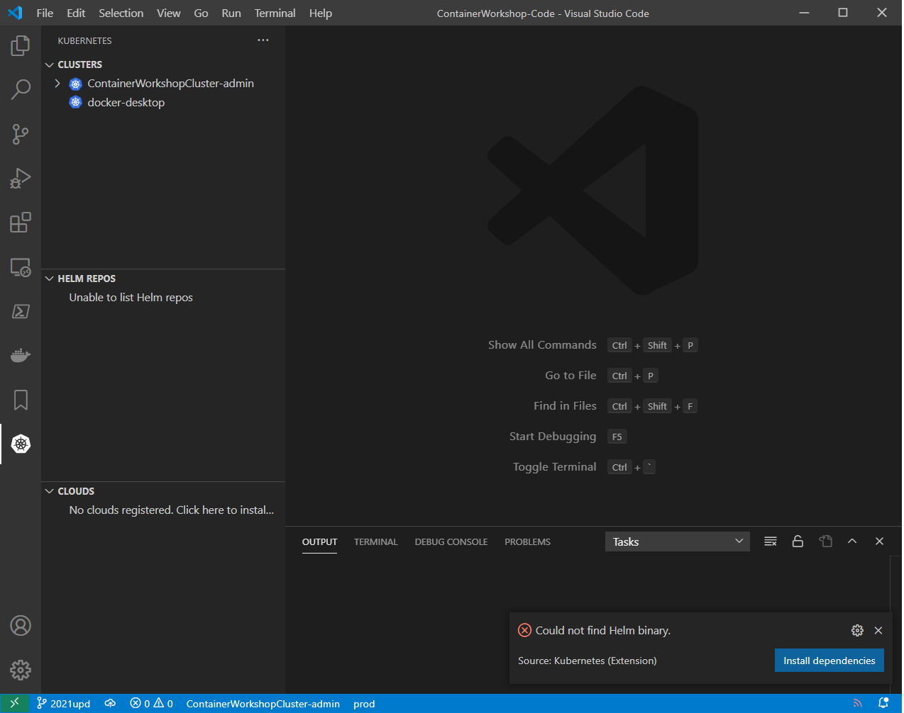

# Lab 10 How to use Kubernetes

During this lab, you will become familiar with Kubernetes concepts, showing you how to deploy a container, scale the number of instances, and see the output of a running application.

Goals for this lab:
- Gain a basic understanding of the *kubectl* tooling for Kubernetes.
- See what a node, deployment and pod is.
- How to inspect and see the logs of a pod.
- Understand how to scale up and down the number of instances of a container.
- Use a service to define networking.

## Prerequisites
Make sure you have completed [Lab 1 - Getting Started](Lab1-GettingStarted.md#6). Doublecheck that you have completed chapter 'Create a Kubernetes cluster'

## Getting started

Launch Visual Studio Code, open the Kubernetes extension, make sure the cluster named 'docker-desktop' or 'ContainerWorkshopCluster-admin' is the current cluster, or right click on it to select it as the current cluster.
Click on the 'Install dependencies' button if needed.

Also, in the terminal, change directories to the Docs repository directory named 'resources/lab10'
```
C:\Sources\ContainerWorkshop\ContainerWorkshop-Docs\resources\lab10>
```

## <a name='inspect-cluster'></a>Inspecting the cluster
To interact with the Kubernetes cluster, you will need to use the **kubectl** tool. This allows you to issue commands and queries to the selected Kubernetes cluster. 

For example, type the `kubectl cluster-info` command to inspect the cluster:

```
kubectl cluster-info

Kubernetes master is running at https://containerw-containerworksho-guid-guid.hcp.westeurope.azmk8s.io:443
healthmodel-replicaset-service is running at https://containerw-containerworksho-guid-guid.hcp.westeurope.azmk8s.io:443/api/v1/namespaces/kube-system/services/healthmodel-replicaset-service/proxy
CoreDNS is running at https://containerw-containerworksho-guid-guid.hcp.westeurope.azmk8s.io:443/api/v1/namespaces/kube-system/services/kube-dns:dns/proxy
Metrics-server is running at https://containerw-containerworksho-guid-guid.hcp.westeurope.azmk8s.io:443/api/v1/namespaces/kube-system/services/https:metrics-server:/proxy      

To further debug and diagnose cluster problems, use 'kubectl cluster-info dump'.
```

This command will show you where the master node is running. To see the cluster version, use the `kubectl version` command to return the client and server version numbers:

```
kubectl version

Client Version: version.Info{Major:"1", Minor:"19", GitVersion:"v1.19.3", GitCommit:"1e11e4a2108024935ecfcb2912226cedeafd99df", GitTreeState:"clean", BuildDate:"2020-10-14T12:50:19Z", GoVersion:"go1.15.2", Compiler:"gc", Platform:"windows/amd64"}
Server Version: version.Info{Major:"1", Minor:"18", GitVersion:"v1.18.14", GitCommit:"89182bdd065fbcaffefec691908a739d161efc03", GitTreeState:"clean", BuildDate:"2020-12-18T16:05:02Z", GoVersion:"go1.13.15", Compiler:"gc", Platform:"linux/amd64"}
```

## <a name='select-ns'></a>Selecting your work namespace
Kubernetes resources are deployed in containers called 'namespaces'. 
Select the built-in Namespace 'default' as the default for this session:

```
kubectl config set-context --current --namespace=default

Context "ContainerWorkshopCluster-admin" modified.
```

## <a name='nodes'></a>Information about the nodes
A cluster has one or more nodes that are responsible for running the actual pods. A node is the worker machine in Kubernetes and can be a virtual machine or a physical machine. To see which nodes are available, we can use the `describe` command of `kubectl`.

```
kubectl describe nodes
```

Each node is listed with not only the technical details but also the actual pods running on the specific node. To get the details about a particular node, you can use the same `describe` command:

```
kubectl describe node {node-name}
```
>Note replace {node-name} with the name of one cluster node. E.g. `aks-nodepool1-36156572-vmss000000` or `docker-desktop`.

The _conditions_ in the output indicate if the node can accept pods. You might see an output like below:

```
Conditions:
  Type                 Status  LastHeartbeatTime                 LastTransitionTime                Reason                       Message
  ----                 ------  -----------------                 ------------------                ------                       -------
  NetworkUnavailable   False   Tue, 02 Feb 2021 07:01:34 +0000   Tue, 02 Feb 2021 07:01:34 +0000   RouteCreated                 RouteController created a route
  MemoryPressure       False   Thu, 04 Feb 2021 08:02:14 +0000   Tue, 02 Feb 2021 07:01:19 +0000   KubeletHasSufficientMemory   kubelet has sufficient memory available
  DiskPressure         False   Thu, 04 Feb 2021 08:02:14 +0000   Tue, 02 Feb 2021 07:01:19 +0000   KubeletHasNoDiskPressure     kubelet has no disk pressure
  PIDPressure          False   Thu, 04 Feb 2021 08:02:14 +0000   Tue, 02 Feb 2021 07:01:19 +0000   KubeletHasSufficientPID      kubelet has sufficient PID available
  Ready                True    Thu, 04 Feb 2021 08:02:14 +0000   Tue, 02 Feb 2021 07:01:29 +0000   KubeletReady                 kubelet is posting ready status. AppArmor enabled
```

In this case, the node is in a _Ready_ state and can run Pods.

## <a name='deployment'></a>Create a deployment
When you want to run a containerized application inside the cluster, you will use a Deployment configuration to schedule a pod. The `Deployment` resource will govern the lifecycle of a `Pod`.
A pod is a group of one or more containers running on 1 node. It can have its own storage and networking setup and contains specifications on how to run the actual containers.

Start a new deployment using `kubectl create deployment` by creating a pod running an nginx container:

```
kubectl create deployment hello-nginx --image=nginx

deployment.apps/hello-nginx created
```

Verify that the deployment is working, by using the describe functionality again, this time by querying the deployment by using `kubectl describe deployment` and passing the deployment name:

```
kubectl describe deployment hello-nginx

Name:                   hello-nginx
Namespace:              default
CreationTimestamp:      Thu, 04 Feb 2021 08:08:59 +0000
Labels:                 app=hello-nginx
Annotations:            deployment.kubernetes.io/revision: 1
Selector:               app=hello-nginx
Replicas:               1 desired | 1 updated | 1 total | 0 available | 1 unavailable
StrategyType:           RollingUpdate
MinReadySeconds:        0
RollingUpdateStrategy:  25% max unavailable, 25% max surge
Pod Template:
  Labels:  app=hello-nginx
  Containers:
   nginx:
    Image:        nginx
    Port:         <none>
    Host Port:    <none>
    Environment:  <none>
    Mounts:       <none>
  Volumes:        <none>
Conditions:
  Type           Status  Reason
  ----           ------  ------
  Available      False   MinimumReplicasUnavailable
  Progressing    True    ReplicaSetUpdated
OldReplicaSets:  <none>
NewReplicaSet:   hello-nginx-5c7ddf5c4 (1/1 replicas created)
Events:
  Type    Reason             Age   From                   Message
  ----    ------             ----  ----                   -------
  Normal  ScalingReplicaSet  22s   deployment-controller  Scaled up replica set hello-nginx-5c7ddf5c4 to 1
```

You will get all the details about the running pod. For a quick overview of all deployments, use the command:

```
kubectl get deployments
```

Which will output something like this:

```
NAME            READY   UP-TO-DATE   AVAILABLE   AGE
hello-nginx   0/1     1            0           87s
```

### Dealing with pods
Now let's see if we can get some information about the pod that was created for us by the Deployment, by using `kubectl get pods`:

```
kubectl get pods

NAME                          READY   STATUS    RESTARTS   AGE
hello-nginx-8688958b4-skdvg   1/1     Running   0          106s
...
```

> Note that your pod name will be different. 

As you can see, the deployment created a pod for us and it's running happily.

Get more details about the pod. 
Copy the pod name and pass it to the `kubectl describe pod` command:

```
kubectl describe pod hello-nginx-8688958b4-skdvg
```

In the output you'll see detailed information about the container(s) running inside the pod.
The last part, that describes `Events` is very important; if your container fails to start there is more information about it here.

### Pod networking
Another interesting element of the pod is that it has an IP address. See if you can find it in the output from `kubectl describe pod`. It should be similar to this: `IP: 10.244.0.16`.

> What this means, is that we can connect pods to a network, similar to what we did with `docker-compose` in [Lab 4 - Networking](Lab4-Networking.md) earlier.

### Pod lifecycle

Let's see why deployments are very useful tools in Kubernetes by simulating an application crash inside the nginx container.

```
kubectl delete pod hello-nginx-8688958b4-skdvg

pod "hello-nginx-8688958b4-skdvg" deleted
```

Quickly check the list of running pods again:

```
kubectl get pods

NAME                          READY   STATUS    RESTARTS   AGE
hello-nginx-8688958b4-4xt5v   1/1     Running   0          39s
```

You should see that a brand new pod was created. The deployment noticed that the first pod went away, and responded by creating a new pod. A deployment adds resillience to your applications running on Kubernetes!

### Cleanup

Remove the deployment, by issuing the `kubectl delete` command and pass the deployment name:

```
kubectl delete deployment hello-nginx

deployment.apps "hello-nginx" deleted
```

## <a name='deployment-using-template'></a>Deploy an application using a pod template

Earlier, we created a container running in a pod, by creating a deployment using the `kubectl` CLI. Instead of creating pods imperatively, we can also use a pod template to create them declaratively. This way we can define the desired state (which image, resources, networking, etc.) and Kubernetes will ensure that the required changes are made.

> If you worked at [Lab 4 - Networking](Lab4-Networking.md) before, you'll see similarities between using the docker CLI (imperative) and the docker-compose CLI (declarative).

Examine the YAML definition below:

``` yaml
apiVersion: v1
kind: Pod
metadata:
  name: myapp-pod
  labels:
    app: myapp
spec:
  containers:
  - name: myapp-container
    image: alpine
    command: ['sh', '-c', 'echo Hello Kubernetes!']
```
It describes a pod and specifies a pod name by using metadata. In the pod `spec` you can see that the container is based on `alpine` image. It also specifies which command to run inside the container after it has been created.

### Creating a pod from a template
In your terminal, move to the repository directory named 'resources/lab10'.
```
user@machine:/mnt/d/Projects/gh/ContainerWorkshop-Docs$ cd resources/lab10/
```

Use the command `kubectl apply` to deploy the template:

```
kubectl apply -f 00-nginx-pod.yaml

pod/myapp-pod created
```

Verify that the pod is running by using `kubectl get pods`:
```
kubectl get pods       

NAME        READY   STATUS    RESTARTS   AGE
myapp-pod   1/1     Running   0          14s
```

We have now directly created a pod, without using a deployment. Kill the pod to simulate an application crash again:

```
kubectl delete pod myapp-pod

pod "myapp-pod" deleted
```

Now check running pods again, to see if it was automatically restarted by Kubernetes:
```
kubectl get pods   

No resources found in default namespace.
```

As you can see, a pod without a deployment to manage its lifecycle will not be recreated when it is deleted.

## <a name='deployment-scaling'></a>Scale a deployment
In the example above, we created a pod using a pod template. We can also use a deployment template. Kubernetes will maintain the desired state described in the deployment.
Deployment resources will not only govern the lifecycle of a pod. It can also be used for networking and scaling.

Please examine this YAML code:

```yaml
apiVersion: apps/v1
kind: Deployment
metadata:
  name: nginx-deployment
  labels:
    app: nginx
spec:
  replicas: 1
  selector:
    matchLabels:
      app: nginx
  template:
    metadata:
      labels:
        app: nginx
    spec:
      containers:
      - name: nginx
        image: nginx
        ports:
        - containerPort: 80
```
This deployment will create a pod with a single container based on the nginx image. It will also expose port 80 of the container on the pod's IP address.

Let's roll out nginx again, but this time we're using a deployment resource:

```
kubectl apply -f 01-nginx-deployment.yaml
```

It might take some time to become available, so query the state of the deployment using the `get` command until it is available:

```
kubectl get deployment nginx-deployment
```

The number of replicas is now set to 1. When the container crashes for some reason, Kubernetes will make sure there is at least one container running. Running a single instance might not always be enough. When can scale the number of pods by issuing a `scale` command:

```
kubectl scale deployment.v1.apps/nginx-deployment --replicas=3

deployment.apps/nginx-deployment scaled
```

Query the state by checking the deployment:

```
kubectl get deployment nginx-deployment
```

And you should now see three pods are running:

```
NAME               READY   UP-TO-DATE   AVAILABLE   AGE
nginx-deployment   3/3     3            3           4m
```

Confirm this by listing the running pods:
```
kubectl get pods

NAME                               READY   STATUS    RESTARTS   AGE
nginx-deployment-d46f5678b-6gd9h   1/1     Running   0          2m1s
nginx-deployment-d46f5678b-hlvj5   1/1     Running   0          8m27s
nginx-deployment-d46f5678b-k95wr   1/1     Running   0          2m1s
```
This list is sorted alphabetically, and pod names are generated, so your list will look different.
Two of three pods were created by scaling out, so they have a younger age.

## <a name='services'></a>Use services
As we saw earlier, in Kubernetes each pod will get a unique IP address. In theory you can use this to communicate with other pods. However, when a pod dies and gets recreated by the deployment resource, its IP address will be different. 

So, when a front-end pod needs to talk to a back-end pod, we need a reliable way to communicate. Services are the solution to this. A service is an IP address inside the cluster, that never changes. It can be attached to pods by using selection criteria with a `selector`. A sService will live forever as it doesn't have any moving parts. The pods connected to a Service may come and go. This way, you have a fixed endpoint within the Kubernetes cluster, that acts as a load balancer into a dynamic collection of pods.

As an example, let's see if we can add a service to the nginx deployment. We will add a service in front of the running pods. The service will target pods matching a given app (based on the pod's `metadata` - `label.app` attribute value 'nginx'. 

This is the relevant part of the deployment YAML:
```yaml
apiVersion: apps/v1
kind: Deployment
spec:
  ..
  template:
    metadata:
      labels:
        app: nginx
```
This YAML will cause a metadata attribute `app: nginx` to be added to all created pods. We will create a Service with a `selector` to find all pods with that label:

In the YAML below, you can see how that works:

```yaml
apiVersion: v1
kind: Service
metadata:
  name: nginx-service
spec:
  selector:
    app: nginx
  ports:
    - protocol: TCP
      port: 8080
      targetPort: 80
```
The service will forward traffic from Service port 8080 to port 80 of the pod.

### Creating a Service
Apply the service template:
```
kubectl apply -f 02-nginx-service.yaml
```

and inspect the outcome:

```
kubectl get service nginx-service

NAME            TYPE        CLUSTER-IP     EXTERNAL-IP   PORT(S)    AGE
nginx-service   ClusterIP   10.0.119.208   <none>        8080/TCP   5s
```

To validate that we can resolve the name using the internal DNS to a service, we will run a lookup from within the cluster.

```
kubectl run wget --image=busybox -i --tty --restart=Never
```

In the terminal that opens, run `nslookup` and pass the name of the service 'nginx-service', it will return the IP address of the service:

```
nslookup nginx-service

Server:         10.0.0.10
Address:        10.0.0.10:53

Name:   nginx-service.default.svc.cluster.local
Address: 10.0.119.208
```

> Note that in your environment, IP addresses will likely be different.

In the same terminal window, execute a `wget` command to fetch the nginx index HTML page:

```
wget -S 10.0.119.208:8080 -O -

Connecting to 10.0.119.208:8080 (10.0.119.208:8080)
  HTTP/1.1 200 OK
  Server: nginx/1.19.6
  Date: Thu, 04 Feb 2021 11:42:02 GMT
  Content-Type: text/html
  Content-Length: 612
  Last-Modified: Tue, 15 Dec 2020 13:59:38 GMT
  Connection: close
  ETag: "5fd8c14a-264"
  Accept-Ranges: bytes
..
  <h1>Welcome to nginx!</h1>
..
written to stdout
```

> Note, replace the IP address with the value for __your__ Service and make sure to target port 8080.

You can see that the response of the `wget` call was created by an nginx pod. We have created a Service which we can interact with by using the built-in DNS server of Kubernetes. It will be reachable regardless of individual pod restarts or scaling of the number of pods.

## <a name='clean'></a>Cleaning up
If your terminal is still active, exit it by running:
```
exit
```
Delete the 'wget' pod:
```
kubectl delete pod wget
```

Delete the nginx service and deployment

```
kubectl delete deployment nginx-deployment
kubectl delete service nginx-service
```

An alternative way to delete the deployment and service is by undoing the `kubectl apply` by using `kubectl delete`:

```
kubectl delete -f 01-nginx-deployment.yaml
kubectl delete -f 02-nginx-service.yaml
```

## Wrapup

In this lab you experimented with Kubernetes from the command line. You have learned how to manage pods using Deployments and how to add network connectivity to pods.

Continue with [Lab 7 - Registries and clusters](Lab7-RegistriesClusters.md).

