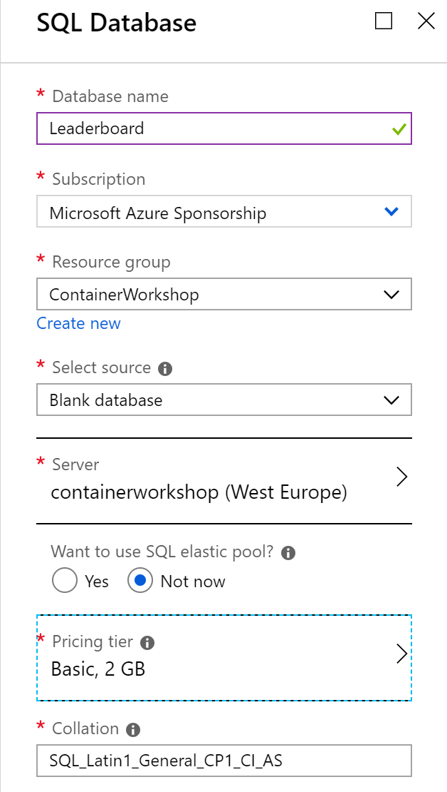

# Lab 6 - Container registries and clusters

In this lab you are going to learn about registries and clusters. This includes pushing images to the registry and deploying compositions to a running cluster.

Goals for this lab:

- [Push images to a container registry](#push)
- [Connecting to your cluster](#connect)
- [Create and enhance cluster composition for Docker Swarm](#create)
- [Deploy images to cluster](#deploy)
- [Run and manage composition in cluster](#run)
- [(Optional) Switch to Azure SQL Database](#sql)

## <a name="run"></a>Run existing application
We will start with or continue running the existing ASP.NET Core application from Visual Studio. Make sure you have cloned the Git repository, or return to [Lab 1 - Getting Started](Lab1-GettingStarted.md) to clone it now if you do not have the sources. Switch to the `Master` branch by using this command 

```cmd
git checkout Master
```

> ##### Important
> Make sure you have:
>
> - switched to the `Master` branch to use the right .NET solution.
> - configured 'Docker Desktop' to run Linux containers.

Open the solution `ContainerWorkshop.sln` in Visual Studio. Take your time to navigate the code and familiarize yourself with the various projects in the solution. You should be able to identify these:

- `GamingWebApp`, an ASP.NET MVC Core frontend 
- `Leaderboard.WebAPI`, an ASP.NET Core Web API

For now, a SQL Server for Linux container instance is providing the developer backend for data storage. This will be changed later on. Make sure you run the SQL Server as desribed in [Lab 2](https://github.com/XpiritBV/ContainerWorkshop2018Docs/blob/master/Lab2-Docker101.md#lab-2---docker-101).

## <a name="push"></a>Pushing images to a registry

Docker registries are to Docker container images what NuGet feeds are to NuGet packages. They allow access to existing images that have been published by the owner. They can be private or publicly accessible.

First, you will create an Azure Container Registry which allows (multiple) private repositories inside your registry. Run the following command from the command-line to create it:
Find a unique name for your container registry, e.g. `ContainerWorkshopRegistry` plus your last name.

```cmd
az group create --name ContainerWorkshop --location WestEurope
az acr create --name <registry-name> --resource-group ContainerWorkshop --sku Basic --admin-enabled true --location WestEurope
```

After creation, check if the registry is created successfully:

```cmd
az acr list --resource-group containerworkshop --output table
```

Notice the `LOGIN SERVER` name.

If you want to create a Docker Hub registry, follow the steps [documented here](https://docs.docker.com/docker-hub/repos/)

Now that we have a registry, you should try to create working images for our application and push the images to the registry. First, create a `Release` build of the solution. Run the build to check whether it is working correctly. With a successful build run `docker images` and verify that you have new images that are not tagged as `:dev`. Output should be similar to this:

```
REPOSITORY                        TAG                 IMAGE ID            CREATED             SIZE
gamingwebapp                      latest              52ca01b894b7        26 minutes ago      302MB
leaderboard.webapi                latest              388e4e4f4abd        26 minutes ago      303MB
gamingwebapp                      dev                 838b58f6e96d        2 days ago          299MB
leaderboard.webapi                dev                 86c3b70e7efa        2 days ago          299MB
```

The images for the release build are tagged with `latest`. Make sure you understand why a `Debug` build creates images that are tagged `:dev`.

> ##### Hint
> You may want to look in the special folder `obj/Docker` at the solution level again.

The current images are not suitable to be pushed to the registry, since their name does not include the name of the registry you created a moment ago. That format is `registry/repository` with the repository representing the name of the container image as it is at the moment, e.g. `containerworkshop/gamingwebapp`.

Tag the current images again to include the registry name. This will not create a new image, but it does appear as a separate entry in your local images list.

```
docker tag gamingwebapp:latest <full-registry-name>/gamingwebapp:latest
```

Make sure you replace the name `<full-registry-name>` with your registry name. For Azure Container Registry, use the value of `LOGIN SERVER` as the registry name, e.g. `containerworkshopregistry.azurecr.io`. For Docker Hub it is the simple name, like `containerworkshop`.

Perform the tagging for the Web API image as well. Verify that the images are tagged and have the same image ID as the ones without registry name.

Login to the registry. For example, for Docker Hub this will be:

```cmd
docker login
```

and for ACR, get the credentials first, by using:

```cmd
az acr credential show --resource-group ContainerWorkshop --name <registry>
```

Next, you can login with:

```cmd
az acr login --name <registry> -u <username>
```

Replace the name with your unique registry's name and your username with , supply your username and supply one of the passwords that was displayed earlier when prompted.

When you have successfully logged in, push both images to the their respective repositories in the registry:

```
docker push <registry.azurecr.io>/gamingwebapp:latest
```
Again remember to replace the registry name, with yours.
The output of the push will resemble something like this:
```

The push refers to repository [containerregistry.azurecr.io/gamingwebapp]
d3dd2499dbb1: Pushed
0506db78f43c: Pushed
55e0e17f207d: Pushed
f689d872fdfe: Pushed
cf5b3c6798f7: Pushed
latest: digest: sha256:05d2b2ceea30bbaa1fd0f37ac88d1185e66f055a29b85bf6438ce4658e379da6 size: 1791
```

Remove your local images for the web application release build from the Docker CLI by calling:
```
docker rmi <full-registry-name>/gamingwebapp:latest
docker rmi gamingwebapp:latest
docker rmi gamingwebapp:dev
```

Verify that the `gamingwebapp` images are no longer on your machine.

When using DockerHub, visit your registry at https://hub.docker.com/r/<registry>/gamingwebapp/ to check whether the image is actually in the repository.

When using ACR, use this command:
```cmd
az acr repository list --resource-group ContainerWorkshop --name <registry>
az acr repository show-tags --resource-group ContainerWorkshop --name containerregistry --repository gamingwebapp
```

Then, try to pull the image from the registry with:
```
docker pull <full-registry-name>/gamingwebapp:latest
```
This process can be automated by a build and release pipeline. You will learn how to do that in a later lab.

## Connecting to your cluster

At this point you will need to have access to a Docker cluster. If you haven't done so already, create an Azure Kubernetes Service cluster in Azure. [Module 1](Lab1-GettingStarted.md) describes how you can create one.

Make sure the addon 'http application routing' is installed. If it's not run this command:

```cmd
az aks enable-addons -a http_application_routing --resource-group ContainerWorkshop --name ContainerWorkshopCluster
```

Open the dashboard of your cluster. There are several ways to connect to it. The easiest way is to use VSCode and the Kubernetes extension. Navigate to the Kubernetes pane on the left and find your cluster listed. Right-click it and use `Set as current cluster` if you have more than one cluster and yours is not selected yet. Right-click again and select `Open Dashboard` from the context menu. This should create a port mapping from your localhost machine to the master node of your cluster. A browser window will open at `http://localhost:10000` and show the Kubernetes dashboard.

Alternatively, you can run the command:

```cmd
az aks browse --name ContainerWorkshopCluster --resource-group ContainerWorkshop
```

and navigating to the localhost address `http://localhost:8001` that forwards to the actual cluster. Most likely a browser window will already open.

> ****Important****
>
> If you get any errors in the Kubernetes dashboard, revisit [Module 1](Lab1-GettingStarted.md) and fix the dashboard by changing the RBAC configuration.

You also set your cluster as the active context and interact with it using kubectl commands. First, retrieve a list of the current available clusters and contexts with `kubectl` commands and then set your cluster as active. All `kubectl` will be executed against that context from now.
```
kubectl cluster-info
kubectl config get-clusters
kubectl config get-contexts
kubectl config use-context ContainerWorkshopCluster-admin
```

Open the [Azure Portal](https://portal.azure.com). Find the resource for your cluster in the resource group `ContainerWorkshop`. Make a note of the properties `HTTP application routing domain` and `API server address`.

> ****Question****
>
> Which two important actions can be performed on your cluster from the Azure portal?

Open the resource group that is prefixed `MC_ContainerWorkshop_ContainerWorkshopCluster...`
Inside this resource group you will find the underlying resources of your AKS cluster. 

> What resources are part of a AKS cluster? What is the purpose of each of these?

## Deploy your Docker composition to a cluster

> You can switch back to the master branch and build your images from there. Commit or undo any pending changes.

Kubernetes does not use Docker Compose files for its deployments. The Visual Studio solution contains a folder `Deployments` under `Solution Items`. You should find a Kubernetes deployment manifest in it, called `gamingwebapp.k8s-static.yaml`. Kubernetes use these files instead of composition files. Open a command prompt and navigate to the folder.

You need to make a few changes to the manifest for it to be useable. In particular, make sure you change the following markers:
- `__containerregistry__`
	- execute the command `az acr show -n <registry> --query loginServer` to get the value
- `__httpapplicationroutingdomain__`
	- execute the command `az aks show --name ContainerWorkshopCluster -g ContainerWorkshop --query addonProfiles.httpApplicationRouting.config.HTTPApplicationRoutingZoneName ` to retrieve the value or look in the Azure Portal
- change `gamingwebapp:demo` into `gamingwebapp:latest`

In order to be able to pull images from your registry into the cluster, you will need to authenticate against a private registry. If you are using Docker Hub, then this is not required. 

For Azure Container Registry, you can create another service principal that will be allowed access to the registry. Execute the following command after having replaced the placeholders with your specific details.

```
az ad sp create-for-rbac --scopes /subscriptions/<your-subscription-id>/resourcegroups/ContainerWorkshop/providers/Microsoft.ContainerRegistry/registries/<your-registry-name> --role Contributor --name ContainerWorkshopRegistryPrincipal
```
This command creates a principal that has the Contributor role in the ACR. Take a note of the password that is generated in the output.

Next, you are going to create a secret in the cluster to hold the credentials for this principal. The secret is specific to container registries and allows the manifest deployment to use the credentials to pull images for the Kubernetes services.

```
kubectl create secret docker-registry pullkey --docker-server <your-registry-name>.azurecr.io --docker-email <your-email> --docker-username=<your-principal-appid> --docker-password <generated-password>
```

Later, secrets will be covered in more detail. Execute the next command, again replacing the necessary items.

Save your work and go to the command prompt. Run the command:
```
kubectl apply -f .\gamingwebapp.k8s-static.yaml
```
and watch the results from the dashboard. This deployment could take some time to complete. As container images must be downloaded and additional virtual disks will be deployed to your cluster resource group in Azure.
Also, a DNS A-record and a public IP address will be created. After about 5 minutes, everything should be up and running.

> Note that consecutive deployments of the same application, but with newer images, will go a lot faster.

Open a browser and navigate to the URL you supplied as `__httpapplicationroutingdomain__` preceded by "http://containerworkshop." e.g:

`http://containerworkshop.6558a6c44f9d4e63aaa6.westeurope.aksapp.io`

You should see the page named 'All time highscore hall of fame'.

> ##### Using containerized SQL Server in production
> It is not recommended to use SQL Server in a production scenario in this way. You will loose data, unless you take special measures, such as mounting volumes.
> However, for now you will keep the SQL Service instance in a Docker container.
>
> Make sure that you change the environment name to **Development** to provision the database `Leaderboard` and seed it using Entity Framework's `DbInitialize()`.
>
> If you have time left, try the stretch exercise below to switch to an Azure SQL Database.

## <a name="sql"></a>(Optional) Switch to Azure SQL Database

If you have time left, you can remove the SQL Server container altogether and switch to Azure SQL Database.
The steps you need to do are:
- Provision an Azure SQL Server database called `Leaderboard`, and an Azure SQL Server if necessary.



  You might have change the server name to be unique.

- Add a firewall rule to the Azure SQL Server to allow traffic coming in from the cluster. You can find the IP address of the cluster in the external load balancer NAT rules.
- Connect with SQL Server Management Studio or any other query tool to execute a couple of SQL scripts to the server and database:

```sql
CREATE DATABASE [Leaderboard]
GO

USE [Leaderboard]
GO
```

Create a SQL Create script for the two tables in your local SQL Server database in the Docker container, or use the provided `CreateDatabase.sql` file in the Git repository.

Next, run the following script on the database:

```sql
CREATE LOGIN retrogamer WITH PASSWORD='abc123!@'

USE Leaderboard
GO

CREATE USER retrogamer
   FOR LOGIN retrogamer
   WITH DEFAULT_SCHEMA = dbo
GO
-- Add user to the database owner role
EXEC sp_addrolemember N'db_owner', N'retrogamer'
GO
```

- Change the connection string in the manifest file `gamingwebapp.k8s-static.yaml`. It should resemble the following, with the placeholder replaced with your server name:

```yaml
- ConnectionStrings:LeaderboardContext=Server=tcp:<your-sql-server>.database.windows.net,1433;Initial Catalog=Leaderboard;Persist Security Info=False;User ID=retrogamer;Password=abc123!@;MultipleActiveResultSets=False;Encrypt=True;TrustServerCertificate=False;Connection Timeout=30;
```

- Set the `ASPNETCORE_ENVIRONMENT` for the `LeaderboardWebAPI` to `Production` again.

Try to deploy the manifest again using Azure SQL Database now instead of the containerized version.

## Wrapup

In this lab you have created a composition that is able to deploy a stack of services to a cluster. Necessary changes to the environment variables were made and perhaps you even got to use an Azure SQL Database.

Continue with [Lab 7 - Security](Lab7-Security.md).
