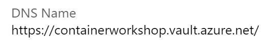
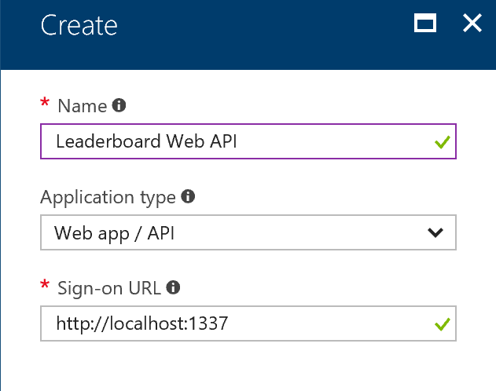
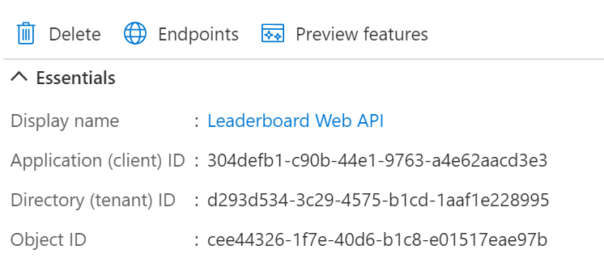

# Lab 7 - Security

During this lab you will look at a specific security related aspect for containers: secrets in configuration. There is a lot more to be said and done about security  for containers though. Your focus will be to remove all secrets from configuration files and into secure stores for development and production.

Goals for this lab:
- [Add support for Azure Key Vault to store secrets](#keyvault)
- [Store user secrets during development](#usersecrets)
- [Use Kubernetes Secrets to store Key Vault credentials](#kubernetessecrets)

## <a name="run"></a>Run existing application
We will start with or continue running the existing ASP.NET Core application from Visual Studio. Make sure you have cloned the Git repository, or return to [Lab 1 - Getting Started](Lab1-GettingStarted.md) to clone it now if you do not have the sources. Switch to the `master` branch by using this command:

```cmd
git checkout master
```

> ##### Important
> Make sure you have: 
> - Switched to the `master` branch to use the right .NET solution.
> - Configured 'Docker Desktop' to run Linux containers.

Open the solution `ContainerWorkshop.sln` in Visual Studio. Take your time to navigate the code and familiarize yourself with the various projects in the solution. You should be able to identify these:
- `GamingWebApp`, an ASP.NET MVC Core frontend 
- `Leaderboard.WebAPI`, an ASP.NET Core Web API.

For now, a SQL Server for Linux container instance is providing the developer backend for data storage. This will be changed later on. Make sure you run the SQL Server as desribed in [Lab 2](https://github.com/XpiritBV/ContainerWorkshop2018Docs/blob/master/Lab2-Docker101.md#lab-2---docker-101).

## Secrets and Docker

You must have noticed that the connection string to the database contains a username and password. The connection string is set in an environment variable that is stored in the `docker-compose.yml` and `gamingwebapp.k8s-static.yaml` file . Even though this file is only relevant during startup when the environment variables are set on containers, these secrets inside running containers are easily accessible when you have access to the host.

Open a Docker CLI and find a running container on your host. If there aren't any, run the docker project from the demo solution in Visual Studio. Run the following command:

```cmd
docker ps
```

If SQL Server is not running, run this command:

```cmd
docker run -d -p 5433:1433 --env ACCEPT_EULA=Y -e SA_PASSWORD="Pass@word" --env MSSQL_PID=Developer --name sqldocker microsoft/mssql-server-linux
```

Inspect SQL Server, which contains the connection string in an environment variable. Use its container ID to inspect it.

```
docker inspect -f "{{.Config.Env}} " <container-id>
```

This displays the `Env` section that contains all variables for the current environment.
```bat
SA_PASSWORD=Pass@word
MSSQL_PID=Developer
ACCEPT_EULA=Y
PATH=/usr/local/sbin:/usr/local/bin:/usr/sbin:/usr/bin:/sbin:/bin
```

You can also look at the history of images and see the various commands that were used to build them. Try running:

```cmd
docker history microsoft/mssql-server-linux
docker history microsoft/mssql-server-linux --no-trunc
```

Docker containers and their images are inspectable and it is non-trivial to work with secrets in a secure way. Let's find out how to do that.

## <a name='keyvault'></a>Adding support for Azure Key Vault

You can use Azure Key Vault to store sensitive information, such as  connections, certificates or accounts, in keys, secrets and certificates.

Run the following commands to create a new key vault (It needs to have a unique name):

```cli
az provider register -n Microsoft.KeyVault
az keyvault create --name <unique name> --resource-group ContainerWorkshop --enabled-for-deployment --enabled-for-template-deployment
```

Visit the [Azure Portal](https://portal.azure.com) and go to your new Key Vault resource in your resource group.

> Note: Ideally you would place the KeyVault in a separate resource group, as its lifetime is likely to exceed that of the container cluster group.

Take note of the DNS name of the Key Vault in the `Properties` section.



Next, allow the Web API access to the Key Vault. Register the web API as an Azure Active Directory application. Go to the Azure Active Directory for your Azure subscription and choose `App Registrations`. Create a new application registration called `Leaderboard Web API` of type `Web app / API` and use the local URL `http://localhost:44369` as the Sign-on URL value.



This Azure AD application registration represents a service principal that you are going to give access to the Azure Key Vault. Store the application ID of the application that is displayed in the `Essentials` section.



Allow the Web API service principal to access the Key Vault. For that you need a Client ID and Secret. The Client ID is the application ID you stored earlier. The secret is a key you have to create under the application registration. Go to the `Keys` section and create a password. Give it `KeyVaultSecret` as a name. Set its expiration date to a year and save it. Make sure you copy and store the value that is generated. It should resemble the following format:

```cmd
vFwBC9rEtBfO7BNVgeYmSLcpxhTGQfqKG4/ZAoCKhjh=
```

Navigate to the `Access policies` under your Key Vault blade. Create a new access policy by clicking `Add new` and selecting the `Leaderboard Web API` as the principal. Assign `Get` and `List` permission for `Secrets`.

This should give you a list of values for the following :

Name | Value (example)
--- | ---
Key Vault name | https://your-keyvault.vault.azure.net/
Application ID | 1f31d60b-2f81-42c6-9df6-eb636bd3e9d3
Client Secret | vFwBC9rEtBfO7BNVgeYmSLcpxhTGQfqKG4/ZAoCKhjh=

with your specific values.

## Use Key Vault values in .NET Core

The configuration system of .NET Core makes it relatively easy to access Key Vault values as part of your configuration.

Open the `Leaderboard.WebAPI` project and add three key/value pairs to the `appsettings.json` file, replacing the values with your own.

```json
"KeyVaultName": "https://your-keyvault.vault.azure.net/",
"KeyVaultClientID": "1f31d60b-2f81-42c6-9df6-eb636bd3e9d3",
"KeyVaultClientSecret": "vFwBC9rEtBfO7BNVgeYmSLcpxhTGQfqKG4/ZAoCKhjh=",
```

Add code to the `Startup` class's constructor to add the Azure Key Vault into the configuration system.

```c#
builder.AddAzureKeyVault(
    configuration["KeyVaultName"],
    configuration["KeyVaultClientID"],
    configuration["KeyVaultClientSecret"]
);
Configuration = builder.Build();
```

At this point you are ready to store the connection string in the Key Vault. Open the blade for the Key Vault and go to `Secrets`. Add a new secret with the name `ConnectionStrings--LeaderboardContext`. The value is the connection string for the SQL Server instance in your container or the Azure SQL Database.
For the containerized database you would use this value:

`Server=sql.retrogaming.internal;Database=Leaderboard;User Id=sa;Password=Pass@word;Trusted_Connection=False`

The double-dash in the name of the secret, is a convention to indicate a section. In this format it will surface as a connection string just like before.

Remove the connection string value from `appsettings.json`.

Run your web API separately by clicking `Debug, Start new instance` from the right-click context menu of the project. Add a breakpoint in the ConfigureServices method and check whether the connection string is read correctly. If all is well, run the composition locally.

## <a name='usersecrets'></a> Using User Secrets

Now that all secrets are safely stored in the Key Vault you are one step closer to managing the sensitive configuration information of your Docker solution.

You must have noticed how there is still a set of secrets present in the solution. (The service principal credentials.) This must be resolved too, as these secrets allow access to the Key Vault and enable anyone to retrieve secrets from the vault.

First, let's store the Key Vault access information in a safe place during development on your machine. Right-click the Web API project and choose `Manage User Secrets` from the context menu. It will open a JSON file called `secrets.json` that is not added to the project. Instead it exists on the file system in a special location `%AppData%\Roaming\Microsoft\UserSecrets\<UserSecretsId>\secrets.json`. Find the location of this file and verify that the `UserSecretsId` corresponds to the new entry in the `.csproj` file of the Web API project.

Cut the values for the Key Vault connection from the `appsettings.json` file and add these to the `secrets.json` file. Save the file and go to the `Startup` class.
Assert the presence of code below in the constructor to add user secrets to the configuration system of .NET Core.

```c#
  .AddEnvironmentVariables(); // Existing code

  if (env.IsDevelopment())
  {
    builder.AddUserSecrets<Startup>(true);
  }
  Configuration = builder.Build();
```

Check if the user secrets are used when running the Web API outside of a container again. When it does, try running it in the complete composition. You should find that it does not. Think about why it does not work anymore when run from a container.

To fix the issue of the user secrets not being available in the container, you need **remove** the connection string environment variable from the `docker-compose.override.yml` file.

```yaml
- ConnectionStrings:LeaderboardContext=Server=sql.retrogaming.internal;Database=Leaderboard;User Id=sa;Password=Pass@word;Trusted_Connection=False
```

Additionally, you need to give the container access to the local file system to be able to read the `secrets.json` file. You can mount a volume to the container that maps the user secrets folder into the container.

Assert the presence of the following line in your `docker-compose.override.yml` file:

on Windows:
```yaml
volumes:
  - ${APPDATA}/Microsoft/UserSecrets:/root/.microsoft/usersecrets:ro
```
or on Linux:
```
volumes:
  - $HOME/.microsoft/usersecrets/$USER_SECRETS_ID:/root/.microsoft/usersecrets/$USER_SECRETS_ID
```

Using user secrets is well suited for development scenarios and single host machine. When running in a cluster for production scenarios it is not recommended. Instead you can store 'Secrets' on your cluster host machines. 

## <a name='kubernetessecrets'></a>(Optional) Using Kubernetes Secrets

> This uses a Kubernetes cluster. If you don't have one yet, go to [Lab 1 - Getting Started](Lab1-GettingStarted.md) to see how to create one.
You can store the secrets in a secure way in your cluster. The way this is done depends on the type of orchestrator you have. Kubernetes has its own implementation for secrets. In this final step you are going to create three secrets for the Azure Key Vault connection details, so all secrets are "securely" stored in a combination of the cluster and the Azure Key Vault.

Open the file `appsettings.secrets.json` and edit the details of the file a Docker CLI and connect to your cluster.
Using a command prompt at the folder with the secrets file:

```cmd
kubectl create secret generic secret-appsettings --from-file=./appsettings.secrets.json
```

to create a secret containing that file in the default namespace.
Open the dashboard again and navigate to the `Secrets` section under `Config and Storage`.
You should see the new secret there.

In the deployment manifest add the following to the `spec` section of the `leaderboardwebapi`:

```yaml
spec:
  volumes:
  - name: secretsettings
    secret:
      secretName: secret-appsettings
```

Also, under `containers` for the `leaderboardwebapi` deployment definition add:
```yaml
volumeMounts:
- name: secretsettings
  mountPath: /app/secrets
  readOnly: true
```

Redeploy the manifest with:

```cmd
kubectl apply -f .\gamingwebapp.k8s-static.yaml
```

> Note that the secrets here are only base64 encoded and not protected. You should use [Managed Identities](https://docs.microsoft.com/en-us/azure/active-directory/managed-identities-azure-resources/overview) in Azure to run your nodes in the cluster under a known-identity that has access to the Azure Key Vault. Using this strategy you do not need to maintain any secrets to get access to your Key Vault.

## Wrapup

In this lab you have stored the secrets of your application in the Azure Key Vault. You also moved the remaining secrets, containing the details to get access to the vault, in user secrets for development scenarios. In production these secrets are stored as Kubernetes secrets.

Continue with [Lab 8 - Azure DevOps Pipelines](Lab8-AzDOPipelines.md).
