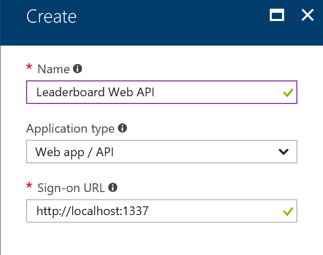
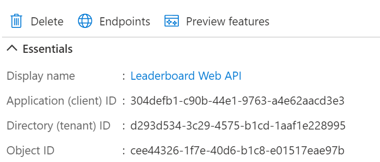

# Lab 8 - Security

During this lab you will look at a specific security related aspect for containers: secrets in configuration. There is a lot more to be said and done about security  for containers though. Your focus will be to remove all secrets from configuration files and into secure stores for development and production.

Goals for this lab:
- [Add support for Azure Key Vault to store secrets](#keyvault)
- [Store user secrets during development](#usersecrets)
- [Use Kubernetes Secrets to store Key Vault credentials](#kubernetessecrets)

> ##### Important
> Make sure you have:
>
> - Checked out the `start` from the repository.
> - Completed previous labs.
> - Configured 'Docker Desktop' to run Linux containers.

Navigate to 'user@machine:/mnt/c/Sources/ContainerWorkshop-Docs/resources/lab08'

## Secrets and Docker

You must have noticed that the connection string to the database contains a username and password. The connection string is set in an environment variable that is stored in the `docker-compose.yml` and `gamingwebapp.k8s-static.yaml` file . Even though this file is only relevant during startup when the environment variables are set on containers, these secrets inside running containers are easily accessible when you have access to the host.

Open a Docker CLI and find a running container on your host. If there aren't any, run the docker project from the demo solution in Visual Studio. Run the following command:

```cmd
docker ps
```

If SQL Server is not running, run this command:

```cmd
docker run -d -p 5433:1433 --env ACCEPT_EULA=Y -e SA_PASSWORD="Pass@word" --env MSSQL_PID=Developer --name sqldocker microsoft/mssql-server-linux
```

Inspect SQL Server, which contains the connection string in an environment variable. Use its container ID to inspect it.

```
docker inspect -f "{{.Config.Env}} " <container-id>
```

This displays the `Env` section that contains all variables for the current environment.
```bat
SA_PASSWORD=Pass@word
MSSQL_PID=Developer
ACCEPT_EULA=Y
PATH=/usr/local/sbin:/usr/local/bin:/usr/sbin:/usr/bin:/sbin:/bin
```

You can also look at the history of images and see the various commands that were used to build them. Try running:

```cmd
docker history microsoft/mssql-server-linux
docker history microsoft/mssql-server-linux --no-trunc
```

Docker containers and their images are inspectable and it is non-trivial to work with secrets in a secure way. Let's find out how to do that.

## <a name='keyvault'></a>Adding support for Azure Key Vault

You can use Azure Key Vault to store sensitive information, such as  connections, certificates or accounts, in keys, secrets and certificates.

Run the following commands to create a new key vault (It needs to have a unique name):

```cli
az provider register -n Microsoft.KeyVault
az keyvault create --name <unique name> --resource-group ContainerWorkshop --enabled-for-deployment --enabled-for-template-deployment
```

Visit the [Azure Portal](https://portal.azure.com) and go to your new Key Vault resource in your resource group.

> Note: Ideally you would place the KeyVault in a separate resource group, as its lifetime is likely to exceed that of the container cluster group.

Take note of the DNS name of the Key Vault in the `Properties` section.


Next, allow the Web API access to the Key Vault. Register the web API as an Azure Active Directory application. Go to the Azure Active Directory for your Azure subscription and choose `App Registrations`. Create a new application registration called `Leaderboard Web API` of type `Web app / API` and use the local URL `http://localhost:44369` as the Sign-on URL value.



This Azure AD application registration represents a service principal that you are going to give access to the Azure Key Vault. Store the application ID of the application that is displayed in the `Essentials` section.



Allow the Web API service principal to access the Key Vault. For that you need a Client ID and Secret. The Client ID is the application ID you stored a moment ago. The secret is a key you have to create under the application registration. Go to the `Certificates and Secrets` section and create a new Client Secret. Give it `KeyVaultSecret` as a name and set its expiration date to a year and save it. Make sure you copy and store the value that is generated. It should resemble the following format:

```cmd
vFwBC9rEtBfO7BNVgeYmSLcpxhTGQfqKG4/ZAoCKhjh=
```

Navigate to the `Access policies` under your Key Vault blade. Create a new access policy by clicking `Add new` and selecting the `Leaderboard Web API` as the principal. Assign `Get` and `List` permission for `Secrets`.

This should give you a list of values for the following :

Name | Value (example)
--- | ---
Key Vault name | https://your-keyvault.vault.azure.net/
Tenant ID | ad184f13-1651-4b33-98bc-b636b35ee7e4
Application ID | 1f31d60b-2f81-42c6-9df6-eb636bd3e9d3
Client Secret | vFwBC9rEtBfO7BNVgeYmSLcpxhTGQfqKG4/ZAoCKhjh=

with your specific values.

## Use Key Vault values in .NET

The configuration system of .NET makes it relatively easy to access Key Vault values as part of your configuration.

Open the `LeaderboardWebAPI` project and add three key/value pairs to the `appsettings.json` file, replacing the values with your own.

```json
"KeyVaultName": "https://your-keyvault.vault.azure.net/",
"KeyVaultTenantID": "6bd3e9d3-9df6-2f81-42c6-1f31d60beb63",
"KeyVaultClientID": "1f31d60b-2f81-42c6-9df6-eb636bd3e9d3",
"KeyVaultClientSecret": "vFwBC9rEtBfO7BNVgeYmSLcpxhTGQfqKG4/ZAoCKhjh=",
```

Add references to the packages `Azure.Extensions.AspNetCore.Configuration.Secrets` and `Azure.Identity` in the `LeaderboardWebAPI` project. Next, configure the application's configuration by adding the `AzureKeyVault` provider when running in production. To do this, change the code in `CreateHostBuilder` inside `Program.cs` to create a `SecretClient` instance and `KeyVaultSecretManager` to establish a connection to your KeyVault using Client ID and secret.

```c#
Host.CreateDefaultBuilder(args)
    .ConfigureAppConfiguration((context, config) =>
    {
        var hostConfig = config.Build();
        if (!String.IsNullOrEmpty(hostConfig["KeyVaultName"]))
        {
            var secretClient = new SecretClient(
                new Uri(hostConfig["KeyVaultName"]),
                new ClientSecretCredential(
                    hostConfig["KeyVaultTenantID"],
                    hostConfig["KeyVaultClientID"],
                    hostConfig["KeyVaultClientSecret"])
            );
            config.AddAzureKeyVault(secretClient, new KeyVaultSecretManager());
        }
    })
  // Existing code
```

At this point you are ready to store the connection string in the Key Vault. Open the blade for the Key Vault and go to `Secrets`. Add a new secret with the name `ConnectionStrings--LeaderboardContext`. The value is the connection string for the SQL Server instance in your container or the Azure SQL Database.
For the containerized database you would use this value:

`Server=sql.retrogaming.internal;Database=Leaderboard;User Id=sa;Password=Pass@word;Trusted_Connection=False`

The double-dash in the name of the secret, is a convention to indicate a section. In this format it will surface as a connection string just like before.

Add a breakpoint in the ConfigureServices method of the web API project. Run your composition and check whether the connection string is read correctly.

## <a name='usersecrets'></a> Using User Secrets

Now that all secrets are safely stored in the Key Vault you are one step closer to managing the sensitive configuration information of your Docker solution.

You must have noticed how there is still a set of secrets present in the solution: the service principal credentials in particular. This must be resolved too, as these secrets allow access to the Key Vault and enable anyone to retrieve all secrets from the vault.

First, let's store the Key Vault access information in a safe place during development on your machine. Right-click the Web API project and choose `Manage User Secrets` from the context menu. It will open a JSON file called `secrets.json` that is not added to the project. Instead it exists on the file system in a special location `%AppData%\Roaming\Microsoft\UserSecrets\<UserSecretsId>\secrets.json`. Find the location of this file and verify that the `UserSecretsId` corresponds to the new entry in the `.csproj` file of the Web API project.

Cut the values for the Key Vault access from the `appsettings.json` file and add these to the `secrets.json` file. Save the file and go to the `Program` class.
Add a breakpoint in the `ConfigureAppConfiguration` method and inspect the configuration providers. With the presence of a `secrets.json` file there should be an additional provider of type `JspnConfigurationProvider` using the `secrets.json` file.

Check if the user secrets are used when running the Web API outside of a container again. When it does, try running it in the complete composition. You should find that it does. Think about why this works when running from a container.

The answer is that the Visual Studio tooling for Docker helps in mounting the user secrets file inside a composition. If you are interested in finding how, check out the file `docker-compose.vs.debug.g.yml` insode the folder `obj\Docker` under the solution root for your source code. 

Using user secrets is well suited for development scenarios and single host machine. When running in a cluster for production scenarios it is not recommended. Instead you can store 'Secrets' on your cluster host machines. 

## <a name='kubernetessecrets'></a>(Optional) Using Kubernetes Secrets

> This uses a Kubernetes cluster. If you don't have one yet, go to [Lab 1 - Getting Started](Lab1-GettingStarted.md) to see how to create one.
You can store the secrets in a secure way in your cluster. The way this is done depends on the type of orchestrator you have. Kubernetes has its own implementation for secrets. In this step you are going to create four secrets for the Azure Key Vault connection details, so all secrets are "securely" stored in a combination of the cluster and the Azure Key Vault: one set of cluster-based connection details to the Key Vault, and all other secrets in the vault. 

Open the file `appsettings.secrets.json` from the solution items and edit the details to reflect the contents of four configuration settings for the KeyVault. Open a terminal window, navigate to the `deployment` folder in your solution folder. Use the Docker CLI to connect to your cluster and create a secret named `secret-appsettings`:
```cmd
kubectl create secret generic secret-appsettings --from-file=./appsettings.secrets.json
```

This creates a secret containing that file in the default namespace. Open the dashboard of your local cluster or the Azure portal to your AKS cluster and navigate to the `Secrets` section under `Configuration`, `Secrets`.
You should see the new secret there.

In the deployment manifest add the following directly under the `spec` section of the `template` in the `dep-leaderboardwebapi` deployment definition:

```yaml
spec:
  volumes:
  - name: secretsettings
    secret:
      secretName: secret-appsettings
```

Also, directly under `containers` for the `dep-leaderboardwebapi` deployment definition add:
```yaml
volumeMounts:
- name: secretsettings
  mountPath: /app/secrets
  readOnly: true
```

The `mountPath` indicates where the volume will appear in our container. Since the container is running with a working directory of `/app` you can read the config file starting from the `secrets` subfolder. Add the following code to `Program` class of the `LeaderboardWebAPI` project, right before the configuration is built:

```C#
.ConfigureAppConfiguration((context, config) => {
    config.AddJsonFile("secrets/appsettings.secrets.json", optional: true);
    var hostConfig = config.Build();
    // ...
```

Rebuild your container images locally by pressing Ctrl+Shift+B. Tag and push the new images and redeploy the manifest to your local and Azure AKS cluster with:

```cmd
kubectl apply -f .\gamingwebapp.k8s-static.yaml
```
Remember to set the correct context before you apply the manifest. 
Verify that the `appsettings.secrets.json` file was read correctly in the cluster and that everything works correctly.

Note that the secrets here are only base64 encoded and not protected. It is more secure to use [Managed Identities](https://docs.microsoft.com/en-us/azure/active-directory/managed-identities-azure-resources/overview) in Azure to run your nodes in the cluster under a known-identity that has access to the Azure Key Vault. Using this strategy you do not need to maintain any secrets to get access to your Key Vault anymore.

## <a name='kubernetessecrets'></a>(Optional) Using Kubernetes Secrets from Azure Key Vault

> Note: run this part of the lab on Linux, Mac, or WSL on Windows. Make sure your `az` CLI is logged in.

> Note 2: For Windows users: If you created your cluster in Windows (not in WSL), make sure that the content of ~/.kube/config is equal to the content of the config file in your profile: `mv ~/.kube/config ~/.kube/config.bak` and `cp /mnt/c/Users/your username/.kube/config ~/.kube`

> Note 3: Do not run this chapter on Docker Desktop!

### Introduction

If you want to store secrets outside of the cluster in a secure managed store, you can use Azure Key Vault combined with [Azure Managed Identity](https://docs.microsoft.com/en-us/azure/active-directory/managed-identities-azure-resources/overview).
To do this, we will deploy a Secrets Store Driver (Built by Microsoft) to Kubernetes and use a user-assigned Managed Identity to get access to the vault.

**This is an advanced Lab.**
### Get some cluster information

We will first need to get some information from your Managed Identity-enabled Kubernetes cluster.

```
az aks show --name ContainerWorkshopCluster --resource-group ContainerWorkshop | grep -C 1 kubeletidentity

"identityProfile": {
  "kubeletidentity": {
    "clientId": "60718dfc-1747-4f11-b203-3bbe9ffcc537",
```

Make a note of the value of `identityProfile.kubeletidentity.clientid`, in the example that is `60718dfc-1747-4f11-b203-3bbe9ffcc537`, your value will be different.

Store the value in an environment variable named `clusterClientId`, using the `set` command and the guid from your cluster:

```
clusterClientId=60718dfc-1747-4f11-b203-3bbe9ffcc537
```

Get your subscription id using `az account show | grep id` and store that as well (your value will be different):

```
subscriptionId=00000000-0000-0000-0000-00000001
```

And repeat for `tenantId`:
```
az account show | grep tenantId

tenantId=00000000-0000-0000-0000-00000002
```

You should now have 3 environment variables, check them using `echo`:

```
echo "Cluster Id: $clusterClientId"
echo "Subscription Id: $subscriptionId"
echo "Tenant Id: $tenantId"
```

### Using Helm

In this chapter, we will use a tool called Helm, to deploy a Secrets Store Driver from a (public) repository, straight onto Kubernetes. Helm can be compared with an App Store or Marketplace. 

Check you Helm tool version, which should be version 3 or higher:
```
helm version
```

If Helm is not installed, or you have an older version, install it:
```
curl -fsSL -o get_helm.sh https://raw.githubusercontent.com/helm/helm/master/scripts/get-helm-3
chmod 700 get_helm.sh
./get_helm.sh
rm -f get_helm.sh
```

Install the Secrets Store Driver using `helm`:
```
helm repo add csi-secrets-store-provider-azure https://raw.githubusercontent.com/Azure/secrets-store-csi-driver-provider-azure/master/charts

helm repo update

helm install csi-secrets-store-provider-azure/csi-secrets-store-provider-azure --generate-name
```

The Secrets Store Driver will be able to talk to Azure Key Vault, using the pod's identity. It will create a volume that contains a file, that has the secret value as its content.

Check the deployment of the driver by listing the Pods using `kubectl get pods`:

```
kubectl get pods

NAME                                                              READY   STATUS    RESTARTS   AGE
csi-secrets-store-provider-azure-1612818292-4v797                 1/1     Running   0          9s
csi-secrets-store-provider-azure-1612818292-secrets-store-ff5kz   3/3     Running   0          9s
```

If the Status equals 'Running', we are good to go to the next step.

---------
#### Troubleshooting option

**If the previous step was ok, skip this paragraph.**

If Helm doesn't work, try this:
```
kubectl apply -f https://raw.githubusercontent.com/kubernetes-sigs/secrets-store-csi-driver/master/deploy/rbac-secretproviderclass.yaml
kubectl apply -f https://raw.githubusercontent.com/kubernetes-sigs/secrets-store-csi-driver/master/deploy/csidriver.yaml
kubectl apply -f https://raw.githubusercontent.com/kubernetes-sigs/secrets-store-csi-driver/master/deploy/secrets-store.csi.x-k8s.io_secretproviderclasses.yaml
kubectl apply -f https://raw.githubusercontent.com/kubernetes-sigs/secrets-store-csi-driver/master/deploy/secrets-store.csi.x-k8s.io_secretproviderclasspodstatuses.yaml
kubectl apply -f https://raw.githubusercontent.com/kubernetes-sigs/secrets-store-csi-driver/master/deploy/secrets-store-csi-driver.yaml
kubectl apply -f https://raw.githubusercontent.com/kubernetes-sigs/secrets-store-csi-driver/master/deploy/rbac-secretprovidersyncing.yaml
```
-------

### Creating an Azure Key Vault and Access Policies

The secrets driver is now in place. It is time to create an Azure Key Vault.

Create an Azure Key Vault, because the name of the vault needs to be unique within the region, append it with your initials.
Store the name in an environment variable, make sure to change the value:

```
vaultName=containerworkshopvault
```

```
az keyvault create --name $vaultName --resource-group "ContainerWorkshop" --location "westeurope"
```

Put the SQL password string into the Vault with the Azure CLI using the `az keyvault` command. Notice how the separator for the hierarchy in an appsetting uses `--` in the KeyVault's secret name:
```
az keyvault secret set --vault-name $vaultName --name "ConnectionStrings--LeaderboardContext" --value "Server=sql.retrogaming.internal;Database=Leaderboard;User Id=sa;Password=Pass@word;Trusted_Connection=False"
```

To create, list, or read a user-assigned managed identity, your AKS cluster needs to be assigned the Managed Identity Operator role: 
```
az role assignment create --role "Managed Identity Operator" --assignee $clusterClientId --scope /subscriptions/$subscriptionId/resourcegroups/ContainerWorkshop

az role assignment create --role "Virtual Machine Contributor" --assignee $clusterClientId --scope /subscriptions/$subscriptionId/resourcegroups/ContainerWorkshop
```

### Create a Managed Identity as Pod identity

Create a new user assigned Managed Identity to use in your Pods:

```
az identity create -g ContainerWorkshop -n PodRunnerIdentity

{
  "clientId": "aaaaaaaa-192c-4f43-8e59-aaaaaaaa",
  "clientSecretUrl": "redacted",
  "id": "/subscriptions/6eb94a2c-34ac-45db-911f-c21438b4939c/resourcegroups/ContainerWorkshop/providers/Microsoft.ManagedIdentity/userAssignedIdentities/PodRunnerIdentity",
  "location": "westeurope",
  "name": "PodRunnerIdentity",
  "principalId": "aaaaaaaa-bae1-4f32-8f0e-d8cf29fba4fd",
  "resourceGroup": "ContainerWorkshop",
  "tags": {},
  "tenantId": "aaaaaaaa-865c-4c4e-b258-0934b470991d",
  "type": "Microsoft.ManagedIdentity/userAssignedIdentities"
}
```
Make a note of the `principalId` and `clientId` that are returned. Store them as an environment variables:
```
miPrincipalId=aaaaaaaa-bae1-4f32-8f0e-d8cf29fba4fd
miClientId=aaaaaaaa-192c-4f43-8e59-aaaaaaaa
```

If you come back here later, but you don't remember the `principalId`, don't worry. You can get it by running `az identity show`:

```
az identity show -g ContainerWorkshop -n PodRunnerIdentity
```

#### Checkpoint

You should now have 6 environment variables, check them using `echo`:

```
echo "Cluster Id: $clusterClientId"
echo "Subscription Id: $subscriptionId"
echo "Tenant Id: $tenantId"
echo "Key vault name: $vaultName"
echo "Managed Id Principal Id: $miPrincipalId"
echo "Managed Id Client Id: $miClientId"
```

#### Assing RBAC roles
In this paragraph, we will grant the Managed Identity read-access to Azure resources and Azure Key Vault data. To do this, we will use [Azure Role Based Access Control](https://docs.microsoft.com/en-us/azure/role-based-access-control/overview).

Assign the 'Reader' role, so it can see the Azure Key Vault in the resource group named 'ContainerWorkshop':
```
az role assignment create --role "Reader" --assignee $miPrincipalId --scope /subscriptions/$subscriptionId/resourceGroups/ContainerWorkshop/providers/Microsoft.KeyVault/vaults/$vaultName
```

Create [Azure Key Vault access policies](https://docs.microsoft.com/en-us/azure/key-vault/general/secure-your-key-vault#data-plane-and-azure-rbac-preview), so the Managed Identity is allowed read-only access to Key Vault secrets:
```
az keyvault set-policy -n $vaultName --secret-permissions get --spn $miClientId
```

### Deploy Pod Identity
Deploy an AureIdentity resource to use the Managed Identity we created earlier as the Identity that runs your Pods.

```
az aks pod-identity add --resource-group ContainerWorkshop --cluster-name ContainerWorkshopCluster --name azureidentity --identity-resource-id "/subscriptions/$subscriptionId/resourcegroups/ContainerWorkshop/providers/Microsoft.ManagedIdentity/userAssignedIdentities/PodRunnerIdentity" --namespace default
```

This operation can take some time to complete.

### Deploying a workload

Create a `SecretProviderClass` resource type in your Kubernetes cluster that will fetch a single secret from the Key Vault. To do this, you will need to customize a template from the labs resources folder `resources/lab07` first. 

Open the file named `00-secret.yaml` and put in values for `keyvaultName`, `subscriptionId` and `tenantId`. The values should still be available as environment variables. Alternatively, you can find the values using `az account show`. 

> Please note the property `objectName: connectionstrings--leaderboardcontext` that indicates which Key Vault secret needs to be fetched. Also notice the property `keyvaultName: "containerworkshopvault"` that indicates which Key Vault should be used and finally the property `usePodIdentity: "true"` that indicates that the Pod's identity should be used to access the vault.

After this, create the resource using `kubectl apply`:
```
kubectl apply -f 00-secret.yaml 
```

We can now deploy a pod and configure it to run using the 'PodRunnerIdentity' as its pod identity. The identity can be used to get access to the Key Vault. To assign an identity to a pod, we will add a `metadata` item named `label` to it, named `aadpodidbinding` with a value `azureidentity`. The value is the `--name` we passed to the `az aks pod-identity add` command earlier.

Make two changes to the gamingwebapp.k8s-static.yaml file:
- Change the volume type to use `csi` instead of `secret`:
```yaml
volumes:
- name: secretsettings
  csi:
    driver: secrets-store.csi.k8s.io
    readOnly: true
    volumeAttributes:
      secretProviderClass: containerworkshopvault
```
- Add the label for identity binding inside the `dep-leaderboardwebapi` deployment definition:
```yaml
template:
  metadata:
    labels:
      app: leaderboardwebapi
      aadpodidbinding: azureidentity # Add this line
```
Also, an adjustment to the way the web API code connects to the Azure KeyVault must be made. Replace the `ClientSecretCredential` instance with `DefaultAzureCredential` in the `CreateHostBuilder` method of the `Program` class:
```c#
var secretClient = new SecretClient(
    new Uri(hostConfig["KeyVaultName"]),
    new DefaultAzureCredential()
);
```

Notice how there is only the configurable endpoint for the Azure KeyVault left. Build, tag and push the updated `LeaderboardWebAPI` image and deploy your new solution by applying the static manifest .

### Checking the result
Assert that the `leaderboardwebapi` pod is still running after deployment. Next, list all available secrets by running `ls` on the volume. Make sure to replace `<leaderboardwebapi-podname>` with the name of the pod instance. Use `kubectl get pods` to find it.

```
kubectl exec -it <leaderboardwebapi-podname> -- ls /app/secrets/

connectionstrings--leaderboardcontext
```
Finally, list the content of the secret using `cat` on a file in the volume, after having replaced the current pod name in the command again:

```
kubectl exec -it <leaderboardwebapi-podname> -- cat /app/secrets/connectionstrings--leaderboardcontext
```
The connection string from the Azure KeyVault should be displayed.

For final testing, visit the homepage of the web application at the public IP address and check whether the high scores are still listed. 

If not, verify that the pod for the leaderboard Web API is still running. View the logs and create a port forward to access the API directly and troubleshoot it till you get it fixed.

You now have a pod running as a managed identity that is used to get access to the Azure KeyVault, where it can access a single read-only secret. No passwords are stored anywhere. 

## Cleanup
You can choose to remove the resources of the last part on managed identities, or continue with this setup. 

In case you want to remove all, start by removing the AzureIdentity:
```
az aks pod-identity delete --resource-group ContainerWorkshop --cluster-name ContainerWorkshopCluster --name azureidentity --namespace default
```
Next, remove the Managed Identity:
```
az identity delete -g ContainerWorkshop -n PodRunnerIdentity
```
List the installed Helm packages to find the one that installed the secrets store provider and driver:
```
helm list

NAME                                            NAMESPACE       REVISION       UPDATED                                                                                                                                                                                                 STATUS   CHART                                   APP VERSION
csi-secrets-store-provider-azure-1612818292     default         1              2021-02-08 22:04:52.9564704 +0100 CET                                                                                                                                                                   deployed csi-secrets-store-provider-azure-0.0.16 0.0.12
```

Remove the secrets store provider and driver by removing the Helm chart:

```
helm uninstall csi-secrets-store-provider-azure-1612818292
```

## Wrapup

In this lab you have stored the secrets of your application in the Azure Key Vault. You also moved the remaining secrets, containing the details to get access to the vault, in user secrets for development scenarios. In production these secrets are stored as Kubernetes secrets, or as a managed identity for Azure AKS scenarios.

Continue with [Lab 9 - Blue/Green deployments on Kubernetes with Contour](Lab9-BlueGreen.md).
