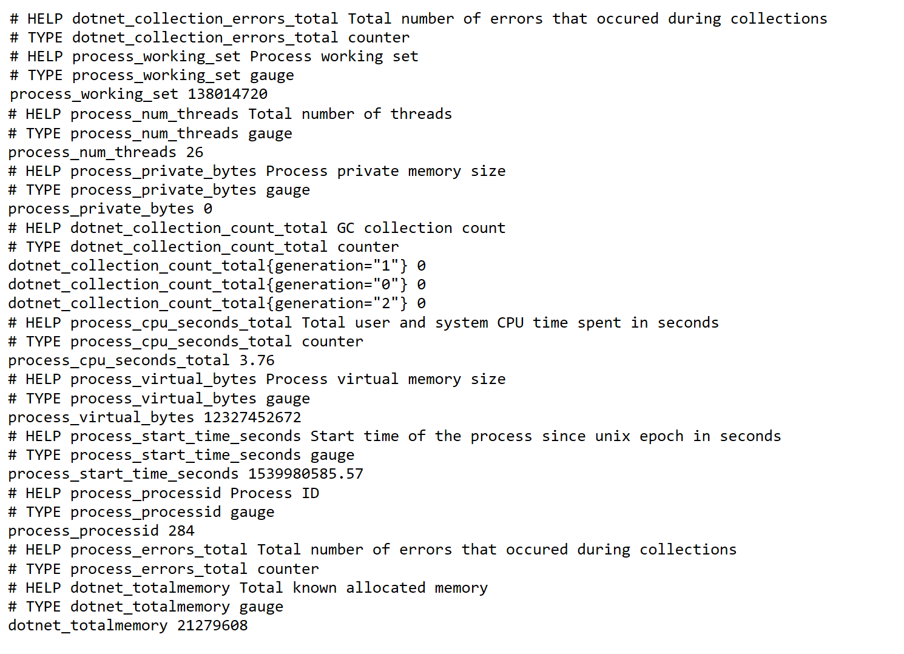
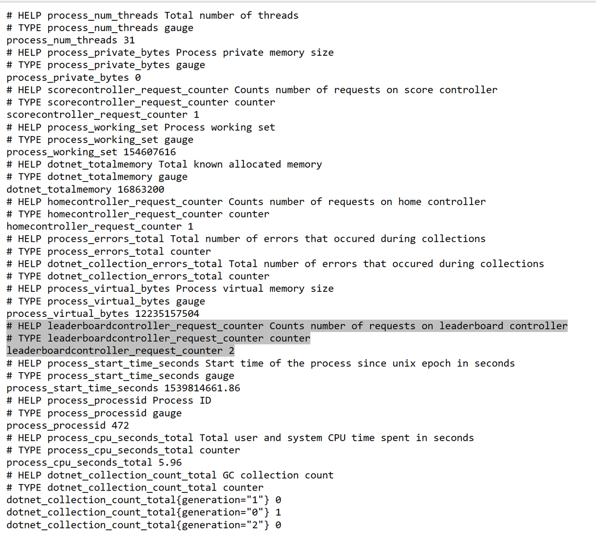

# Lab 9 - Prometheus

In this Lab exercise you will install the CoreOS Prometheus Helm chart. This will enable monitoring in your cluster and provide a dashboard for all your services.
If time permits you can add a custom metrics endpoint to your .NET core service and deploy that to the cluster and enable the monitoring of that service using the custom resource types that got created in your AKS cluster by the deployment of the Prometheus package.

Goals for this lab:
- [Add Prometheus monitoring support to your AKS cluster](#install)
- [Explore the monitoring data using the Grafana dashboard](#grafana)
- [Expose a metrics endpoint to your service to provide Prometheus with data](#custommetrics)
- [explore the custom resource types to monitor your own service](#kubernetessecrets)

## Installing Prometheus
<a name="install"></a>
Before we can install Prometheus, we need Helm package management enabled for our Kubernetes Cluster.
So we first install Helm. This is done with the following steps:

Go to the GitHub repository to download the latest zip package that contains the Helm client. You can find the repo here: https://github.com/helm/helm/releases.

Unpack the zip file and add the location of Helm.exe to your system path, so you can use this command from any command window you create.

Now we need to install the server part. For this we assume you have a working version of kubectl.exe on your machine and that you can connect to the cluster. To validate this, type the command:

```cmd
kubectl get nodes
```

This should return a set of nodes in your cluster. In our lab setup this should be at least one node.

Now we can install the tiller pod, that is required by helm to do our installation of packages.
Type the following command:

```cmd
helm init
```

This should return the following:

```cmd
$HELM_HOME has been configured at C:\Users\<youruser>\.helm.
Happy Helming!
```

Now we need to add the CoreOS helm repository to the Helm repositories where it will search for Helm Charts we can install on our cluster.
Adding the repo is done with the following command:

```cmd
helm repo add coreos https://s3-eu-west-1.amazonaws.com/coreos-charts/stable/
```

We need to create a service-account to serve our needs for monitoring. Create a new yaml file (helm.yml) and paste these contents

```yaml
apiVersion: v1
kind: ServiceAccount
metadata:
  name: tiller
  namespace: kube-system
---
apiVersion: rbac.authorization.k8s.io/v1
kind: ClusterRoleBinding
metadata:
  name: tiller
roleRef:
  apiGroup: rbac.authorization.k8s.io
  kind: ClusterRole
  name: cluster-admin
subjects:
  - kind: ServiceAccount
    name: tiller
    namespace: kube-system
```

Execute the command `kubectl apply -f helm.yml

Change the service account in you cluster to the newly created tiller service account.

```cmd
helm init --service-account tiller --upgrade
```

Find the package by using the command:

```cmd
helm search coreos/prometheus
```

This results in the following output if your repo has been correctly registered:

```cmd
NAME                            VERSION DESCRIPTION
coreos/prometheus               0.0.51  Prometheus instance created by the CoreOS Prome...
coreos/prometheus-operator      0.0.29  Provides easy monitoring definitions for Kubern...
```

We need both packages. First install the prometheus-operator package, since that will take care of the configuration of Prometheus in the cluster.

Install the Helm chart by issuing the following command:

```cmd
helm install coreos/prometheus-operator --name prometheus-operator --namespace monitoring
```

and after this has successfully completed:

```cmd
helm install coreos/kube-prometheus --name kube-prometheus --namespace monitoring
```

You should have Prometheus running in your cluster and we can explore the configuration by browsing to the Prometheus build in dashboard.

## Browsing built-in dashboard
When you want to look at the dashboard that is provided, we need to be able to browse to the endpoint exposed by the prometheus server. This is located in one of the deployed pods on the cluster. We can use `kubectl` to do port forwarding for us, so we can browse to the localhost to view it.

To start forwarding the dashboard to your localhost use the following command in a powershell/bash shell:

```cmd
kubectl --namespace monitoring port-forward $(kubectl get pod --namespace monitoring -l prometheus=kube-prometheus -l app=prometheus -o template --template "{{(index .items 0).metadata.name}}") 9090:9090
```

Browse to the location: http://localhost:9090/targets

This will show you which targets prometheus will scrap for metrics. It also shows a status overview of endpoints if it got data or is dead for a while
The dashboard should show something like this:


## Browsing the Grafana dashboard
<a name="grafana"></a>
With the installation of prometheus, an instance of the grafana dashboarding is also installed. We can find out by querying all pods in the `monitor` namespace.

When you execute the following command, you will find there is a pod that contains Grafana:

```cmd
kubectl get pods --namespace=monitoring
```

resulting in something similar to the following:

```
NAME                                                   READY   STATUS    RESTARTS   AGE
alertmanager-kube-prometheus-0                         2/2     Running   0          6d
kube-prometheus-exporter-kube-state-7d964949f4-m8kdx   2/2     Running   0          6d
kube-prometheus-exporter-node-2pb48                    1/1     Running   0          6d
kube-prometheus-exporter-node-7p6ls                    1/1     Running   0          6d
kube-prometheus-exporter-node-t6tpc                    1/1     Running   0          6d
kube-prometheus-grafana-6fb79c6c58-wclfm               2/2     Running   0          6d
prometheus-kube-prometheus-0                           3/3     Running   1          6d
prometheus-operator-76c65c6d89-v8dd2                   1/1     Running   0          6d
```

In this example we can see that the pod running grafana is named: `kube-prometheus-grafana-6fb79c6c58-wclfm`

This pod will expose the Grafana website where we can see the metrics provided by Prometheus.

Again for this we use port forwarding to enable us to browse to the website on our localhost. We do this with the following command at a bash command prompt:

```cmd
kubectl --namespace monitoring port-forward $(kubectl get pod --namespace monitoring -l app=kube-prometheus-grafana -o template --template "{{(index .items 0).metadata.name}}") 3000:3000
```

Now browse to http://localhost:3000 and there you will see the home of the dashboards.


Click on the home button in the left upper corner and then select e.g. the Nodes dashboard. This will result in a similar dashboard as displayed here:


## Creating your custom .NET core metrics Prometheus endpoint

We will now add our own metrics endpoint to our web APIs. For this we can use the Prometheus client libraries on NuGet. The endpoint will be exposed on the path /metrics as per convention of prometheus.

First, we start with adding the required NuGet packages to our LeaderBoard.WebAPI project, but the same can be done for the GamingWebApp project of course.

Add the NuGet library packages "Prometheus.Client" and "Prometheus.Client.AspNetCore" to the project.
Next we can make the changes in our code.

Open the Startup.cs file and find the following method:

```c#
public void Configure(IApplicationBuilder app, IHostingEnvironment env,
    ILoggerFactory loggerFactory, LeaderboardContext context)
{

}
```

Add at the end of this method the following statement to create the Prometheus Metric Endpoint:

```c#
app.UsePrometheusServer();
```

Import the required namespace to make the code compile. Now we have the endpoint that will provide standard metrics. Below you can see the output of the endpoint when you run it in the debugger:



# Create your custom metric
<a name="custommetrics"></a>
Let's add a custom metric. We want to keep the count of the number of requests we got on one particular Web API endpoint. Add a code to the controllers for the respective endpoints.
We will start with the `HomeController`. Open the class `HomeController.cs` and find the following method:

```C#
 public IActionResult Index()
 {

 }
```

Add the following code:

```C#
var counter= Metrics.CreateCounter("homecontroller_request_counter", "Counts number of requests on home controller", "count");
counter.Inc();
```

This code uses the prometheus client library to create a new metric of type counter. We give it a name, some description and a label.
The first time this code is called it will create the counter. Every next time it will just reuse the counter already created. this is matched on the counter name.

Next, we increment the counter. A counter should always be increasing. The only exception to this is resetting to 0. E.g., this is permitted in case of the service restarting.

You can repeat this step for all controllers. In the `LeaderboardController` we add the following line of code:

```C#
var counter = Metrics.CreateCounter("leaderboardcontroller_request_counter", "Counts number of requests on leaderboard controller", "count");
counter.Inc();
```

and in the `ScoreController` we add the following line of code:

```C#
var counter = Metrics.CreateCounter("scorecontroller_request_counter", "Counts number of requests on score controller", "count");
counter.Inc();
```

Compile the code and debug the code using the Docker container support in Visual Studio (F5).
Browse to the various endpoints and retrieve some values

Now browse to the metric endpoint. This will result in something similar as the following result:



# Configuring Prometheus custom resource
Deploy our new services to the Kubernetes cluster. We want our custom metrics to be picked up by the prometheus server.

Therefore, we need to setup a service monitor, so it will start scraping our services for their metrics endpoint.

To create the service monitor we need to define the data for this custom resource we added by installing Prometheus monitor.