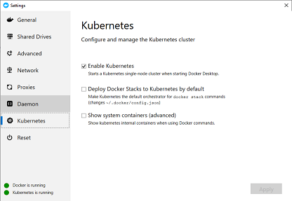

# Lab 9.5 How to use Kubernetes

During this lab, you will become familiar with Kubernetes concepts, showing you how to deploy a container, scale the number of instances, and see the output of a running application.

Goals for this lab:
- Gain a basic understanding of the *kubectl* tooling for Kubernetes.
- See what a Node, Deployment, and Pod is.
- How to inspect and see the logs of a Pod.
- Understand how to scale up and down the number of instances of a container.
- Use a service to define networking.

## <a name='start'></a>Use your Kubernetes environment
Make sure you have a Kubernetes cluster available, either by running this in the form of AKS or use the mini cluster. See [Lab 1 - Getting Started](Lab1-GettingStarted.md) if you do not have it installed. Also, make sure you have [this](https://github.com/XpiritBV/ContainerWorkshop2019Docs) repository cloned, so you have a copy of the Kubernetes template files on your machine.

You can deploy the mini-cluster by right clicking on the icon in the tool bar. 


On the Kubernetes tab, check 'Enable Kubernetes' and click 'Apply'.



Wait a few minutes until the indicator in the bottom-left of the screen indicates that both Docker and Kubernetes are running.

If you already installed the mini-cluster, please open the tab named 'Reset' and select 'Reset Kubernetes Cluster..' to reset the local mini-cluster to its defaults.


Now, in VS Code, open the Kubernetes extension, make sure the cluster named 'docker-desktop' is the current cluster, or right click on it to select it as the current cluster.

## <a name='inspect-cluster'></a>Inspecting the cluster
To interact with the Kubernetes cluster, you will need to use the **kubectl** tool. This allows you to issue commands and queries to the selected Kubernetes cluster. 

For example, type the following command to inspect the cluster:

```
kubectl cluster-info
```

This command will show you where the master node is running. To see the cluster version, use the following command to return the client and server version numbers.

```
kubectl version
```

## <a name='nodes'></a>Information about the nodes
A cluster has one or more nodes that are responsible for running the actual pods. A node is the worker machine in Kubernetes and can be a virtual machine or a physical machine. To see which nodes are available, we can use the 'describe' command of `kubectl`.

```
kubectl describe nodes
```

Each node is listed with not only the technical details but also the actual pods running on the specific node. To get the details about a particular node, you can use the same describe command:

```
kubectl describe node docker-desktop
```

The _conditions_ in the output indicate if the node can accept pods. You might see an output like below:

```
Conditions:
  Type             Status  LastHeartbeatTime                 LastTransitionTime                Reason                       Message
  ----             ------  -----------------                 ------------------                ------                       -------
  MemoryPressure   False   Fri, 11 Oct 2019 09:32:05 +0200   Tue, 10 Sep 2019 09:20:31 +0200   KubeletHasSufficientMemory   kubelet has sufficient memory available        
  DiskPressure     False   Fri, 11 Oct 2019 09:32:05 +0200   Tue, 10 Sep 2019 09:20:31 +0200   KubeletHasNoDiskPressure     kubelet has no disk pressure
  PIDPressure      False   Fri, 11 Oct 2019 09:32:05 +0200   Tue, 10 Sep 2019 09:20:31 +0200   KubeletHasSufficientPID      kubelet has sufficient PID available
  Ready            True    Fri, 11 Oct 2019 09:32:05 +0200   Tue, 10 Sep 2019 09:20:31 +0200   KubeletReady                 kubelet is posting ready status
```

In this case, the node is in a _Ready_ state and can run Pods.

## <a name='deployment'></a>Create a deployment
When you want to run a containerized application inside the cluster, you will use a deployment configuration to schedule a Pod. A Pod is a group of one or more containers. It can have its own storage and networking setup and contains specifications on how to run the actual containers.

Start a new deployment using `kubectl` by creating a Pod running the busybox container:

```
kubectl create deployment hello-busybox --image=busybox
```

Verify that the deployment is working, by using the describe functionality again, this time by querying the deployment by its name:

```
kubectl describe deployment hello-busybox 
```

You will get all the details about the running Pod. For a quick overview of all deployments, use the _get_ method.

```
kubectl get deployments
```

Which will output something like below:

```
NAME            READY   UP-TO-DATE   AVAILABLE   AGE
hello-busybox   1/1     1            0           1m
```

Remove the just created deployment, by issuing the delete command:

```
kubectl delete deployment hello-busybox
```

## <a name='deployment-using-template'></a>Deploy an application using a Pod template

We just started the container by directly creating a deployment; we can also use a Pod template. 

```yaml
apiVersion: v1
kind: Pod
metadata:
  name: myapp-pod
  labels:
    app: myapp
spec:
  containers:
  - name: myapp-container
    image: busybox
    command: ['sh', '-c', 'echo Hello Kubernetes! && sleep 3600']
```

In your terminal, move to the repository directory named 'resources/lab9.5'.

Type the following command to deploy the template:

```
kubectl apply -f '00-busybox.yaml'
```

This will return a line indicating the Pod creation:

```
pod/myapp-pod created
```

## <a name='logging'></a>See the output of a pod
The just deployed Pod will run a container with a command to output a certain string. To see this output, we can query the logs of the Pod.

```
kubectl logs myapp-pod
```

You should see a text like `Hello Kubernetes!` being returned. Remove the Pod by executing the delete command:

```
kubectl delete pod myapp-pod
```

## <a name='deployment-scaling'></a>Scale a deployment
In the example above, we rolled out a Pod using a Pod Template. We can also use a Deployment template. Kubernetes will maintain the desired state described in the deployment.

Let's roll out a _nginx_ container:

```yaml
apiVersion: apps/v1
kind: Deployment
metadata:
  name: nginx-deployment
  labels:
    app: nginx
spec:
  replicas: 1
  selector:
    matchLabels:
      app: nginx
  template:
    metadata:
      labels:
        app: nginx
    spec:
      containers:
      - name: nginx
        image: nginx:1.7.9
        ports:
        - containerPort: 80
```

Apply the specification using the following command:

```
kubectl apply -f 01-nginx-deployment.yaml
```

It might take some time to become available, so query the state of the deployment using the _get_ command until it is available:

```
kubectl get deployment nginx-deployment
```

The number of replicas is now set to 1. When the container crashes for some reason, Kubernetes will make sure there is at least one container running. Running a single instance might not always be enough. When can scale the number of pods by issuing a _scale_ command:

```
kubectl scale deployment.v1.apps/nginx-deployment --replicas=3
```

Query the state by checking the deployment:

```
kubectl get deployment nginx-deployment
```

And you will see three instances available:

```
NAME               READY   UP-TO-DATE   AVAILABLE   AGE
nginx-deployment   3/3     3            3           4m
```

## <a name='services'></a>Use services
In Kubernetes, a Pod will get its own IP address. In theory, you can use this to communicate with other Pods. However, when a Pod dies and gets resurrected, the IP address will be different. For example, when a front-end pod needs to talk to a back-end pod, it needs another way to find the location of this Pod. Services are the solution to this.

Take, for example, our _nginx_ deployment. We want to run a service in front of this, which will target the pods matching the same app name. It will forward traffic from port 8080 to port 80 inside the container.

Apply the following service template:

```yaml
apiVersion: v1
kind: Service
metadata:
  name: nginx-service
spec:
  selector:
    app: nginx
  ports:
    - protocol: TCP
      port: 8080
      targetPort: 80
```

```
kubectl apply -f .\02-nginx-service.yaml
```

And inspect the outcome:

```
kubectl get service nginx-service
```

The generated IP will be listed as below.

```
NAME            TYPE        CLUSTER-IP       EXTERNAL-IP   PORT(S)    AGE
nginx-service   ClusterIP   10.108.174.121   <none>        8080/TCP   21s
```

To validate that we can resolve the name using the internal DNS to a service, we will run a lookup from within the cluster.

```
kubectl run curl --image=radial/busyboxplus:curl -i --tty
```

In the terminal that opens, execute a `nslookup nginx-service` and it will return an address to the actual pod:

```
Server:    10.96.0.10
Address 1: 10.96.0.10 kube-dns.kube-system.svc.cluster.local

Name:      nginx-service
Address 1: 10.108.174.121 nginx-service.default.svc.cluster.local
```

Where the 10.108.174.121 address is the same as the cluster service IP. 

In the same terminal window, we can also execute a `curl` command to fetch the nginx page:

```
curl -XGET -v 10.108.174.121:8080
```

As you can see, we created a service that we can interact with using the DNS system of Kubernetes regardless of Pod restarts or scaling of the number of containers.


